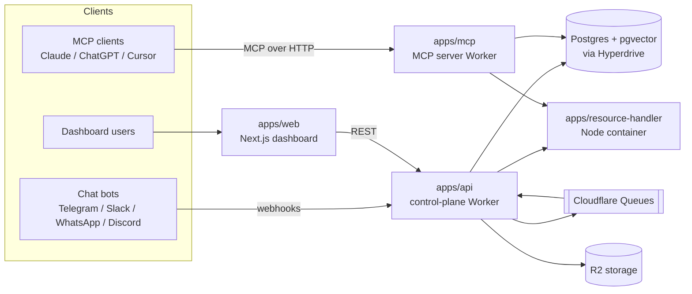

# Ganju

> Turn your knowledge and integrations into a hosted **MCP server** that any AI client or chat bot can connect to.

Ganju is an open-source platform for building and hosting [Model Context Protocol](https://modelcontextprotocol.io) (MCP) servers. A tenant uploads resources (files, websites, cloud drives), wires up tools (Gmail, Slack, Calendar, web search, or their own HTTP/MCP backends), writes prompts, and gets a ready-to-use MCP endpoint at `https://mcp.<domain>/<slug>` — reachable from Claude Desktop, ChatGPT, Cursor, and from chat bots on Telegram, Slack, WhatsApp, and Discord.

It runs almost entirely on the **Cloudflare** developer platform (Workers, Queues, R2, Hyperdrive, Containers, Durable Objects) with Postgres + `pgvector` for storage and retrieval.

## Features

- **Hosted MCP servers** — each "artifact" becomes a stateless MCP server with its own slug, OAuth, and tool set.
- **RAG over your content** — upload files, crawl websites, or sync Google Drive / OneDrive folders; content is chunked and embedded for vector search.
- **A growing tool catalog** — native integrations (Gmail, Outlook, Slack, Google Calendar, Cal.com, Tavily web search) plus two generic, no-code definitions:
  - **`http-endpoint`** — expose your own HTTP API as a tool.
  - **`mcp-proxy`** — connect a vendor's official MCP server (Notion, GitHub, …) and re-expose its tools.
- **Chat-channel bots** — the same artifact can drive Telegram / Slack / WhatsApp / Discord bots through an LLM tool-calling loop (Gemini, Claude, or OpenAI).
- **Multi-tenant** — organizations → projects → artifacts, with invitations and roles.
- **Audit & usage trails** — every MCP request, tool call, and channel message is recorded.

## Architecture at a glance



| App                                              | Runtime                         | Responsibility                                                                            |
| ------------------------------------------------ | ------------------------------- | ----------------------------------------------------------------------------------------- |
| [`apps/api`](apps/api)                           | Cloudflare Worker (Hono)        | Control plane: auth, CRUD, OAuth, channel webhooks, queue consumers                       |
| [`apps/mcp`](apps/mcp)                           | Cloudflare Worker (Hono)        | The MCP server itself — boots a server per request and dispatches tools/resources/prompts |
| [`apps/resource-handler`](apps/resource-handler) | Node container                  | CPU/binary-heavy work: document extraction, web crawling, large file sends                |
| [`apps/web`](apps/web)                           | Next.js (OpenNext → Cloudflare) | The management dashboard                                                                  |

See [docs/ARCHITECTURE.md](docs/ARCHITECTURE.md) for the full picture.

## Repository layout

```
ganju/
├── apps/
│   ├── api/              Control-plane Worker (Hono)
│   ├── mcp/              MCP-server Worker (Hono)
│   ├── resource-handler/ Node container for heavy work
│   └── web/              Next.js dashboard
├── packages/
│   ├── db/               Drizzle schema, migrations, connection
│   ├── utils/            Shared kernel: constants, crypto, oauth, chunking, send helpers
│   ├── ui/               MUI component library
│   ├── containers/       Cloudflare Container class wrapper
│   └── tsconfig/         Shared TypeScript config
├── docs/                 Project documentation (start here)
└── scripts/              Dev tooling
```

It's an [npm workspaces](https://docs.npmjs.com/cli/using-npm/workspaces) + [Turborepo](https://turbo.build/) monorepo.

## Quick start

```bash
npm install
cp .env.example .env      # then fill in the values
npm run migrate-dev       # generate + apply DB migrations
npm run dev               # start all apps via turbo
```

Default local ports: API `8080`, MCP `8081`, resource-handler `8082`, web `3000`.

Full setup (prerequisites, environment variables, database, per-app commands) is in [docs/DEVELOPMENT.md](docs/DEVELOPMENT.md).

## Tech stack

- **Language:** TypeScript everywhere
- **Edge runtime:** Cloudflare Workers, Queues, R2, Hyperdrive, Durable Objects, Containers
- **Web framework:** [Hono](https://hono.dev) (APIs) and [Next.js](https://nextjs.org) (dashboard)
- **Database:** Postgres + [`pgvector`](https://github.com/pgvector/pgvector), accessed with [Drizzle ORM](https://orm.drizzle.team)
- **Auth:** [better-auth](https://www.better-auth.com) (social login + OIDC provider for MCP OAuth)
- **AI:** Gemini, Anthropic, and OpenAI SDKs; Gemini embeddings for RAG
- **MCP:** [`@modelcontextprotocol/sdk`](https://github.com/modelcontextprotocol/typescript-sdk)

## Documentation

| Doc                                                          | What's inside                                       |
| ------------------------------------------------------------ | --------------------------------------------------- |
| [docs/ARCHITECTURE.md](docs/ARCHITECTURE.md)                 | System design, apps, data flow, Cloudflare bindings |
| [docs/DEVELOPMENT.md](docs/DEVELOPMENT.md)                   | Local setup, env vars, commands, troubleshooting    |
| [docs/DATA_MODEL.md](docs/DATA_MODEL.md)                     | Database entities and relationships                 |
| [docs/DEPLOYMENT.md](docs/DEPLOYMENT.md)                     | Deploying to Cloudflare, environments, secrets      |
| [apps/mcp/src/tools/README.md](apps/mcp/src/tools/README.md) | How tools work and how to add one                   |
| [CONTRIBUTING.md](CONTRIBUTING.md)                           | Contribution workflow and conventions               |

## Contributing

Contributions are welcome — please read [CONTRIBUTING.md](CONTRIBUTING.md) first.

## License

[Apache-2.0](LICENSE) — see also [NOTICE](NOTICE).
