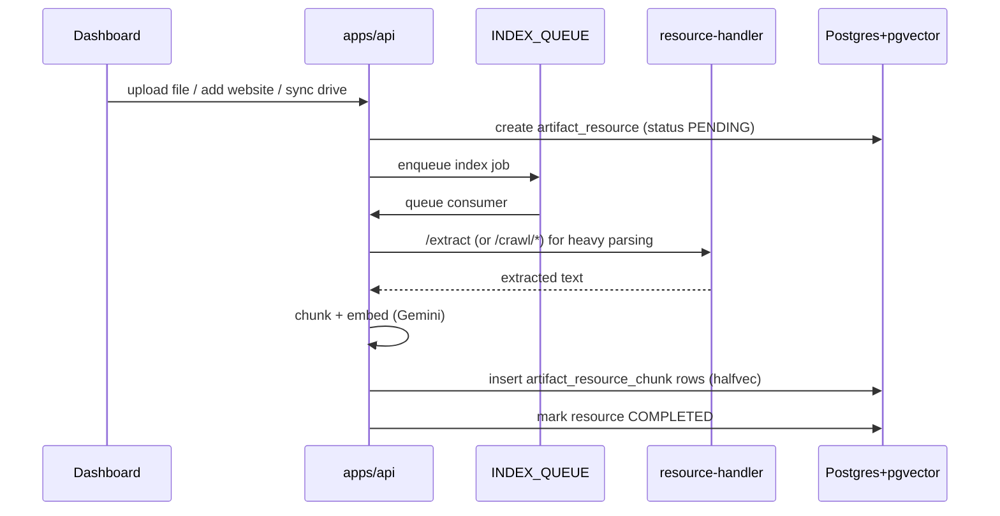
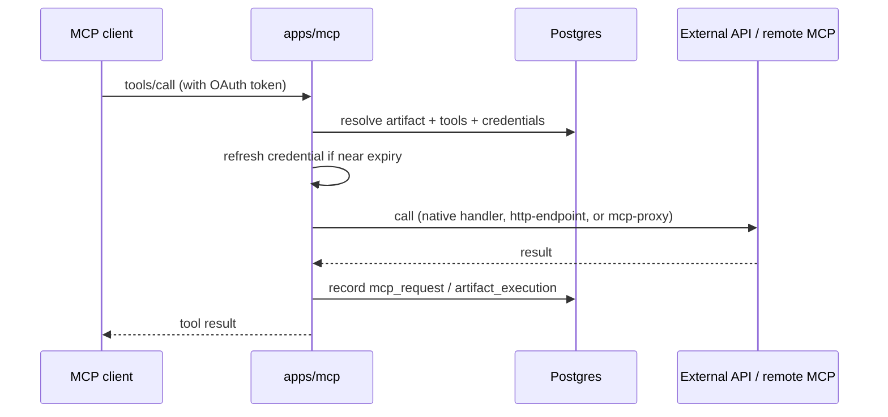

# Architecture

This document explains how Ganju is put together: the apps, how requests flow, and the Cloudflare resources each part depends on. For the database entities, see [DATA_MODEL.md](DATA_MODEL.md).

## The big idea

Everything centers on the **artifact**. An artifact is a project's MCP server: it owns prompts, resources, tools, credentials, and channels. When a client connects to `https://mcp.<domain>/<slug>`, the MCP Worker resolves the slug to an artifact and assembles a live MCP server from the artifact's configured pieces.

```
user → organization → project → artifact → { prompts, resources, tools, credentials, channels }
```

## The four apps

### `apps/api` — control-plane Worker

A [Hono](https://hono.dev) Worker ([`apps/api/src/index.ts`](../apps/api/src/index.ts)) that everything except live MCP traffic goes through:

- **Auth** — [better-auth](https://www.better-auth.com) handles social login (Google, GitHub) and acts as an **OIDC provider** so MCP clients can do OAuth. Discovery is advertised at `/.well-known/oauth-authorization-server`.
- **CRUD** — organizations, projects, artifacts, prompts, resources, tools, credentials, channels, and org-level LLM configs. Controllers live under [`apps/api/src/controllers`](../apps/api/src/controllers).
- **Integration OAuth** — `GET /oauth/:provider/authorize` + callbacks for Gmail, Google Drive/Calendar, Outlook, OneDrive, and Slack.
- **Channel webhooks** — `POST /channel/:channelId/webhook/:platform` ingests Telegram/Slack/WhatsApp/Discord events; a Discord **Durable Object** ([`durable-objects/discordGateway.ts`](../apps/api/src/durable-objects/discordGateway.ts)) holds the persistent Gateway WebSocket.
- **Queue consumers** — the `queue()` handler dispatches background jobs (see [Queues](#queues-background-work)).

### `apps/mcp` — MCP-server Worker

A small Hono Worker ([`apps/mcp/src/index.ts`](../apps/mcp/src/index.ts)) that **is** the MCP server. It's stateless: a fresh `McpServer` is built per request from the artifact's stored config, then it handles `initialize` / `tools/list` / `tools/call` / `resources/*` / `prompts/*`.

- Auth gate runs only on artifact-bearing routes; `/.well-known/oauth-protected-resource` is public so a 401 can point clients at the authorization server.
- Tool dispatch and the tool catalog are documented in depth in [`apps/mcp/src/tools/README.md`](../apps/mcp/src/tools/README.md) — read that before adding or changing a tool.
- Heavy or binary work is delegated to the resource-handler container; tool handlers stay light.

### `apps/resource-handler` — Node container

A plain Node HTTP server ([`apps/resource-handler/src/server.ts`](../apps/resource-handler/src/server.ts)) packaged as a **Cloudflare Container** and reached over a Durable Object binding (`RESOURCE_HANDLER`). Workers are capped at 128 MiB and can't run native binaries, so anything heavy lives here:

- **Document extraction** (`/extract`) — PDF, Word, Excel → text, for embedding.
- **Web crawling** (`/crawl/discover`, `/crawl/page`) — Cheerio or Playwright.
- **Large file sends** — pushing resources into Gmail/Outlook/Slack/Telegram/Discord/WhatsApp, including streaming a proxied remote MCP resource as a file without it transiting a Worker.

### `apps/web` — dashboard

A [Next.js](https://nextjs.org) app (Pages Router, MUI/Emotion) deployed to Cloudflare via [OpenNext](https://opennext.js.org). It talks to `apps/api` over REST and is where users manage every entity above. Components live under [`apps/web/src/components/views`](../apps/web/src/components/views).

## Shared packages

| Package | Role |
| --- | --- |
| [`packages/db`](../packages/db) | Drizzle schema ([`lib/schema.ts`](../packages/db/src/lib/schema.ts)), connection via Hyperdrive, migrations, shared error handler |
| [`packages/utils`](../packages/utils) | The shared kernel: [`constants.ts`](../packages/utils/src/constants.ts) (mime types, provider URLs, platform caps, LLM catalog, chunking config), crypto, OAuth refresh, SSRF screening, chunking, per-channel send helpers |
| [`packages/ui`](../packages/ui) | MUI-based component library used by the web app |
| [`packages/containers`](../packages/containers) | The `ResourceHandler` Cloudflare Container class |
| [`packages/tsconfig`](../packages/tsconfig) | Shared TypeScript config |

## Data flow examples

### Ingesting a resource (RAG)



Vector search then runs as a cosine HNSW query over `artifact_resource_chunk.embedding` (3072-dim `halfvec`).

### Answering an MCP tool call



### Channel bot turn

A chat platform posts a webhook to `apps/api`, which runs an LLM tool-calling loop (the org's configured model) against the artifact's MCP `Client`, then replies on the platform. Resources reach the agent through the native `resources` tool group, and MCP prompts surface as slash commands — both detailed in the [tools README](../apps/mcp/src/tools/README.md#channel-bots-telegram).

## Cloudflare bindings

Defined per app in `wrangler.toml` (see [`apps/api/wrangler.toml`](../apps/api/wrangler.toml) for the full set). The API Worker is the binding hub:

| Binding | Type | Purpose |
| --- | --- | --- |
| `HYPERDRIVE` | Hyperdrive | Pooled Postgres connection |
| `STORAGE_BUCKET` | R2 | Uploaded files / avatars |
| `SEND_EMAIL` | Email | Transactional email (verified destinations only) |
| `RESOURCE_HANDLER` | Durable Object → Container | Heavy work delegation |
| `DISCORD_GATEWAY` | Durable Object | Persistent Discord Gateway socket |
| `MCP` / `API` | Service bindings | Worker-to-Worker calls |
| `*_QUEUE` | Queues | Background jobs (see below) |

### Queues (background work)

Each has a producer binding, a consumer, and a dead-letter queue:

| Queue | Job |
| --- | --- |
| `INDEX_QUEUE` | Chunk + embed a resource |
| `CRAWL_DISCOVER_QUEUE` / `CRAWL_PAGE_QUEUE` | Website crawl: discover URLs, then fetch pages |
| `GDRIVE_DISCOVER_QUEUE` / `GDRIVE_FILE_QUEUE` | Google Drive folder sync |
| `ONEDRIVE_DISCOVER_QUEUE` / `ONEDRIVE_FILE_QUEUE` | OneDrive folder sync |

Consumer code is in [`apps/api/src/queue`](../apps/api/src/queue).

## Design principles

- **Workers stay light.** Anything CPU- or memory-heavy (PDF parsing, headless browsing, large multipart) goes to the resource-handler container.
- **Proxy before you build.** Prefer connecting a vendor's official MCP server (`mcp-proxy`) over hand-writing a native tool. See the [tools README](../apps/mcp/src/tools/README.md#build-vs-proxy).
- **Secrets are never inlined.** Tool configs reference credentials by id; secrets live encrypted in `artifact_credential` and are applied just before egress, never logged.
- **Untrusted egress is SSRF-screened.** `http-endpoint`, `mcp-proxy`, and the crawler screen target hosts against private/loopback ranges.
- **Everything is auditable.** MCP requests, tool/prompt/resource executions, and channel messages are recorded.
</content>
