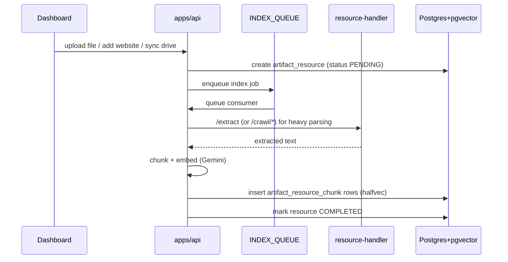
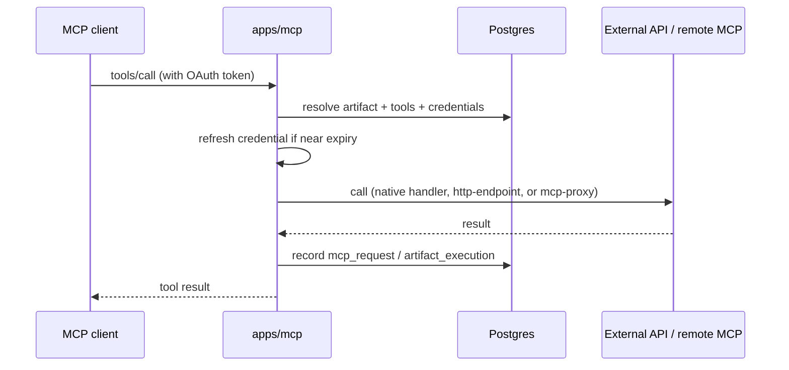

# Architecture

This document explains how Ganju is put together: the apps, how requests flow, and the Cloudflare resources each part depends on. For the database entities, see [DATA_MODEL.md](DATA_MODEL.md).

## The big idea

Everything centers on the **artifact**. An artifact is a project's MCP server: it owns prompts, resources, tools, credentials, and channels. When a client connects to `https://mcp.<domain>/<slug>`, the MCP Worker resolves the slug to an artifact and assembles a live MCP server from the artifact's configured pieces.

```
user → organization → project → artifact → { prompts, resources, tools, credentials, channels }
```

## The six apps

### `apps/api` — control-plane Worker

A [Hono](https://hono.dev) Worker ([`apps/api/src/index.ts`](../apps/api/src/index.ts)) that everything except live MCP traffic goes through:

- **Auth** — [better-auth](https://www.better-auth.com) handles social login (Google, GitHub) and, via `@better-auth/oauth-provider`, acts as an **OAuth 2.1 / OIDC provider** so MCP clients can do OAuth. Discovery is advertised at `/.well-known/oauth-authorization-server`; the consent screen is served at `/oauth/consent`.
- **CRUD** — organizations, projects, artifacts, prompts, resources, tools, credentials, channels, and org-level LLM configs. Controllers live under [`apps/api/src/controllers`](../apps/api/src/controllers).
- **Integration OAuth** — `GET /oauth/:provider/authorize` + callbacks for Gmail, Google Drive/Calendar, Outlook, OneDrive, and Slack.
- **Channel webhooks** — `POST /channel/:channelId/webhook/:platform` ingests Telegram/Slack/WhatsApp/Discord events; a Discord **Durable Object** ([`durable-objects/discordGateway.ts`](../apps/api/src/durable-objects/discordGateway.ts)) holds the persistent Gateway WebSocket.
- **Queue consumers** — the `queue()` handler dispatches background jobs (see [Queues](#queues-background-work)).

### `apps/mcp` — MCP-server Worker

A small Hono Worker ([`apps/mcp/src/index.ts`](../apps/mcp/src/index.ts)) that **is** the MCP server. It's stateless: a fresh `McpServer` is built per request from the artifact's stored config, then it handles `initialize` / `tools/list` / `tools/call` / `resources/*` / `prompts/*`.

- Auth gate runs only on artifact-bearing routes; `/.well-known/oauth-protected-resource` is public so a 401 can point clients at the authorization server.
- Tool dispatch and the tool catalog are documented in depth in [`apps/mcp/src/tools/README.md`](../apps/mcp/src/tools/README.md) — read that before adding or changing a tool.
- Heavy or binary work is delegated to the resource-handler container; tool handlers stay light.

### `apps/resource-handler` — Node container

A plain Node HTTP server ([`apps/resource-handler/src/server.ts`](../apps/resource-handler/src/server.ts)) packaged as a **Cloudflare Container** and reached over a Durable Object binding (`RESOURCE_HANDLER`). Workers are capped at 128 MiB and can't run native binaries, so anything heavy lives here:

- **Document extraction** (`/extract`) — PDF, Word, Excel → text, for embedding.
- **Web crawling** (`/crawl/discover`, `/crawl/page`) — Cheerio or Playwright.
- **Large file sends** — pushing resources into Gmail/Outlook/Slack/Telegram/Discord/WhatsApp, including streaming a proxied remote MCP resource as a file without it transiting a Worker.

### `apps/tool-broker` — the host capabilities a user's tool is given

A Hono Worker ([`apps/tool-broker/src/index.ts`](../apps/tool-broker/src/index.ts)) reached over a **service binding** from inside a customer's deployed script. It is what makes `ctx` in [`@ganju/sdk`](../packages/sdk) real: `connection()` mints a short-lived access token, `secret()` resolves an `artifact_credential` by label, `resources.*` reads, creates and deletes the artifact's resources, and `sendFile()` forwards to the resource-handler container the way the native Gmail/Outlook/Slack handlers do.

Two properties it exists to hold, neither of which could live in the SDK:

- **Secrets never enter user code.** Refresh tokens and client secrets stay here; the isolate only ever sees an access token with an expiry.
- **A service binding carries no caller identity**, so the script is authenticated by `GANJU_TOOL_TOKEN` — an HMAC over `{artifactId, versionId}` injected at upload time, verified here against the artifact's *current* active version. That is what makes a superseded script's credential stop working the moment a newer version publishes. The artifact id is never read from the request body.

### `apps/tool-outbound` — the egress screen for user code

A small Worker ([`apps/tool-outbound/src/index.ts`](../apps/tool-outbound/src/index.ts)) that every outbound `fetch` from a customer's script goes through: the shared SSRF screen (`isBlockedHost` — private, loopback, link-local), the tool's `allowedHosts` when set, and the per-artifact rate limit.

**Enforcement is here rather than in the SDK on purpose** — anything inside the isolate is user-editable and therefore not a control. An empty `allowedHosts` means unrestricted rather than blocked, but `isBlockedHost` applies whatever the list says. Note it screens global `fetch` only: a container binding is not intercepted, which is why the embedding host needs an exemption and the `sendFile` container call never did.

Both Workers are deployed per environment (`ganju-tool-broker-development`, `ganju-tool-outbound-development`) and are described in full, with the reasoning, in [CUSTOM_TOOLS.md](CUSTOM_TOOLS.md).

### `apps/web` — dashboard

A [Next.js](https://nextjs.org) app (Pages Router, MUI/Emotion) deployed to Cloudflare via [OpenNext](https://opennext.js.org). It talks to `apps/api` over REST and is where users manage every entity above. Components live under [`apps/web/src/components/views`](../apps/web/src/components/views).

## Shared packages

| Package                                         | Role                                                                                                                                                                                                                        |
| ----------------------------------------------- | --------------------------------------------------------------------------------------------------------------------------------------------------------------------------------------------------------------------------- |
| [`packages/db`](../packages/db)                 | Drizzle schema ([`lib/schema.ts`](../packages/db/src/lib/schema.ts)), connection via Hyperdrive, migrations, shared error handler                                                                                           |
| [`packages/utils`](../packages/utils)           | The shared kernel: [`constants.ts`](../packages/utils/src/constants.ts) (mime types, provider URLs, platform caps, LLM catalog, chunking config), crypto, OAuth refresh, SSRF screening, chunking, per-channel send helpers |
| [`packages/ui`](../packages/ui)                 | MUI-based component library used by the web app                                                                                                                                                                             |
| [`packages/containers`](../packages/containers) | The `ResourceHandler` Cloudflare Container class                                                                                                                                                                            |
| [`packages/sdk`](../packages/sdk)               | `@ganju/sdk` — the typed `ctx` a user's tool is written against, and the module attached beside every deployed script                                                                                                        |
| [`packages/cli`](../packages/cli)               | `ganju` — write, deploy and debug custom tools from a terminal; a thin client of the same endpoints the dashboard uses                                                                                                       |
| [`packages/tsconfig`](../packages/tsconfig)     | Shared TypeScript config                                                                                                                                                                                                    |

## Data flow examples

### Ingesting a resource (RAG)


```mermaid
sequenceDiagram
  participant U as Dashboard
  participant API as apps/api
  participant Q as INDEX_QUEUE
  participant RH as resource-handler
  participant DB as Postgres+pgvector

  U->>API: upload file / add website / sync drive
  API->>DB: create artifact_resource (status PENDING)
  API->>Q: enqueue index job
  Q->>API: queue consumer
  API->>RH: /extract (or /crawl/*) for heavy parsing
  RH-->>API: extracted text
  API->>API: chunk + embed (Gemini)
  API->>DB: insert artifact_resource_chunk rows (halfvec)
  API->>DB: mark resource COMPLETED
```

Vector search then runs as a cosine HNSW query over `artifact_resource_chunk.embedding` (3072-dim `halfvec`).

### Answering an MCP tool call


```mermaid
sequenceDiagram
  participant C as MCP client
  participant MCP as apps/mcp
  participant DB as Postgres
  participant Ext as External API / remote MCP

  C->>MCP: tools/call (with OAuth token)
  MCP->>DB: resolve artifact + tools + credentials
  MCP->>MCP: refresh credential if near expiry
  MCP->>Ext: call (native handler, http-endpoint, or mcp-proxy)
  Ext-->>MCP: result
  MCP->>DB: record mcp_request / artifact_execution
  MCP-->>C: tool result
```

### Channel bot turn

A chat platform posts a webhook to `apps/api`, which runs an LLM tool-calling loop (the org's configured model) against the artifact's MCP `Client`, then replies on the platform. Resources reach the agent through the native `resources` tool group, and MCP prompts surface as slash commands — both detailed in the [tools README](../apps/mcp/src/tools/README.md#channel-bots-telegram).

## Cloudflare bindings

Defined per app in `wrangler.toml` (see [`apps/api/wrangler.toml`](../apps/api/wrangler.toml) for the full set). The API Worker is the binding hub:

| Binding            | Type                       | Purpose                                          |
| ------------------ | -------------------------- | ------------------------------------------------ |
| `HYPERDRIVE`       | Hyperdrive                 | Pooled Postgres connection                       |
| `STORAGE_BUCKET`   | R2                         | Uploaded files / avatars                         |
| `SEND_EMAIL`       | Email Service              | Transactional email (invitations, contact, alerts) |
| `RESOURCE_HANDLER` | Durable Object → Container | Heavy work delegation                            |
| `DISCORD_GATEWAY`  | Durable Object             | Persistent Discord Gateway socket                |
| `MCP` / `API`      | Service bindings           | Worker-to-Worker calls                           |
| `DISPATCH`         | Workers for Platforms      | Runs a customer's deployed tool script           |
| `*_QUEUE`          | Queues                     | Background jobs (see below)                      |

`DISPATCH` is bound in **both** `apps/api` (to upload and smoke-test a publish) and `apps/mcp` (to run a tool call), against the `ganju-tools-<env>` dispatch namespace. Two things about it are worth knowing before touching either: there is **no local emulation**, so the binding is marked `remote = true` and `wrangler dev` proxies to the real namespace ([DEVELOPMENT.md](DEVELOPMENT.md)); and the boot loop must never call it to discover tools — names and schemas are read from Postgres, so a slow or failed deploy cannot break `tools/list`.

A customer's script gets two bindings of its own, injected at upload: a service binding to `apps/tool-broker`, and `GANJU_TOOL_TOKEN`, the signed credential the broker authenticates it by.

### Queues (background work)

Each has a producer binding, a consumer, and a dead-letter queue:

| Queue                                             | Job                                            |
| ------------------------------------------------- | ---------------------------------------------- |
| `INDEX_QUEUE`                                     | Chunk + embed a resource                       |
| `CRAWL_DISCOVER_QUEUE` / `CRAWL_PAGE_QUEUE`       | Website crawl: discover URLs, then fetch pages |
| `GDRIVE_DISCOVER_QUEUE` / `GDRIVE_FILE_QUEUE`     | Google Drive folder sync                       |
| `ONEDRIVE_DISCOVER_QUEUE` / `ONEDRIVE_FILE_QUEUE` | OneDrive folder sync                           |

Consumer code is in [`apps/api/src/queue`](../apps/api/src/queue).

## Design principles

- **Workers stay light.** Anything CPU- or memory-heavy (PDF parsing, headless browsing, large multipart) goes to the resource-handler container.
- **Proxy before you build.** Prefer connecting a vendor's official MCP server (`mcp-proxy`) over hand-writing a native tool. See the [tools README](../apps/mcp/src/tools/README.md#build-vs-proxy).
- **Secrets are never inlined.** Tool configs reference credentials by id; secrets live encrypted in `artifact_credential` and are applied just before egress, never logged.
- **Untrusted egress is SSRF-screened.** `http-endpoint`, `mcp-proxy`, and the crawler screen target hosts against private/loopback ranges.
- **Everything is auditable.** MCP requests, tool/prompt/resource executions, and channel messages are recorded.
