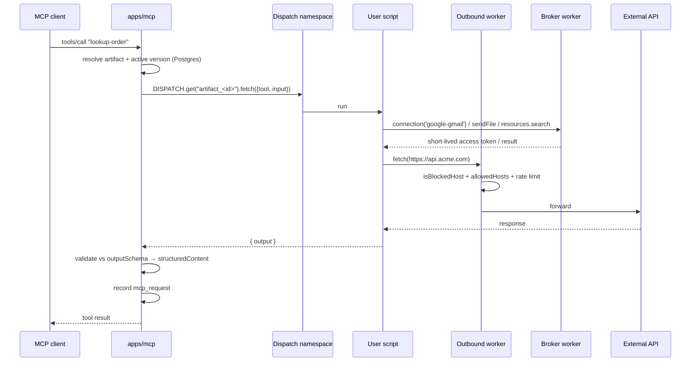

# Custom tools (Workers for Platforms)

Plan of record for letting users **write their own tools** instead of picking from a fixed catalog. Companion to [ARCHITECTURE.md](ARCHITECTURE.md) and the [tools README](../apps/mcp/src/tools/README.md); read those first.

## The problem

Our tool catalog is a finite guess at what users need. When a user's use-case isn't in it, they're stuck — and the only fix available to us is to hand-write another native handler. That's a treadmill we lose: every vendor now ships their own MCP server, and the long tail of "call my internal API, transform it, then post to Slack" is infinite.

`mcp-proxy` and `http-endpoint` already cover two thirds of the escape hatch: a vendor's official MCP server, and a single HTTP call. What's missing is **logic** — multi-step flows, transforms, branching, and anything that needs to combine a credential with a computation.

## The answer

Users write a **Cloudflare Worker** — their own code, their own tool names, descriptions, input schemas, and output schemas — deployed to a Workers for Platforms dispatch namespace and registered as MCP tools on their artifact. They get the platform's OAuth connections and file-send capability as **host bindings**, so their code never touches a refresh token or a 40MB attachment.

Three properties this must have:

1. **The catalog doesn't disappear, it becomes editable.** Templates that recreate the shipped tools, on top of managed connections. Same cards, same Connect button — the card now installs code the user can edit.
2. **Secrets never enter user code.** The broker mints short-lived access tokens; refresh tokens and client secrets stay server-side.
3. **Boot never depends on the runtime.** Tool names and schemas live in Postgres, written at publish time — the same configure-time-discovery trick `mcp-proxy` already uses ([tools README](../apps/mcp/src/tools/README.md#key-design-choice-configure-time-discovery)).

---

## Scope decisions

### Keep (native)

| Group | Why it stays |
|---|---|
| `resources` (`list-resources`, `read-resource`, `send-resource`, `search-resources`) | The RAG core. The channel runner intercepts these **by name** ([runner.ts](../apps/api/src/controllers/channel/runner.ts)); `send-resource` is the only path that streams a file without transiting a 128MiB Worker. |
| `list-prompts` | Same — server-introspection, not a vendor wrapper. |
| `gmail` (18), `outlook` (18), `slack` (5) | These call the resource-handler container for attachments and uploads ([gmail:169](../apps/mcp/src/tools/gmail/index.ts#L169), [outlook:186](../apps/mcp/src/tools/outlook/index.ts#L186), [slack:169](../apps/mcp/src/tools/slack/index.ts#L169)). User code **cannot** reproduce that — see [`sendFile`](#the-sendfile-capability). They also double as the reference implementation for the templates. |
| `web` (`web-search`, `web-extract`) | A capability, not an integration — it's what lets the model cite sources. Load-bearing for the RAG story. |
| `greeting` | Zero-config smoke test for "is my MCP endpoint alive". |
| `http-endpoint`, `mcp-proxy` | Unchanged. `http-endpoint` becomes the **Free tier's** custom tool. |

### Remove

| Group | Tools | Why |
|---|---|---|
| `google-calendar` | 6 | Pure vendor wrapper, no container dependency, converts cleanly to a template. |
| `calcom` | 4 | Same. Also our only non-Tavily API-key provider, so removing it simplifies `API_KEY_PROVIDERS`. |

This cull is deliberately conservative — 10 of 60. The native surface can shrink further once templates prove out in production; revisit after Phase 6.

### Add

- `custom-code` — a third **proxied definition**, structurally parallel to `http-endpoint` and `mcp-proxy`.
- Workers for Platforms dispatch namespace + outbound worker.
- A **broker worker** exposing connections, secrets, resources, and `sendFile` to user code.
- `@ganju/sdk` (npm) and a `ganju` CLI.
- `artifact_tool_version` — draft / publish / rollback.
- **Connections** as a first-class concept, in two modes: *managed* (our OAuth app) and *BYO app* (user's client id/secret).

---

## Architecture



### Unit of deployment: one script per artifact

One WfP script can export many tools (route on tool name in the request body). The boundary sits at the **artifact**, because the artifact *is* the MCP server, it's the thing with a slug, and it's the natural unit for `ganju deploy`.

Since `artifact` is 1:1 with `project` ([DATA_MODEL.md](DATA_MODEL.md#the-artifact-and-its-children)), **script count == artifact count == project count**. We already gate projects per plan — no new "worker quota" concept is needed.

Script naming: `artifact_<artifactId>` (id, not slug — slugs are user-editable).

### Authenticating user code to the broker

A service binding carries no caller identity. At **upload time**, inject a per-script secret binding `GANJU_TOOL_TOKEN` scoped to `{ artifactId }` and rotated on every publish. The broker verifies the token, resolves the artifact, and serves only that artifact's connections/resources/secrets. Never accept an artifact id from the request body.

### Egress control

All outbound `fetch` from user scripts goes through the WfP **outbound worker**, which applies:

- `isBlockedHost` (shared SSRF screen — private/loopback/link-local)
- the tool's `allowedHosts`, when set
- the per-artifact rate limit (reuse `HTTP_ENDPOINT_RATE_LIMITER`, see [rateLimit.ts](../apps/mcp/src/utils/rateLimit.ts))

Enforce here, **not** in the SDK — anything in the isolate is user-editable and therefore not a control.

### The `sendFile` capability

The one thing user code genuinely cannot do: a user Worker is capped at 128MiB, has no R2 binding, and no path to `RESOURCE_HANDLER`. So attachments and large uploads stay a **host capability**:

```ts
await ganju.sendFile({ resourceId, to: 'gmail', ... })
```

The broker forwards to the resource-handler container exactly as the native handlers do today. Those three handlers are the reference implementation — **do not delete them before this is built.**

### Boot contract

The MCP boot loop must **never** call the dispatcher to discover tools. Names, titles, descriptions, `inputSchema`, and `outputSchema` are written to Postgres at publish time and read from the active version at boot. A slow or failed dispatch must not break `tools/list` for the whole artifact.

Parse failures skip-and-log, never abort boot — same pattern as [mcp/index.ts:415-431](../apps/mcp/src/controllers/mcp/index.ts#L415-L431).

---

## Data model

One `artifact_tool` row of key `custom-code` per artifact (many MCP tools from one row — the `mcp-proxy` shape).

```ts
// artifact_tool.config
{
  activeVersionId: string | null;   // FK → artifact_tool_version
  allowedHosts?: string[];
  connections?: string[];           // providers this script may request
  timeoutMs?: number;               // default 10_000, cap 30_000
}
```

New table `artifact_tool_version`:

| Column | Notes |
|---|---|
| `id` | uuidv7 |
| `artifactToolId` | FK → `artifact_tool` |
| `version` | monotonic int per tool |
| `status` | `draft` \| `published` \| `archived` |
| `scriptTag` | WfP script version tag |
| `tools` | JSON — `[{ name, title, description, inputSchema, outputSchema? }]` |
| `sourceKey` | R2 key of the uploaded bundle |
| `sourceHash` | dedupe / integrity |
| `error` | last publish/validation error, surfaced in the UI |
| `publishedAt`, `createdAt`, `createdByUserId` | |

**Code and contract move atomically** — one row holds both the script tag and the schemas, and boot reads only `activeVersionId`. This is what makes rollback safe.

### Output schemas

MCP supports `outputSchema` + `structuredContent`, but [`ToolDefinition`](../apps/mcp/src/tools/types.ts#L56-L65) has no `outputSchema` and the boot loop never passes one. Additive change, needed for user-declared outputs to be real rather than decorative. Applies to native tools too.

---

## SDK surface

```jsonc
// ganju.json
{
  "artifact": "acme-support",
  "tools": [
    {
      "name": "lookup-order",
      "title": "Look up order",
      "description": "Find an order by its id. Use when the customer gives an order number.",
      "entry": "src/lookupOrder.ts",
      "input":  { "type": "object", "properties": { "orderId": { "type": "string" } }, "required": ["orderId"] },
      "output": { "type": "object", "properties": { "status": { "type": "string" } } },
      "connections": ["google-gmail"],
      "allowedHosts": ["api.acme.com"]
    }
  ]
}
```

**JavaScript and TypeScript only**, which is one language as far as we're concerned: a bundle is already compiled by the time it reaches the upload endpoint. Python Workers are a different upload shape (`index.py` main module, `python_workers` flag) and would need their own SDK to answer the health probe, so a Python bundle fails at publish rather than half-working. Not planned for v1.

One script serves every tool an artifact declares, so the deployed module's default export routes on the tool name. `defineTool` is there for inference — without it `input` and `ctx` are implicitly `any`, and typed `ctx` is most of the reason to use the SDK at all.

```ts
import { createHandler, defineTool } from '@ganju/sdk';

export default createHandler({
  'lookup-order': defineTool(async (input, ctx) => {
    const { accessToken } = await ctx.connection('google-gmail');
    const res = await fetch(`https://api.acme.com/orders/${input.orderId}`);
    return { status: (await res.json()).status };
  })
});
```

The keys must match the manifest's tool names — publish verifies that against what the bundle actually exports.

| `ctx` member | Contract |
|---|---|
| `ctx.connection(provider)` | `{ accessToken, provider, expiresAt }`. Short-lived. **Never** the refresh token or client secret. Throws when the provider isn't in the tool's declared `connections`. |
| `ctx.secret(name)` | Per-tool `artifact_credential` (provider `custom-code`), addressed by label, same orphan-cleanup as `http-endpoint`. |
| `ctx.resources.search / read / list` | Reuses the same embedding + resource read the native RAG tools use. Binary resources are refused rather than base64'd — that's what `sendFile` is for. |
| `ctx.sendFile(opts)` | Broker → resource-handler container. **Phase 5**; returns 501 today. |
| `ctx.log(...)` | Buffered in the isolate, returned with the result, recorded on `mcp_request`. Capped at 50 lines. |
| `fetch` | Global, screened by the outbound worker. |
| *not available* | `require`, `process`, `fs`, raw DB, other artifacts. No `nodejs_compat` — user scripts get the plain Workers runtime. |

The SDK is typed sugar over the binding. **The security lives in the binding**, not the package — a library that performed the token exchange itself would expose the client secret to user code.

---

## Phases

Ordered so that nothing user-visible is removed before its replacement exists.

### Phase 0 — Prerequisites

- [x] **Workers for Platforms enabled** on the account (14 Aug), and both dispatch namespaces created:

  | Namespace | Id |
  |---|---|
  | `ganju-tools-development` | `8a9bdfa9-2f90-49c6-b193-86f76d5a5683` |
  | `ganju-tools-production` | `ce1faf54-defd-4051-be55-24d3a174520d` |

  Worth knowing if this is ever done again: the entitlement takes a few minutes to reach the API. `wrangler` kept returning `10121 You do not have access to dispatch namespaces` well after the dashboard showed the product as Active — an empty `[]` from `wrangler dispatch-namespace list` is the signal it has landed. Creating both namespaces up front costs nothing: the $25/mo is a per-account platform fee and namespaces aren't a billed unit, so the charge starts with the first script deployed into one, drawing on an account-wide 1,000-script allowance.
- [x] Confirm current WfP pricing → verified August 2026 in [PRICING.md](PRICING.md#part-1--what-things-actually-cost-us): $25/mo including 1,000 scripts, then $0.02 per script per month
- [ ] Decide: managed-only connections for v1, or managed + BYO app from the start
- [ ] Decide: is the LLM-generates-the-tool flow in v1, or CLI + templates only

### Phase 1 — Data model + publish API (no runtime) ✅

- [x] `artifact_tool_version` table + Drizzle relation in [schema.ts](../packages/db/src/lib/schema.ts) ([migration 0064](../packages/db/drizzle/0064_careless_hellfire_club.sql)); [DATA_MODEL.md](DATA_MODEL.md) updated
- [x] `custom-code` constants in [constants.ts](../packages/utils/src/constants.ts): `TOOL_DEFINITION_KEY_CUSTOM_CODE`, `CREDENTIAL_PROVIDER_CUSTOM_CODE` (in `PER_TOOL_CREDENTIAL_PROVIDERS`), version statuses, script/source-key prefixes, and the limits (`CUSTOM_CODE_MAX_TOOLS = 50`, timeouts, `CUSTOM_CODE_MAX_BUNDLE_BYTES = 3 MB`)
- [x] `CUSTOM_CODE_CONFIG` zod schema in [schema.ts](../packages/utils/src/schema.ts), plus `CUSTOM_CODE_MANIFEST` and the four request schemas
- [x] Seed `tool_group` + `tool_definition` rows for `custom-code` — [scripts/seed-custom-code.mjs](../scripts/seed-custom-code.mjs), idempotent, run on dev
- [x] API: `POST …/artifact/custom-code/version`, `PUT …/version/:versionId/bundle`, `POST …/version/:versionId/publish`, `POST …/version/:versionId/rollback`, `GET …/versions` — handlers in [artifact/index.ts](../apps/api/src/controllers/artifact/index.ts), helpers in [artifact/customCode.ts](../apps/api/src/controllers/artifact/customCode.ts)
- [x] Server-side manifest validation: tool-name charset/length, reserved-name check against `RESOURCE_TOOL_KEYS`, uniqueness, schema compilation via `jsonSchemaToZodShape`, per-plan tool cap

Three things came out differently from the sketch above, all in [customCode.ts](../apps/api/src/controllers/artifact/customCode.ts):

- **Bundle upload is its own endpoint.** One request carries one body, and the manifest is JSON while the bundle is binary — the same reason resource upload is split from resource create. Creating a version first also means a failed upload leaves a visible draft rather than nothing.
- **The `artifact_tool` row is created on first use.** `ganju deploy` (Phase 7) is a thin client of these endpoints and has to work against a fresh artifact; the card that would otherwise install the row is Phase 6. The quota check and counter bump mirror `createTool`, so an install still costs a tool slot.
- **`activeVersionId` is never accepted from a request.** Publish and rollback own it, because they're what check that a version belongs to this tool and actually has a bundle. A config edit through the generic tool route has its value overwritten with what's already stored.

Also fixed while here: removing a custom-code tool now deletes its `provider = 'custom-code'` credentials. The generic cleanup in `removeTool` follows `config.auth.credentialId`, which custom-code secrets don't use — they're looked up by label from inside the script — so they would otherwise have been orphaned.

**Verified end to end** against the dev database with a real session: create → upload → publish → second version → rollback, plus the guards (no bundle, wrong version state, unknown/foreign version id, reserved and duplicate tool names, uncompilable schema, over-cap manifest, over-quota plan, no session). Test rows were removed afterwards.

One thing that surfaced and is worth knowing when adding endpoints here: `handleError` derives the response status from **keywords in the thrown message** ([errorHandler.ts](../packages/db/src/utils/errorHandler.ts)) — `not found` → 404, `already` → 409, `invalid`/`required`/`must be`/`exceeds` → 400. A message matching none of them becomes an opaque 500, which is what three of these guards did on the first run. They're worded to land on the right status now.

### Phase 2 — Runtime ✅

- [x] Broker worker ([apps/tool-broker](../apps/tool-broker)): token verification, `connection`, `secret`, `resources.*`. `sendFile` answers 501 — see below. `log` moved into the isolate, also below
- [x] Outbound worker ([apps/tool-outbound](../apps/tool-outbound)): `isBlockedHost` + `allowedHosts` + per-artifact rate limit
- [x] Publish pipeline ([customCodeDeploy.ts](../apps/api/src/utils/customCodeDeploy.ts)): bundle → upload to dispatch namespace as `artifact_<id>` with `GANJU_TOOL_TOKEN` + broker service binding → smoke test → flip `activeVersionId`
- [x] `DISPATCH` binding in [apps/mcp/wrangler.toml](../apps/mcp/wrangler.toml) (and in `apps/api`, for the smoke test only). The per-user-script ceiling is now **5s**, set as `limits.cpu_ms` in the upload metadata — per script rather than per namespace, so it can be raised for one customer without raising it for all
- [x] `@ganju/sdk` ([packages/sdk](../packages/sdk)) — pulled forward from Phase 7, because the invoke protocol has to have a client before any of the above is testable. Only the CLI stays in Phase 7

Five things worth knowing:

- **The tool token is signed, not stored.** `GANJU_TOOL_TOKEN` is an HMAC over `{artifactId, versionId}` ([customCodeToken.ts](../packages/utils/src/customCodeToken.ts)), not a row. The broker verifies the signature *and* that the version is still `config.activeVersionId` — a check it makes against the row it already reads for the connection allow-list. That is what makes "rotated on every publish" real: a superseded script's credential stops working the instant a newer version lands, with no token table to keep in step.
- **`ctx.log` never touches the broker.** Log lines are buffered in the isolate and returned with the result, then recorded on the `mcp_request` row. A log call that cost a network round trip would be a log call nobody makes.
- **Publish now fails when the runtime isn't configured**, rather than degrading to a database-only state change. A publish that moves the pointer without deploying advertises tools to every MCP client with nothing behind them — the same silent orphan the [removal checklist](#removal-checklist-calendar--calcom) warns about, self-inflicted. Missing env vars are named in the error.
- **The smoke test earns its keep.** The manifest and the bundle arrive through different endpoints and nothing connects them until this: the reserved `__ganju_health` tool asks the deployed script which names it actually exports, and publish refuses when they don't cover what the manifest declares. `lookup-order` vs `lookupOrder` used to survive to the first customer call.
- **`sendFile` is still Phase 5.** The route exists and returns 501. Implementing it means reproducing the multipart assembly the three native handlers own; doing that badly here is precisely what Phase 5 exists to avoid.

Also: `apps/api`'s OAuth provider table moved to [@ganju/utils](../packages/utils/src/oauthProviders.ts). The broker needs the same client env names and token URLs to refresh a connection, and two copies would have drifted the first time a provider was added.

### Phase 3 — MCP integration ✅

- [x] `custom-code` branch in the boot loop ([mcp/index.ts](../apps/mcp/src/controllers/mcp/index.ts)) — one query loads every active version's manifest before the tool loop, registers one tool per entry, and skip-and-logs a schema that no longer compiles
- [x] `outputSchema` support: added to [`ToolDefinition`](../apps/mcp/src/tools/types.ts), passed to `registerTool`, `structuredContent` returned with a text fallback. Native tools can opt in through the same path
- [x] Record in `mcp_request` with `artifactToolId` + the specific `toolName`, matching the proxied convention
- [x] Reuse `allowProxyToolCall` for the per-artifact limit — the broker shares the same key space, so a tool call that fans out into fifty connection lookups spends one budget, not two

One trap found here: a tool that declares an `outputSchema` **must** return `structuredContent` or be flagged `isError`, or the MCP SDK refuses to serialize its own result. A user returning a bare string from a tool they declared an object output for would otherwise turn into a protocol failure for the whole call, so the dispatcher converts that case into an ordinary tool error.

### Phase 2/3 — manual setup still outstanding

Nothing below is code; all of it is account state this branch cannot create.

1. **A Cloudflare API token** with `Workers Scripts:Edit` on the account, as `CLOUDFLARE_API_TOKEN`, plus `CLOUDFLARE_ACCOUNT_ID`. The publish pipeline uploads with it.
2. **`CUSTOM_CODE_TOKEN_SECRET`** — any 32+ byte random string, set identically on `apps/api` and `apps/tool-broker`. They sign and verify the same tokens.
3. **Deploy the two new workers before the first publish**: `ganju-tool-broker-*` and `ganju-tool-outbound-*`. The dispatcher's namespace binding names the outbound worker, so it must exist first.
4. **Seed `custom-code`** on production ([scripts/seed-custom-code.mjs](../scripts/seed-custom-code.mjs)) — it has only been run on dev.

### Phase 4 — Channel runner

- [ ] Map custom-code call-names back to their parent `artifact_tool` id (see the `http-endpoint` / `mcp-proxy` branches at [runner.ts:443-465](../apps/api/src/controllers/channel/runner.ts#L443-L465)) so `channel_message_usage.artifactToolId` populates and "Open in Tools" navigates
- [x] Confirm the tool-list size guard: unlimited user tools × schema-per-turn is a real token cost — `CHANNEL_MAX_TOOLS = 40`, enforced in the runner

### Phase 5 — Connections + `sendFile`

- [ ] Promote `artifact_credential` + [providers.ts](../apps/api/src/utils/providers.ts) into a **Connections** surface, consumable by `custom-code` and `http-endpoint`
- [ ] Let `http-endpoint`'s existing `auth.kind: 'oauth'` reference a *shared* managed credential (plumbing exists; the picker doesn't)
- [ ] BYO-app mode: per-org client id/secret, so new vendors need no verification project from us
- [ ] `sendFile` in the broker, forwarding to the resource-handler container

### Phase 6 — Dashboard

- [ ] Code editor + version list + rollback in [tools/](../apps/web/src/components/views/tools/)
- [ ] Test panel: run a draft against sample input, show `ctx.log` output and validation errors
- [ ] **Keep the catalog shape** — cards + Connect, where a card installs a template. An empty code editor as the Tools page will cost conversion.

### Phase 7 — CLI

The SDK itself landed in Phase 2 — the runtime needed a client. What's left here is the CLI and publishing the package to npm.

- [ ] `ganju login` (device-code flow against the existing `@better-auth/oauth-provider`), `init`, `deploy`, `test`, `logs`
- [ ] Thin client of the Phase 1 API — never a second write path
- [ ] Skip `ganju dev` in v1; a local sandbox faithful to production `ctx` is disproportionate work

### Phase 8 — Templates

- [ ] Gmail / Outlook / Slack / Calendar / Cal.com / web-search templates on top of managed connections
- [ ] Calendar + Cal.com templates must land **before** Phase 9

### Phase 9 — Removal

Only after Phase 8. Deleting first fails *silently*: [mcp/index.ts:826-827](../apps/mcp/src/controllers/mcp/index.ts#L826-L827) does `toolRegistry.get(key)` → `if (!handler) continue`, so an orphaned install just stops registering — the tool vanishes from the customer's agent with no error. See the [removal checklist](#removal-checklist-calendar--calcom).

### Phase 10 — Plans, quotas, abuse

- [ ] `PLAN_FEATURE_CUSTOM_CODE` in [plan.ts](../apps/api/src/utils/plan.ts); Free = `http-endpoint` only
- [ ] Meter custom-tool invocations / CPU-ms (the `mcp_request` counter already exists)
- [ ] Abuse response process — see [Risks](#risks)

---

## Removal checklist (calendar + calcom)

**Code**

- [ ] Delete [apps/mcp/src/tools/calendar/](../apps/mcp/src/tools/calendar/) and [apps/mcp/src/tools/calcom/](../apps/mcp/src/tools/calcom/)
- [ ] [registry.ts:125-134](../apps/mcp/src/tools/registry.ts#L125-L134) — 10 entries + their imports (lines 49-62)
- [ ] Delete [apps/api/src/controllers/googleCalendar/](../apps/api/src/controllers/googleCalendar/) and [apps/api/src/controllers/calcom/](../apps/api/src/controllers/calcom/); unwire [controllers/index.ts:12-13,33-34](../apps/api/src/controllers/index.ts#L12-L13)
- [ ] Delete [apps/api/src/utils/googleCalendar.ts](../apps/api/src/utils/googleCalendar.ts) and [apps/api/src/utils/calcom.ts](../apps/api/src/utils/calcom.ts); unwire [utils/index.ts:46-51,131-135](../apps/api/src/utils/index.ts#L46-L51)
- [ ] Routes [apps/api/src/index.ts:383-394](../apps/api/src/index.ts#L383-L394) + imports at :18-19
- [ ] `google-calendar` scopes block [providers.ts:48-55](../apps/api/src/utils/providers.ts#L48-L55)
- [ ] `google-calendar` refresh entry [refreshCredential.ts:33](../apps/mcp/src/utils/refreshCredential.ts#L33)

**Constants** ([constants.ts](../packages/utils/src/constants.ts))

- [ ] `OAUTH_PROVIDER_GOOGLE_CALENDAR` (:64, :73, :87, :101), `GOOGLE_CALENDAR_API_BASE` (:113)
- [ ] `CALENDAR_TOOL_KEY_PREFIX` (:795), `CALENDAR_SEND_UPDATES_*` (:798-805), `CALENDAR_VISIBILITY_*` (:809-816), `CALENDAR_DEFAULT_*` (:818-820), `CALENDAR_CONFERENCE_TYPE_GOOGLE_MEET` (:820)
- [ ] `CalendarConfigField` type + `CALENDAR_TOOL_FIELDS` (:826-:930ish)
- [ ] `API_KEY_PROVIDER_CALCOM` (:936, :964), `CALCOM_API_BASE` (:970) → `API_KEY_PROVIDERS` becomes `[TAVILY]` (:941)
- [ ] Re-export cleanup in [packages/utils/src/index.ts](../packages/utils/src/index.ts)

**Web + website**

- [ ] Group-config UI, calendar/event-type dropdowns, and `saveGroupToolConfig` fan-out in [tools/index.tsx](../apps/web/src/components/views/tools/index.tsx)
- [ ] [docs-nav.ts:100-103](../apps/website/src/lib/docs-nav.ts#L100-L103) + `content/docs/tools/google-calendar.md`, `content/docs/tools/calcom.md` (and locale variants)

**Data** (rows are seeded out of band — see [DATA_MODEL.md](DATA_MODEL.md#conventions))

- [ ] Migration: convert or delete `artifact_tool` rows for the 10 definitions, delete the `tool_definition` + `tool_group` rows, and clean up `artifact_credential` rows with provider `google-calendar` / `calcom`
- [ ] Decide the story for existing installs: auto-migrate to the template, or in-app deprecation notice. **How much this matters depends on whether there are real production installs** — if not launched, delete freely.

**Docs**

- [ ] [tools README](../apps/mcp/src/tools/README.md) — Shipped table, Tier 1 section, provider-auth API-key examples (both reference Cal.com)

---

## Pricing impact

### The one line that becomes false

The current model in [TASKS.md:16-18](../TASKS.md#L16-L18) reasons:

> MCP-CLIENT traffic is NOT billed as messages — the client's own model does the inference; we only execute tools + serve RAG. Meter it as tool calls / RAG queries, or bundle it generously.

That is exactly right **today**, because "execute tools" means one screened `fetch` from our Worker — a cost rounding to zero. It stops being right the moment "execute tools" means *running the customer's code on infrastructure we pay for*. Bundling MCP-client tool calls generously becomes bundling **unmetered, user-controlled compute**.

So the rethink isn't cosmetic. Today the model prices two axes:

| Axis | Grows with | Adversarial? |
|---|---|---|
| Inference (channel messages) | usage | no |
| Storage (embedded GB) | what they upload | no |

Custom code adds a third, and it's the first one a user can turn against us:

| Axis | Grows with | Adversarial? |
|---|---|---|
| **Compute** (custom tool execution) | usage **or malice** — an infinite loop, a miner | **yes** |
| **Script slots** (artifacts) | projects created | no, but it's a fixed monthly floor per unit |

### Fix 1 — cap the tail technically, bill on the legible unit

Don't put CPU-ms on a pricing page; nobody can forecast it and it makes the product feel dangerous. Instead:

- **Enforce** a per-invocation CPU/memory ceiling via WfP per-script limits, so a single call can never cost more than a known amount
- **Bill** on invocations, which users can reason about

Adversarial cost is then bounded by a technical limit rather than by a billing threat, and the pricing page stays simple.

### Fix 2 — "no limits on orgs/projects" can stay

An earlier draft of this doc assumed a per-script monthly floor made unlimited projects dangerous. **Checking the actual rates, that's wrong.** Workers for Platforms includes **1,000 scripts** in its $25 base and charges **$0.02/script/month** beyond that — so an artifact costs two cents, not a floor worth pricing around.

Keep unlimited orgs/projects/artifacts on Pro. Meter the things that genuinely cost money — embedded storage and inference — which you already meter. Full numbers in [PRICING.md](PRICING.md).

### Fix 2b — the remaining gap is shared-key inference

Pro's 3,000 included channel messages may run on *our* model ([TASKS.md:47-54](../TASKS.md#L47-L54)). At ~$0.007/turn on Gemini 3.1 Flash-Lite that's **$21 of inference on a $29 plan** — leaving ~19% margin once storage is counted. Survivable, but it's the one line a customer can consume without limit.

Split the counter: messages on the customer's key stay at $2/1,000 (a correct platform fee); messages on our model get a 1,000-turn sub-cap, then $15/1,000. Never BYO-required — every Free→Pro converter is on our key by definition, so requiring BYO breaks their bot on upgrade day. See [PRICING.md](PRICING.md#part-3--the-gap-in-the-current-model).

### Fix 3 — Enterprise needs a new anchor

"Can add a custom/existing MCP server and use Ganju as a proxy" ([TASKS.md:67](../TASKS.md#L67)) is becoming broadly available. Enterprise moves to: unlimited artifacts/scripts, BYO OAuth apps, dedicated dispatch namespace, raised CPU ceilings, arbitrary MCP URLs, SSO, SLA.

### What does *not* need to change

- **Free is untouched.** No custom code means no new cost basis. Its expensive part is still the 100 shared-key messages, which is already capped.
- **"Unlimited tools" on Pro survives** — and specifically *because* of the one-script-per-artifact decision. Tools are entries in a script the customer already pays for, so tool count costs us nothing. Had we chosen one-script-per-tool, this promise would have had to go too.
- **BYO-LLM as a paid feature** and the **$15/mo custom-slug add-on** are unaffected.

### The strategic reframe

Today the pricing narrative is **consumption** (messages, GB) — a cost-recovery unit. If custom tools become the product, the natural unit shifts to **capacity: number of MCP servers**, which scales with customer value rather than with our bills, and reads like seats. Consumption stays, as overage.

That's the Vercel/Supabase evolution, and it's a better story than metering someone's message count.

### Resulting ladder

| Tier | Extensibility |
|---|---|
| Free | resources + `mcp-proxy` (curated) + `http-endpoint` (capped at 1–3) |
| Pro | + custom code on WfP, CLI, managed connections, templates |
| Enterprise | + BYO OAuth apps, multiple artifacts/scripts, arbitrary MCP URLs |

Free gets no custom code at launch ([TASKS.md:61](../TASKS.md#L61) already says custom tools are Pro). `http-endpoint` *is* the free tier's custom tool — it already gives a custom name, description, and input schema against the user's own backend with no sandbox at all. A QuickJS-in-worker runtime for Free is a possible later hook; building two runtimes to serve non-paying users is the wrong order of work.

Full cost model, plan definitions, worked examples, and break-even: **[PRICING.md](PRICING.md)**.

---

## Risks

**We become a code-execution platform.** Crypto mining, spam relays, and attack proxying will find us. `fetch` without screening is an open proxy. Controls: outbound-worker enforcement (not SDK-level), per-script CPU limits, host allowlists, billing per CPU. Budget for an abuse-response *process*, not just code.

**Publish latency vs. boot correctness.** WfP upload takes seconds — fine at publish time, fatal on the call path. The Postgres-first boot contract is what keeps it off the call path; don't regress it.

**Tool-list explosion — measured, not theoretical.** Querying our own `channel_message` rows: an artifact with **5 tools averages 1,103 input tokens/turn; one with 12 tools averages 13,109.** 2.4× the tools, 12× the tokens, because every schema is re-sent on every model call and a turn makes ~3. Custom tools invite exactly this growth.

Two consequences: MCP clients degrade past ~50-80 tools, and the channel runner pays that inflation in *our* tokens on shared-key turns. The **~40-tool channel cap is now enforced** (`CHANNEL_MAX_TOOLS`); still to do is making the enable/disable unit the **connection** rather than the individual action. See [PRICING.md](PRICING.md#part-2--the-five-things-worth-knowing).

**OAuth broker liability.** Managed connections mean we own the scopes, the annual Google CASA assessment for restricted Gmail scopes, and a single point of suspension across all customers. BYO-app mode is the pressure valve — it's also why we should never have to run a verification project for a new vendor again.

## Open questions

1. Managed-only connections for v1, or managed + BYO app from the start?
2. Is the LLM-generates-the-tool flow in v1, or is CLI + templates the launch surface? (`organizationLlm` already exists, so the plumbing is there.)
3. Are there real production installs of the calendar/calcom tools — i.e. how much migration does Phase 9 warrant?
