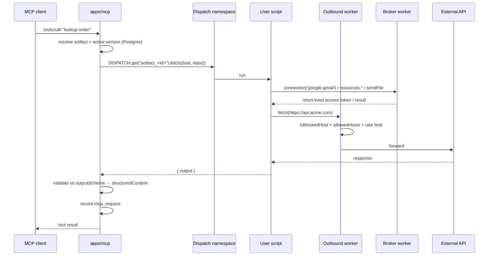

# Custom tools (Workers for Platforms)

Plan of record for letting users **write their own tools** instead of picking from a fixed catalog. Companion to [ARCHITECTURE.md](ARCHITECTURE.md) and the [tools README](../apps/mcp/src/tools/README.md); read those first.

## The problem

Our tool catalog is a finite guess at what users need. When a user's use-case isn't in it, they're stuck — and the only fix available to us is to hand-write another native handler. That's a treadmill we lose: every vendor now ships their own MCP server, and the long tail of "call my internal API, transform it, then post to Slack" is infinite.

`mcp-proxy` and `http-endpoint` already cover two thirds of the escape hatch: a vendor's official MCP server, and a single HTTP call. What's missing is **logic** — multi-step flows, transforms, branching, and anything that needs to combine a credential with a computation.

## The answer

Users write a **Cloudflare Worker** — their own code, their own tool names, descriptions, input schemas, and output schemas — deployed to a Workers for Platforms dispatch namespace and registered as MCP tools on their artifact. They get the platform's OAuth connections and file-send capability as **host bindings**, so their code never touches a refresh token or a 40MB attachment.

Three properties this must have:

1. **The catalog doesn't disappear.** Custom code sits *beside* the shipped integrations rather than replacing them — same cards, same Connect button, plus two tabs for the things a user writes. A user whose case the catalog covers should never have to write code for it.
2. **Secrets never enter user code.** The broker mints short-lived access tokens; refresh tokens and client secrets stay server-side.
3. **Boot never depends on the runtime.** Tool names and schemas live in Postgres, written at publish time — the same configure-time-discovery trick `mcp-proxy` already uses ([tools README](../apps/mcp/src/tools/README.md#key-design-choice-configure-time-discovery)).

---

## Scope decisions

### Keep (native)

| Group | Why it stays |
|---|---|
| `resources` (`list-resources`, `read-resource`, `send-resource`, `search-resources`) | The RAG core. The channel runner intercepts these **by name** ([runner.ts](../apps/api/src/controllers/channel/runner.ts)); `send-resource` is the only path that streams a file without transiting a 128MiB Worker. |
| `list-prompts` | Same — server-introspection, not a vendor wrapper. |
| `gmail` (18), `outlook` (18), `slack` (5) | These call the resource-handler container for attachments and uploads ([gmail:169](../apps/mcp/src/tools/gmail/index.ts#L169), [outlook:186](../apps/mcp/src/tools/outlook/index.ts#L186), [slack:169](../apps/mcp/src/tools/slack/index.ts#L169)). User code **cannot** reproduce that — see [`sendFile`](#the-sendfile-capability). They also double as the reference implementation for the templates. |
| `web` (`web-search`, `web-extract`) | A capability, not an integration — it's what lets the model cite sources. Load-bearing for the RAG story. |
| `greeting` | Zero-config smoke test for "is my MCP endpoint alive". |
| `http-endpoint`, `mcp-proxy` | Unchanged. `http-endpoint` becomes the **Free tier's** custom tool. |

### Remove

**Nothing.** This is a reversal, and worth stating as one: an earlier draft cut `google-calendar` (6 tools) and `calcom` (4) on the reasoning that both are pure vendor wrappers with no container dependency, which convert cleanly to templates.

Every word of that depended on templates existing. Absent them — see [Phase 8](#phase-8--templates--dropped) — removing a shipped integration does not convert it into anything. It deletes a working tool and offers the user an empty editor in its place, which is a worse product for the only people it affects. The cost of keeping a native group is now a handler and a catalog entry the compiler keeps in step ([the catalog is code](#1-the-tool-catalog-is-code-not-rows)), not a per-environment seeding step that could silently disagree with itself. That was most of the maintenance argument, and it is gone.

So the native surface stays at 12 groups and 62 tools. Custom code sits beside it. The [removal checklist](#removal-checklist) is kept as reference for what removing a native group would touch, should that ever be worth doing — the mechanics are real even though nothing is scheduled.

### Add

- `custom-code` — a third **proxied definition**, structurally parallel to `http-endpoint` and `mcp-proxy`.
- Workers for Platforms dispatch namespace + outbound worker.
- A **broker worker** exposing connections, secrets, resources, and `sendFile` to user code.
- `@ganju/sdk` (npm) and a `ganju` CLI.
- `artifact_tool_version` — draft / publish / rollback.
- **Connections** as a first-class concept, in two modes: *managed* (our OAuth app) and *BYO app* (user's client id/secret).

---

## Architecture



### Unit of deployment: one script per artifact

One WfP script can export many tools (route on tool name in the request body). The boundary sits at the **artifact**, because the artifact *is* the MCP server, it's the thing with a slug, and it's the natural unit for `ganju deploy`.

Since `artifact` is 1:1 with `project` ([DATA_MODEL.md](DATA_MODEL.md#the-artifact-and-its-children)), **script count == artifact count == project count**. We already gate projects per plan — no new "worker quota" concept is needed.

Script naming: `artifact_<artifactId>` (id, not slug — slugs are user-editable).

### Authenticating user code to the broker

A service binding carries no caller identity. At **upload time**, inject a per-script secret binding `GANJU_TOOL_TOKEN` scoped to `{ artifactId }` and rotated on every publish. The broker verifies the token, resolves the artifact, and serves only that artifact's connections/resources/secrets. Never accept an artifact id from the request body.

### Egress control

All outbound `fetch` from user scripts goes through the WfP **outbound worker**, which applies:

- `isBlockedHost` (shared SSRF screen — private/loopback/link-local)
- the tool's `allowedHosts`, when set
- the per-artifact rate limit (reuse `HTTP_ENDPOINT_RATE_LIMITER`, see [rateLimit.ts](../apps/mcp/src/utils/rateLimit.ts))

Enforce here, **not** in the SDK — anything in the isolate is user-editable and therefore not a control.

### The `sendFile` capability

The one thing user code genuinely cannot do: a user Worker is capped at 128MiB, has no R2 binding, and no path to `RESOURCE_HANDLER`. So attachments and large uploads stay a **host capability**:

```ts
await ctx.sendFile({
  to: 'gmail',
  uris: ['resource://invoices/2026-q3.pdf'],
  message: { to: 'ap@acme.com', subject: 'Q3 invoice', body: 'Attached.' }
});
```

The broker forwards to the resource-handler container exactly as the native handlers do today — and since Phase 5 they share the resource→bytes step, [`resolveAttachment`](../packages/utils/src/attachment.ts). Those three handlers are still the reference implementation for everything downstream of it (MIME assembly, Graph upload sessions, Slack's external-upload flow), so **do not delete them.**

### Boot contract

The MCP boot loop must **never** call the dispatcher to discover tools. Names, titles, descriptions, `inputSchema`, and `outputSchema` are written to Postgres at publish time and read from the active version at boot. A slow or failed dispatch must not break `tools/list` for the whole artifact.

Parse failures skip-and-log, never abort boot — same pattern as [mcp/index.ts:415-431](../apps/mcp/src/controllers/mcp/index.ts#L415-L431).

---

## Data model

One `artifact_tool` row of key `custom-code` per artifact (many MCP tools from one row — the `mcp-proxy` shape).

```ts
// artifact_tool.config
{
  activeVersionId: string | null;   // FK → artifact_tool_version
  allowedHosts?: string[];
  connections?: string[];           // providers this script may request
  timeoutMs?: number;               // default 10_000, cap 30_000
  resourceAccess?: 'own' | 'all';   // default 'own' — see Phase 5b
}
```

New table `artifact_tool_version`:

| Column | Notes |
|---|---|
| `id` | uuidv7 |
| `artifactToolId` | FK → `artifact_tool` |
| `version` | monotonic int per tool |
| `status` | `draft` \| `published` \| `archived` |
| `scriptTag` | WfP script version tag |
| `tools` | JSON — `[{ name, title, description, inputSchema, outputSchema? }]` |
| `sourceKey` | R2 key of the uploaded bundle |
| `sourceHash` | dedupe / integrity |
| `error` | last publish/validation error, surfaced in the UI |
| `publishedAt`, `createdAt`, `createdByUserId` | |

**Code and contract move atomically** — one row holds both the script tag and the schemas, and boot reads only `activeVersionId`. This is what makes rollback safe.

### Output schemas

MCP supports `outputSchema` + `structuredContent`, but [`ToolDefinition`](../apps/mcp/src/tools/types.ts#L56-L65) has no `outputSchema` and the boot loop never passes one. Additive change, needed for user-declared outputs to be real rather than decorative. Applies to native tools too.

---

## SDK surface

```jsonc
// ganju.json
{
  "artifact": "acme-support",
  // Written by `ganju link`, because every endpoint is keyed by them. The slug
  // above is the readable half — a deploy reporting a uuid would leave the
  // author checking the dashboard to find out which server they just changed.
  "organizationId": "…",
  "projectId": "…",
  // Row-level, because that is the level they are enforced at: one script per
  // artifact, one set of rules for all of it. See below.
  "connections": ["google-gmail"],
  "allowedHosts": ["api.acme.com"],
  "timeoutMs": 10000,
  "resourceAccess": "own",
  "tools": [
    {
      "name": "lookup-order",
      "title": "Look up order",
      "description": "Find an order by its id. Use when the customer gives an order number.",
      "entry": "src/lookupOrder.ts",
      "input":  { "type": "object", "properties": { "orderId": { "type": "string" } }, "required": ["orderId"] },
      "output": { "type": "object", "properties": { "status": { "type": "string" } } }
    }
  ]
}
```

**`connections` and `allowedHosts` sit beside `tools`, not inside one.** An earlier sketch here put them on each tool, and that is not what shipped: they live on `artifact_tool.config` and the broker and the outbound worker read them per *script*, while the manifest entry a tool becomes carries only `name`, `title`, `description`, `inputSchema` and `outputSchema`. Per-tool egress would mean a second gate somewhere between the dispatcher and the isolate, and there is no such place — one script is one isolate with one set of bindings. `timeoutMs` and `resourceAccess` live at the same level for the same reason.

They travel **with the deploy**: `POST …/custom-code/version` takes `config` alongside `manifest` in one request, because they describe how the uploaded code is allowed to run and belong to the same review as the code. `activeVersionId` is never among them — only publish and rollback move that.

**Secrets are not in this file, and must not be.** `ctx.secret('STRIPE_KEY')` resolves an `artifact_credential` row through the broker at call time, so a secret is a thing you send once rather than a value committed next to your source. The CLI manages them through the credential endpoints — see [Phase 7](#phase-7--cli-).

**JavaScript and TypeScript only**, which is one language as far as we're concerned: a bundle is already compiled by the time it reaches the upload endpoint. Python Workers are a different upload shape (`index.py` main module, `python_workers` flag) and would need their own SDK to answer the health probe, so a Python bundle fails at publish rather than half-working. Not planned for v1.

**`entry` is what makes the tool name appear once.** When every tool names one, the CLI generates the `createHandler` map from the manifest, so `lookup-order` vs `lookupOrder` — the mistake the health probe exists to catch — cannot be made. Declaring no `entry` at all is the other supported shape: `main` (default `src/index.ts`) is the author's own map, which is what the dashboard's editor produces. A mix of the two is refused, because both readings silently drop half of what the author wrote.

One script serves every tool an artifact declares, so the deployed module's default export routes on the tool name. `defineTool` is there for inference — without it `input` and `ctx` are implicitly `any`, and typed `ctx` is most of the reason to use the SDK at all.

```ts
import { createHandler, defineTool } from '@ganju/sdk';

export default createHandler({
  'lookup-order': defineTool(async (input, ctx) => {
    const { accessToken } = await ctx.connection('google-gmail');
    const res = await fetch(`https://api.acme.com/orders/${input.orderId}`);
    return { status: (await res.json()).status };
  })
});
```

The keys must match the manifest's tool names — publish verifies that against what the bundle actually exports.

| `ctx` member | Contract |
|---|---|
| `ctx.connection(provider)` | `{ accessToken, provider, expiresAt }`. Short-lived. **Never** the refresh token or client secret. Throws when the provider isn't in the tool's declared `connections`. |
| `ctx.secret(name)` | Per-tool `artifact_credential` (provider `custom-code`), addressed by label, same orphan-cleanup as `http-endpoint`. |
| `ctx.resources.search / read / list` | Reuses the same embedding + resource read the native RAG tools use. Binary resources are refused rather than base64'd — that's what `sendFile` is for. |
| `ctx.resources.create(opts)` | Writes a resource on the artifact — inline text or file bytes. Not indexed unless `index: true`, so script output stays out of the corpus by default: listable and sendable, searchable only on request. |
| `ctx.resources.delete(uri, opts)` | Removes a resource, and with `children: true` everything beneath it. Idempotent — a uri with nothing behind it answers `deleted: false` rather than throwing. |
| *resource access* | How far `create` and `delete` reach is the tool's `config.resourceAccess`: `own` (default) confines them to what a script wrote; `all` lets the tool replace and remove uploaded and crawled resources. Granted at publish time, enforced by the broker. |
| `ctx.sendFile(opts)` | Broker → resource-handler container. Destination is `gmail`, `outlook` or `slack`, and must be in the tool's declared `connections` — sending as an account is the same privilege as reading its token. Bytes never enter the isolate. |
| `ctx.log(...)` | Buffered in the isolate, returned with the result, recorded on `mcp_request`. Capped at 50 lines. |
| `fetch` | Global, screened by the outbound worker. |
| *not available* | `require`, `process`, `fs`, raw DB, other artifacts. No `nodejs_compat` — user scripts get the plain Workers runtime. |

The SDK is typed sugar over the binding. **The security lives in the binding**, not the package — a library that performed the token exchange itself would expose the client secret to user code.

---

## Phases

Ordered so that nothing user-visible is removed before its replacement exists.

### Phase 0 — Prerequisites

- [x] **Workers for Platforms enabled** on the account (14 Aug), and both dispatch namespaces created:

  | Namespace | Id |
  |---|---|
  | `ganju-tools-development` | `8a9bdfa9-2f90-49c6-b193-86f76d5a5683` |
  | `ganju-tools-production` | `ce1faf54-defd-4051-be55-24d3a174520d` |

  Worth knowing if this is ever done again: the entitlement takes a few minutes to reach the API. `wrangler` kept returning `10121 You do not have access to dispatch namespaces` well after the dashboard showed the product as Active — an empty `[]` from `wrangler dispatch-namespace list` is the signal it has landed. Creating both namespaces up front costs nothing: the $25/mo is a per-account platform fee and namespaces aren't a billed unit, so the charge starts with the first script deployed into one, drawing on an account-wide 1,000-script allowance.
- [x] Confirm current WfP pricing → verified August 2026 in [PRICING.md](PRICING.md#part-1--what-things-actually-cost-us): $25/mo including 1,000 scripts, then $0.02 per script per month
- [x] Decide: managed-only connections for v1, or managed + BYO app from the start → **managed-only**, BYO deferred (Phase 5)
- [x] Decide: is the LLM-generates-the-tool flow in v1, or is the CLI the launch surface → **the CLI and the dashboard editor**, codegen deferred until a user asks — see [open question 2](#open-questions)
- [ ] **Google verification + CASA for the restricted Gmail scopes** — not started. The only prerequisite on this list whose clock somebody else runs, and the one item here that a production date depends on rather than the other way round. See [OAuth broker liability](#risks)

### Phase 1 — Data model + publish API (no runtime) ✅

- [x] `artifact_tool_version` table + Drizzle relation in [schema.ts](../packages/db/src/lib/schema.ts) ([migration 0064](../packages/db/drizzle/0064_careless_hellfire_club.sql)); [DATA_MODEL.md](DATA_MODEL.md) updated
- [x] `custom-code` constants in [constants.ts](../packages/utils/src/constants.ts): `TOOL_DEFINITION_KEY_CUSTOM_CODE`, `CREDENTIAL_PROVIDER_CUSTOM_CODE` (in `PER_TOOL_CREDENTIAL_PROVIDERS`), version statuses, script/source-key prefixes, and the limits (`CUSTOM_CODE_MAX_TOOLS = 50`, timeouts, `CUSTOM_CODE_MAX_BUNDLE_BYTES = 3 MB`)
- [x] `CUSTOM_CODE_CONFIG` zod schema in [schema.ts](../packages/utils/src/schema.ts), plus `CUSTOM_CODE_MANIFEST` and the four request schemas
- [x] ~~Seed `tool_group` + `tool_definition` rows for `custom-code`~~ — superseded by [Phase 6](#1-the-tool-catalog-is-code-not-rows): the catalog is code now, the two tables are gone, and the seed script with them
- [x] API: `POST …/artifact/custom-code/version`, `PUT …/version/:versionId/bundle`, `POST …/version/:versionId/publish`, `POST …/version/:versionId/rollback`, `GET …/versions` — handlers in [artifact/index.ts](../apps/api/src/controllers/artifact/index.ts), helpers in [artifact/customCode.ts](../apps/api/src/controllers/artifact/customCode.ts)
- [x] Server-side manifest validation: tool-name charset/length, reserved-name check against `RESOURCE_TOOL_KEYS`, uniqueness, schema compilation via `jsonSchemaToZodShape`, per-plan tool cap

Three things came out differently from the sketch above, all in [customCode.ts](../apps/api/src/controllers/artifact/customCode.ts):

- **Bundle upload is its own endpoint.** One request carries one body, and the manifest is JSON while the bundle is binary — the same reason resource upload is split from resource create. Creating a version first also means a failed upload leaves a visible draft rather than nothing.
- **The `artifact_tool` row is created on first use.** `ganju deploy` (Phase 7) is a thin client of these endpoints and has to work against a fresh artifact; the card that would otherwise install the row is Phase 6. The quota check and counter bump mirror `createTool`, so an install still costs a tool slot.
- **`activeVersionId` is never accepted from a request.** Publish and rollback own it, because they're what check that a version belongs to this tool and actually has a bundle. A config edit through the generic tool route has its value overwritten with what's already stored.

Also fixed while here: removing a custom-code tool now deletes its `provider = 'custom-code'` credentials. The generic cleanup in `removeTool` follows `config.auth.credentialId`, which custom-code secrets don't use — they're looked up by label from inside the script — so they would otherwise have been orphaned.

**Verified end to end** against the dev database with a real session: create → upload → publish → second version → rollback, plus the guards (no bundle, wrong version state, unknown/foreign version id, reserved and duplicate tool names, uncompilable schema, over-cap manifest, over-quota plan, no session). Test rows were removed afterwards.

One thing that surfaced and is worth knowing when adding endpoints here: `handleError` derives the response status from **keywords in the thrown message** ([errorHandler.ts](../packages/db/src/utils/errorHandler.ts)) — `not found` → 404, `already` → 409, `invalid`/`required`/`must be`/`exceeds` → 400. A message matching none of them becomes an opaque 500, which is what three of these guards did on the first run. They're worded to land on the right status now.

### Phase 2 — Runtime ✅

- [x] Broker worker ([apps/tool-broker](../apps/tool-broker)): token verification, `connection`, `secret`, `resources.*`. `sendFile` answers 501 — see below. `log` moved into the isolate, also below
- [x] Outbound worker ([apps/tool-outbound](../apps/tool-outbound)): `isBlockedHost` + `allowedHosts` + per-artifact rate limit
- [x] Publish pipeline ([customCodeDeploy.ts](../apps/api/src/utils/customCodeDeploy.ts)): bundle → upload to dispatch namespace as `artifact_<id>` with `GANJU_TOOL_TOKEN` + broker service binding → smoke test → flip `activeVersionId`
- [x] `DISPATCH` binding in [apps/mcp/wrangler.toml](../apps/mcp/wrangler.toml) (and in `apps/api`, for the smoke test only). The per-user-script ceiling is now **5s**, set as `limits.cpu_ms` in the upload metadata — per script rather than per namespace, so it can be raised for one customer without raising it for all
- [x] `@ganju/sdk` ([packages/sdk](../packages/sdk)) — pulled forward from Phase 7, because the invoke protocol has to have a client before any of the above is testable. Only the CLI stays in Phase 7

Five things worth knowing:

- **The tool token is signed, not stored.** `GANJU_TOOL_TOKEN` is an HMAC over `{artifactId, versionId}` ([customCodeToken.ts](../packages/utils/src/customCodeToken.ts)), not a row. The broker verifies the signature *and* that the version is still `config.activeVersionId` — a check it makes against the row it already reads for the connection allow-list. That is what makes "rotated on every publish" real: a superseded script's credential stops working the instant a newer version lands, with no token table to keep in step.
- **`ctx.log` never touches the broker.** Log lines are buffered in the isolate and returned with the result, then recorded on the `mcp_request` row. A log call that cost a network round trip would be a log call nobody makes.
- **Publish now fails when the runtime isn't configured**, rather than degrading to a database-only state change. A publish that moves the pointer without deploying advertises tools to every MCP client with nothing behind them — the same silent orphan the [removal checklist](#removal-checklist) warns about, self-inflicted. Missing env vars are named in the error.
- **The smoke test earns its keep.** The manifest and the bundle arrive through different endpoints and nothing connects them until this: the reserved `__ganju_health` tool asks the deployed script which names it actually exports, and publish refuses when they don't cover what the manifest declares. `lookup-order` vs `lookupOrder` used to survive to the first customer call.
- **`sendFile` was still Phase 5 at this point.** The route existed and returned 501; it landed in Phase 5 below.

Also: `apps/api`'s OAuth provider table moved to [@ganju/utils](../packages/utils/src/oauthProviders.ts). The broker needs the same client env names and token URLs to refresh a connection, and two copies would have drifted the first time a provider was added.

### Phase 3 — MCP integration ✅

- [x] `custom-code` branch in the boot loop ([mcp/index.ts](../apps/mcp/src/controllers/mcp/index.ts)) — one query loads every active version's manifest before the tool loop, registers one tool per entry, and skip-and-logs a schema that no longer compiles
- [x] `outputSchema` support: added to [`ToolDefinition`](../apps/mcp/src/tools/types.ts), passed to `registerTool`, `structuredContent` returned with a text fallback. Native tools can opt in through the same path
- [x] Record in `mcp_request` with `artifactToolId` + the specific `toolName`, matching the proxied convention
- [x] Reuse `allowProxyToolCall` for the per-artifact limit — the broker shares the same key space, so a tool call that fans out into fifty connection lookups spends one budget, not two

One trap found here: a tool that declares an `outputSchema` **must** return `structuredContent` or be flagged `isError`, or the MCP SDK refuses to serialize its own result. A user returning a bare string from a tool they declared an object output for would otherwise turn into a protocol failure for the whole call, so the dispatcher converts that case into an ordinary tool error.

### Phase 2/3 — manual setup ✅ (development)

None of this is code; all of it was account state this branch could not create. Checked against Cloudflare on 22 Aug, not against memory:

1. **A Cloudflare API token** with `Workers Scripts:Edit`, as `CUSTOM_CODE_CF_API_TOKEN`, plus `CLOUDFLARE_ACCOUNT_ID` — both set on `ganju-api-development`.
2. **`CUSTOM_CODE_TOKEN_SECRET`** — set on `ganju-api-development` and `ganju-tool-broker-development`. Secrets cannot be read back, so that they hold the *same* value is the one thing here only a real publish proves.
3. **Both workers deployed** — `ganju-tool-broker-development` and `ganju-tool-outbound-development` are live, and the `ganju-tools-development` dispatch namespace exists.
4. ~~Seed `custom-code` on production~~ — obsolete. The catalog is code now, so there is nothing to seed; see [Phase 6](#1-the-tool-catalog-is-code-not-rows).

Production has none of it, and is a separate exercise.

What remains is a deploy rather than a setting: every deployed development worker predates the dashboard work, while the development database is already migrated past it. See [Operational state](#operational-state).

### Phase 4 — Channel runner ✅

- [x] Map custom-code call-names back to their parent `artifact_tool` id — the third branch alongside `http-endpoint` / `mcp-proxy` at [runner.ts:507-524](../apps/api/src/controllers/channel/runner.ts#L507-L524), so `channel_message_usage.artifactToolId` populates and "Open in Tools" navigates
- [x] Confirm the tool-list size guard: unlimited user tools × schema-per-turn is a real token cost — `CHANNEL_MAX_TOOLS = 40`, enforced in the runner

Nothing else was needed to make custom tools work in a channel: the runner takes its tool list from `mcp.client.listTools()`, so Phase 3's boot registration already exposes them. Only attribution was missing.

**This is the one call-name source that needs a second query.** `http-endpoint` and `mcp-proxy` derive their names from the install row the runner already loaded; custom-code's live on the active version, in another table. That read is issued [alongside `loadRecentHistory`](../apps/api/src/controllers/channel/runner.ts#L439) — the turn waits on history regardless, so attribution costs no latency — and is skipped entirely when no install has a published version, which is every artifact today.

**Verified against the dev database**: a custom-code install with a published two-tool version plus a superseded one, on a real artifact with native tools. Both active names resolve to the install, a superseded version's names resolve to nothing, an active-version pointer of `null` issues no query, and a manifest entry named after an installed native tool does not take that name. Also exercised end to end below.

### The tool-name namespace ✅

Writing the mapping above surfaced the question it depends on: what happens when a user-chosen name equals a native tool's key? Every tool on an artifact registers into **one flat namespace**, so `gmail-send-email` as a custom tool name is a genuine collision — and both resolutions were bad. Whichever registered second was silently dropped ([mcp/index.ts](../apps/mcp/src/controllers/mcp/index.ts) skips a claimed name), and the runner attributed the call to the other one. Worse, the winner wasn't stable: the relational query that loads `artifactTools` has no `ORDER BY`.

Only `RESOURCE_TOOL_KEYS` was reserved, on custom-code manifests. `http-endpoint`'s `name` — shipped, and the Free tier's custom tool — had no check at all, so it could take `send-resource` and shadow the RAG core the channel runner intercepts by name.

Closed in three parts:

- **Reserved by namespace, not by blocklist.** [`isReservedToolName`](../packages/utils/src/reservedToolName.ts) owns the group prefixes (`gmail-`, `outlook-`, `slack-`, `calendar-`, `calcom-`, `web-`) plus the unprefixed keys. A list of the ~60 shipped keys would answer the wrong question: a name that is free at publish time is taken the moment someone installs a native tool using it. Owning the prefix means a tool added to any of those groups later can never collide with a name already published. `mcp-proxy` needs no entry — its names are always `<prefix>__<remote>`, and no native key contains the separator.
- **Enforced on the write path only.** `CUSTOM_CODE_MANIFEST` and the new `HTTP_ENDPOINT_CONFIG_WRITE` carry the rule; the schemas apps/mcp reads a stored row with do not. Tightening a rule must never stop an already-installed tool from registering — that failure is invisible to the owner, and it's the same silent orphan the [removal checklist](#removal-checklist) warns about. There are no custom-code installs anywhere yet, but `http-endpoint` installs on production can't be checked from here, so the permissive read path is what makes this safe to ship.
- **Registration order made deterministic.** apps/mcp now sorts natives ahead of the three proxied definitions, ties broken by id. A legacy name that is reserved today keeps working and simply loses the tie to the native tool — which is also how the runner attributes it, so the tool that runs and the tool the usage row points at are finally the same one.

One thing worth knowing: the message is a fixed string in constants rather than one that quotes the offending name, because [`localizeZodIssue`](../packages/utils/src/localizeZodIssue.ts) keys its translations on the exact English text. A 50-tool manifest still pinpoints the entry — through the issue `path` (`tools.3.name`), not the message. It also had to contain a word `matchStatus` recognises, or the http-endpoint path, which re-throws the issue message as a plain `Error`, would have answered 500 instead of 400.

### Verified on dev, end to end

Both workers running locally against the dev database, driven through the real HTTP surface with a real signed session cookie — not the schemas in isolation:

| | |
|---|---|
| `POST …/custom-code/version` with `gmail-send-email` | 400, `{ path: 'manifest.tools.1.name' }` — the entry, not just the request |
| …with `gmail-a-tool-we-have-not-shipped-yet` | 400 — the namespace holds, not just today's keys |
| …with ordinary names | 200 |
| `POST …/artifact/tool` naming an endpoint `send-resource` | 400, with the reason — not the opaque 500 the old wording would have produced |
| …named `acme-ping` | 200 |
| `tools/list` on the artifact | both custom tools registered from the active version |
| a stored manifest entry named `greeting`, alongside the native install | native handler wins, squatter dropped, artifact otherwise intact |
| five consecutive boots | identical tool list every time |
| call-name → install mapping | custom names → the custom-code row, `greeting` → the native row, `acme-ping` → the http-endpoint row |

The ordering change is load-bearing, confirmed by reverting it: with the loop back on the unordered query the squatter won and shadowed the native handler, exactly the failure the sort exists to prevent.

Two notes on running this again. Publishing can't be exercised locally — it needs the Cloudflare credentials in the manual-setup list — so `config.activeVersionId` was moved directly, which is the only thing boot reads. And the developer's own org is FREE and already past its tool cap, so every create 402s; the run scaffolds a throwaway PRO org rather than raising the plan on live data. Everything it created was removed afterwards.

**Verified**: every group prefix and unprefixed key rejected, case-insensitively; near-misses (`webhook-notify`, `gmailer`, `my-greeting`, a proxied `github__…`) accepted; the manifest issue carrying the right path and message; both read paths still accepting a name the write paths now refuse; the message mapping to 400 and translating in `es`; and the boot ordering landing natives-first regardless of input order.

### Phase 5 — Connections + `sendFile` ✅ (managed-only)

- [x] **Connections surface** — `GET …/artifact/connections` ([connections.ts](../apps/api/src/controllers/artifact/connections.ts)) reports every managed provider and where the artifact stands with it: `connected`, `needsReauth`, `credentialId`, `expiresAt`, `scopes`, and `configured`
- [x] **`http-endpoint`'s `auth.kind: 'oauth'`** now has its picker. The dispatch plumbing really was already there — apps/mcp resolves `auth.credentialId` against the artifact's *refreshed* credentials, so a managed row worked the moment one could be selected
- [x] **`sendFile` in the broker** ([sendFile.ts](../apps/tool-broker/src/utils/sendFile.ts)) — `gmail`, `outlook`, `slack`, forwarding to the container routes the native handlers already drive
- [ ] BYO-app mode: per-org client id/secret — **deferred until something asks for it**, see [open question 1](#open-questions)

Five things worth knowing:

- **`sendFile` passes the connection allow-list, not a separate one.** Sending as an account is the same privilege as reading its token, so a destination resolves to a provider (`gmail` → `google-gmail`) and goes through the identical gate `ctx.connection()` does. Without that, a tool denied the Gmail token could still send mail as that account by naming a different capability. The gate is now one function both routes call.
- **Slack takes exactly one file per call.** Gmail and Outlook's container routes read `form.getAll('attachment')`; Slack's reads `form.get('attachment')`, because its external-upload flow is three round trips *per file*. A uniform "up to 10" would have accepted ten and delivered the first, silently — so the Slack variant is typed to one and rejects more.
- **A vendor failure comes back as 502, whatever the vendor said.** Passing Gmail's 401 through would read inside the isolate as "your broker token is bad" when it means the artifact's connection was revoked.
- **Resource → attachment bytes is now one implementation.** [`resolveAttachment`](../packages/utils/src/attachment.ts) — R2 object or inline text, mime type, filename, and the `.txt` fallback for a title with no extension. It had been copied three times; the broker would have been the fourth. Size caps stay at the call sites, because each destination's are genuinely different (Gmail caps the combined raw size, Outlook caps per-file *and* combined, Slack caps per-file).
- **Declared connections are validated on write.** `config.connections` was a free string array, so `google_gmail` surfaced only as a runtime 403 saying the provider wasn't declared — true, and useless, because it *was* in the list. `CUSTOM_CODE_CONFIG_WRITE` checks each entry against the provider table; the read shape still doesn't, so a stored row naming a retired provider keeps registering. Same split, same reason, as the reserved-name rule.

**Verified**: the destination union (multi-attachment Gmail accepted, two-file Slack rejected, unknown destination, empty and over-cap uri lists, missing Slack channel); both connection-validation paths and the issue path pinpointing the offending entry; the message mapping to 400 and translating in `es`; and `resolveAttachment` across stored files, inline text, a missing R2 object, an empty resource, the `attach`/`upload` verb switch, and empty-string content still counting as content. The three native handlers were re-pointed at the shared helper with their error strings and caps unchanged.

**Verified on the deployed dev environment**, end to end: publish deployed to the dispatch namespace and passed the smoke test; all ten probe tools registered from the active version; the outbound worker refused a host outside `allowedHosts` and a link-local address in 8-11ms; `ctx.connection` minted a real access token; `sendFile` to an undeclared destination was refused by the same gate as `ctx.connection`; publish/rollback moved the tool list between 10 and 1 and back; every call recorded with `artifactToolId`, and `ctx.log` output landed on the row. A `sendFile` carrying a thread id Gmail could not resolve came back as *"Invalid thread_id value"* — Gmail's own message, returned through broker → container → Gmail with nothing delivered.

That probe settled the open question about the outbound worker: it does **not** intercept a container binding. Only global `fetch` is screened, which is why the embedding host needs an exemption and the container call never did.

Two bugs surfaced only because this ran against a real vendor, and both were fixed as shared rules rather than local patches:

- **Vendor errors read as `[object Object]`.** Gmail and Graph answer with `{ error: { code, message } }` — an object — where Slack and the container's own guards use a string, and every call site assumed the string. [`describeVendorError`](../packages/utils/src/vendorError.ts) now normalises it, applied in the broker's `sendFile` **and in all three native handlers**, which had the same assumption and would have shown a customer `[object Object]` for any structured Gmail failure.
- **A uri could resolve to two different rows.** A website crawl seed and the page indexed beneath it share a uri, and only the child carries content. The MCP boot loop already excluded seeds; the broker did not — so `ctx.resources.read` returned 146 characters for a uri that `sendFile` simultaneously called empty, and roughly half of all crawled urls were unsendable. [`isExposedResource`](../packages/utils/src/exposedResource.ts) now owns the rule, applied in the boot loop and in the broker's `list`, `read` and `sendFile`; `read` also lost the `.limit(1)` that made it a coin flip. No unique constraint was added — the crawler creates those pairs deliberately, so a constraint would break crawling rather than fix anything.

Re-verified after the fix: the script's resource view dropped from 108 to 106, matching what MCP exposes exactly, with no duplicate uris; the previously-ambiguous uri read the same on three consecutive calls; and a `sendFile` naming it reached Gmail exactly as a uniquely-named resource does.

### Phase 5b — `ctx.resources.create` / `.delete` ✅

`sendFile` takes resource **URIs, never bytes**, and `ctx.resources` was read-only — `search`, `read`, `list`. So a script could deliver a file already on the artifact and could not produce one, which meant the flow a tool author reaches for first — *"build the report, then email it"* — didn't work.

| | before | now |
|---|---|---|
| Send a file already in the artifact's resources | ✅ | ✅ |
| Send tool-generated text as the mail *body* | ✅ | ✅ |
| Generate a PDF/CSV in the tool and attach it | ❌ | ✅ |
| Fetch a file from an external API and attach it | ❌ | ✅ |
| Save anything back as a resource for later | ❌ | ✅ |

- [x] `ctx.resources.create({ title, content | bytes, mimeType?, uri?, description?, fileName? })` — broker route + SDK surface ([createResource.ts](../apps/tool-broker/src/utils/createResource.ts))
- [x] Storage-quota helpers moved to [@ganju/db](../packages/db/src/lib/plan.ts), with apps/api re-exporting them through its own `Plan`
- [x] `RESOURCE_SOURCE_TYPE_CUSTOM_CODE` as the provenance marker; a script may replace only rows carrying it
- [x] Indexing: **off by default**, behind an explicit flag — see below
- [x] `ctx.resources.delete(uri, { children })` — the same access rule, idempotent, cascade opt-in
- [x] `config.resourceAccess: 'own' | 'all'` — the capability that lets a tool prune what it did not write
- [x] `index: true` on create — opt-in entry into the search corpus, on the queue apps/api already owns

All four decisions landed as the groundwork predicted, and each is worth restating with what actually shipped:

- **Indexing is off by default, and that default is the load-bearing part.** Content in the corpus is content the assistant will answer *other people's* questions from, so it has to be a decision rather than a side effect of writing a file. `index: true` puts a resource in, on the same `INDEX_QUEUE` apps/api already produces to, and spends the embedded-content quota — a separate and far more expensive budget than raw storage, so only indexing is gated on it. Two refusals rather than silent no-ops: a deployment with no queue binding, and a file whose type no extractor can read (which would index to nothing and look like it had worked). An unindexed row is written `COMPLETED` because nothing is coming for it; an indexed one is genuinely `PENDING` until the job flips it.
- **The quota is charged on the delta.** Inline `content` sets `size`, so both payload shapes count toward `sumRawStorage`. What's charged is `size - previous.size`, which is what lets a daily job replace yesterday's 2MB report without eventually failing against its own history. The broker holds `artifactId` and not `organizationId`, so every write costs one join through `project` to find out whose budget it spends.
- **Provenance is a declared capability, not a fixed rule.** `RESOURCE_SOURCE_TYPE_CUSTOM_CODE` marks what a script wrote, and `config.resourceAccess` decides what that buys: `own` — the default and the safe floor — confines a tool to those rows, so a buggy or model-generated tool has none of the customer's documents to destroy. `all` lifts it, which is what a tool whose job is to prune a stale crawl actually needs. It is declared in the tool's config and enforced by the broker, so a script cannot grant it to itself — the same shape as `allowedHosts` and `connections`, and for the same reason: a capability the code can widen is not a capability, it is a comment. The check runs against **every** row at the uri, not the addressable one, because a crawl seed shares its page's uri and belongs to the crawler either way.
- **`bytes` transits the isolate, and says so.** Inline text is capped at 1MB (it becomes a column every resource listing reads); bytes at 10MB (an R2 object nothing reads until it is sent). The file ceiling sits under every destination's attachment cap, so anything a script can create it can also send. This is explicitly **not** the no-transit guarantee `sendFile` makes: the script is holding these bytes, and the SDK carries them again as base64, so the real footprint is roughly 2.3× the declared cap. The SDK accepts an `ArrayBuffer`/`Uint8Array` directly and encodes for the wire, because a caller handed a base64-only API gets it wrong the first time.

Two things surfaced while auditing `sourceType`, which the groundwork correctly flagged as needing one:

- **A script-created resource could produce a dead link in a channel.** [collectSources](../apps/api/src/controllers/channel/sources.ts) builds a source from a `read-resource` call, not only from a search hit — and a created resource *is* readable — so the model could cite one in a channel turn. Both formatters then branched on `sourceType === 'FILE'` to choose a download link over a web link, and anything else fell through to the web branch, emitting a button pointing at `resource://q3-report`. The predicate was never really "is it a FILE"; it is "does this resolve to bytes we serve". `isDownloadableSource` now owns it, applied in both formatters and in the channels view.
- **It would have been invisible in the dashboard's default view.** The Files folder is built from `sourceType === 'FILE'`, so a created resource appeared only under *All*. It now sits with uploaded files — it is a file, and the badge already says where it came from — rather than getting a folder of its own that most artifacts would render empty.

Also folded in: the dashboard's title→uri derivation and the broker's now share [resourceUriFromTitle](../packages/utils/src/resourceUri.ts). They have to agree, or a script asked to replace "the Q3 report" can't address the row the dashboard made.

**Verified against the dev database** by [scripts/verify-custom-code-resources.mjs](../scripts/verify-custom-code-resources.mjs), which bundles the real broker module and drives it rather than re-implementing its SQL — 125 checks, all passing. It scaffolds a throwaway PRO org → project → artifact and removes everything it created.

What it covers:

- **Creating** — text and bytes; replacement in both shapes, including that the superseded R2 object is deleted and only after the row stops pointing at it; the resource counter incrementing on insert and not on replace; explicit uris; and that no chunks are ever written, which is the "not indexed" promise.
- **Deleting** — that the stored object goes with the row; that a second delete is a no-op which does not decrement the counter twice; that a uri which never existed is not an error; and that the freed bytes come back into the quota.
- **Access** — an uploaded document and a real crawl (seed, the page sharing its uri, and a page below it) refused by both calls on `own`, and replaceable and removable on `all`.
- **Cascade** — a parent refused without `children: true`; `children: true` *not* bypassing the access floor; the whole three-row tree going at once; the counter dropping by three rather than one; the chunks cascading and the embedded total coming down with them; and a surviving parent's child count decremented.
- **Indexing** — off by default with nothing queued and the row `COMPLETED`; `index: true` queueing exactly the row just written and leaving it `PENDING`; refused with no queue binding and refused for a file type no extractor can read; and a replacement without `index` dropping the stale chunks and crediting the embedded total back.
- **Quota** — the Free raw ceiling tripping as a 402 with nothing written; the delta rule shown sharply (on 300 bytes of headroom, rewriting a 1,000-byte resource in place fits while a new resource of exactly those bytes does not); and the embedded ceiling refusing an indexed write while an unindexed one still succeeds, which is what proves the two budgets are separate.
- **The request schemas** — both payload shapes, neither, both, the byte-measured text cap (an emoji string that fits by character count and not by bytes), the base64 cap, mime and title bounds, the `index` and `children` defaults, `resourceAccess` defaulting to `own` and rejecting anything outside the pair, the issue paths, and all three messages translating in `es`.

The fixture inserts its crawl rows the way the platform does — moving `artifact_resource_count` with them — which is the difference between the counter checks asserting something and the `greatest(0, …)` floors quietly absorbing an off-by-one.

**Verified on the deployed dev environment** by [scripts/probe-custom-code-resources.mjs](../scripts/probe-custom-code-resources.mjs) — 37 checks, all passing, first run. The verify script above calls the broker module directly, so everything between an MCP client and that module was unexercised: the dispatcher, the user script, the service binding, real R2 and Postgres, the index queue, and the indexer consuming it. This probe publishes a throwaway artifact's script into the dispatch namespace, drives its tools over the real MCP endpoint, asserts against the database, and removes the script and every row afterwards.

What only a deployed run could show:

- **The queue really delivers.** `index: true` wrote the row `PENDING`, the indexer picked it up, produced a chunk, flipped it to `COMPLETED`, and credited the artifact's embedded total — the one path the local run stubs out entirely.
- **The corpus boundary holds both ways.** Semantic search found the indexed resource (score 0.65) and did *not* return the unindexed one written moments earlier. Writing a file does not put it in the knowledge base; asking for it does.
- **`resourceAccess` is read per call from the stored row.** Granting `all` took effect on the next tool call with no redeploy and no new token — the config edit alone, which is the point of the capability living there rather than in the bundle.
- **The seed filter survives the round trip.** `ctx.resources.list()` returned the crawled page once, not twice, from inside a real isolate.

#### `delete`, cascade, and idempotency

Create and replace alone would leave a tool that generates per-run output accumulating rows until someone cleared them from the dashboard, so `ctx.resources.delete(uri, { children })` closes the loop. It runs on the same declared access `create` does, with its own message, because the two leave the reader in different positions: the fix for a create is a different uri, and the fix for a delete is either the config flag or the Resources page.

**A uri with nothing behind it answers `deleted: false` rather than 404.** Delete is the one call a script makes to reach a state rather than to cause an effect — *"make sure last week's report is gone"* — and a cleanup loop that throws on its second run is a cleanup loop nobody writes twice. Naming a resource the tool may not touch is still an error; that is a script doing the wrong thing, not a script arriving somewhere it already was.

**Children are opt-in, and they have to be.** The FK cascades whether or not the caller asked, so a plain delete on a crawl seed would quietly take four hundred pages with it *and* leave the artifact's counters describing rows that no longer exist. Naming a resource that has children without `children: true` is refused instead. The tree walk runs either way — it is how we know whether to refuse, and once cascading it is how the storage keys get collected, since Postgres knows nothing about R2. `children: true` grants nothing on its own: the access floor is re-checked against the whole tree, so a script on `own` cannot reach a crawled page by naming something above it.

Cascading is also where the bookkeeping stops being trivial. Under `own` nothing deleted was ever indexed, but under `all` a pruned crawl frees a great deal, so the delete path drops the chunks, credits `artifactResourceEmbeddedSize` back, decrements `artifactResourceCount` by the whole tree, and brings down the `childResourceCount` of any parent that survives — each with a `greatest(0, …)` floor, because these are denormalised totals and a delete must never be the thing that drives one negative. Raw storage needs none of that: it is a live sum over `size`, so dropping the row frees the quota by itself.

One consequence worth naming: replacing a resource under `all` sets its source type to `CUSTOM_CODE`, because a tool did write its content. That means a later version running on `own` can delete it. Not an escalation — the version that converted it could already delete anything — but it is a one-way door, and it is the reason `all` should be granted to the tool that needs it rather than to every tool in an artifact.

**Still open**: nothing in this phase. The dashboard has no filter for tool-written resources and no editor for `resourceAccess` yet — both Phase 6's problem rather than this one's. Created resources carry a *Tool* badge and sit with uploaded files today, and `resourceAccess` is set through the version-create endpoint's `config` like every other custom-code setting.

### Phase 6 — Dashboard ✅

- [x] Code editor + version list + rollback in [tools/](../apps/web/src/components/views/tools/) — Monaco, the SDK's own declarations feeding its completion, draft and deploy as separate acts
- [x] Test panel: run a draft against sample input, show `ctx.log` output and validation errors — through a preview script nothing dispatches to, so the live version keeps serving while a draft is tried
- [x] **Keep the catalog shape** — cards + Connect survive; what changed is that the page grew two tabs beside the catalog rather than replacing it with an editor

The old page had two tabs, **Installed** and **Catalog**, and one way to add a tool: find its card, toggle it on. That shape stopped fitting once a tool could be something the user *writes*. "Installed" is a database fact rather than a user concept — nobody wants to see a list of rows, they want to know what their agent can do right now. Turning a tool off deleted it, which is tolerable when config is a field or two and destructive the moment a tool is a function someone wrote. And a code editor, a version list and a deploy button have no home in a grid of integration cards.

The new shape is three tabs in a fixed order — **Functions · HTTP Endpoints · Catalog** — matching the three things a user can put on their server: code they wrote, endpoints they pointed at, integrations we ship. Only which tab opens first changes with the plan (Free lands on Catalog, paid on Functions), pinned after the first resolve so the page never moves mid-task. A tab order that changed on upgrade day would make every screenshot and support answer plan-dependent for no gain.

**The plan arrives with the page, which is what makes that pin possible.** `getAuthMe` in [ssr.ts](../apps/web/src/utils/ssr.ts) fetches `GET …/organization/:id/plan` alongside `/me` — one `Promise.all`, so the plan costs no latency the page was not already spending — and hands it down as a prop. Fetched on the client instead, the first paint would have no plan to read, so the tab bar would either render a guess and correct itself or render nothing and pop in; both are the mid-task movement the pin exists to prevent, and the correcting-guess version moves the tab under a cursor already travelling toward it. It is also the plan every gate on the page reads, so the Functions tab knows on the first frame whether it is offering an editor or an upgrade. The prop is the *display* answer only — [`assertCustomCodeAllowed`](../apps/api/src/utils/plan.ts) still runs on every write, since a prop is a thing the browser holds.

Four platform changes were needed that this plan did not anticipate. Each is worth stating on its own, because each outlives the page that prompted it.

#### 1. The tool catalog is code, not rows

`tool_group` and `tool_definition` held static reference data that only meant something paired with a handler in [registry.ts](../apps/mcp/src/tools/registry.ts). A row whose key had no handler did not error — the boot loop skipped it and the tool quietly vanished from the customer's server. The rows were seeded per environment by hand, so a definition could exist on dev and not production, which is exactly what had happened to `custom-code`.

Every consumer of the `artifact_tool → tool_definition` join did one thing with it: resolve the id back into `tool_definition.key`. So the join became the key.

- [toolCatalog.ts](../packages/utils/src/toolCatalog.ts) — 12 groups, 62 tools, generated from precisely the rows [migration 0065](../packages/db/drizzle/0065_tool_catalog_to_code.sql) drops.
- `toolRegistry` is now `Record<ToolKey, ToolDefinition>`. A catalog entry with no handler, or a handler no entry offers, is a **build failure**. Verified in both directions.
- `artifact_tool.tool_definition_id` → `tool_key text not null`.
- `describeCatalogTool()` attaches the entry server-side, so API responses keep their shape and no client carries its own copy of the catalog.

**`mcp_server_catalog` deliberately stayed in Postgres.** Its rows point at a *remote* server whose tools, resources and prompts are discovered at configure time. Nothing in our code implements them, so there is no pair to keep in step and no build-time guarantee to win.

Read paths are lenient by design: a stored key the current catalog no longer offers still parses, and the boot loop skips what it cannot resolve rather than failing the artifact. Writes validate against `isToolKey`.

#### 2. Disabling a tool no longer destroys it

[Migration 0066](../packages/db/drizzle/0066_artifact_tool_enabled.sql) adds `artifact_tool.enabled`, defaulting true so every existing install is untouched.

- The boot loop drops disabled rows before the ordering sort — they don't register, don't claim their name against another install, and don't cost the model a schema every turn.
- `PATCH …/artifact/tool/:toolId/enabled` — deliberately its own route. `updateTool` re-validates config and re-runs remote discovery for mcp-proxy; nobody should pay a network round trip to flip a switch, or have the toggle fail because a remote server is down. Idempotent, because two tabs on one page is the ordinary way you ask for a state something is already in.
- `loadProxiedPrompts` skips disabled servers.

**`artifactToolCount` now counts enabled tools, not rows.** "7 tools on Free" should mean seven tools your server exposes. It follows that *enabling* re-checks the quota — that's the one place a user can cross the cap without creating anything (disable three, enable four), and it has to be caught there, since at boot the only available answer would be silently dropping a tool the dashboard shows as on.

**Both actions are on every row, because they are different actions.** Off keeps the row and everything configured on it; Remove deletes both. A first pass shipped only one of them per surface — catalog rows had a switch and no way to delete, remote MCP servers had Disconnect and no way to go quiet — which left each surface missing the safer half of the pair. Now:

| Surface | Off | Remove |
|---|---|---|
| Catalog tool row | switch | trash, only once a row exists |
| HTTP endpoint | switch | trash |
| Remote MCP server | switch in its dialog | Disconnect, as before |

Two supporting details. A disabled row carries an **`Off · settings kept`** chip, because on a switch alone "off" and "never installed" look identical and one of them is holding a configuration somebody chose. And the delete confirmation says what delete does that off doesn't — it takes the settings with it — since anyone opening it to shorten their tool list wants the other control.

#### 3. Custom code is a paid feature, with a server-side gate

| Plan | `canUseCustomCode` | `maxHttpEndpointsPerArtifact` | tools |
|---|---|---|---|
| FREE | ✗ | 3 | 7 |
| PRO | ✓ | unlimited | unlimited |
| ENTERPRISE | ✓ | unlimited | unlimited |

`assertCustomCodeAllowed` and `assertHttpEndpointQuota` in [plan.ts](../apps/api/src/utils/plan.ts), enforced from every write path that can produce a running script — `createTool`, `resolveCustomCodeTool` (create version, upload bundle), the test run, and publish/rollback — so the CLI can't route around the dashboard.

Publish and rollback needed their own call. They resolve the tool read-only, since neither installs anything, so they were the two endpoints that deploy code without asking the plan — and they are the ones that most literally deploy it. A downgraded org keeps its row, its versions and their bundles, so a gate everywhere else and not there is no gate at all. The check sits *before* the existing-row shortcut in [customCode.ts](../apps/api/src/controllers/artifact/customCode.ts): the question every write asks is whether this org may deploy code **now**.

The two caps count different things on purpose. The tool quota counts enabled tools, so disabling frees a slot. The endpoint cap counts *rows*, because disabling leaves the definition behind — if that freed a slot, the cap would be unbounded by toggling.

#### 4. `allowedTools` — one function off, without a redeploy

A `custom-code` row exposes one tool per manifest entry, and until now only the whole row toggled. `config.allowedTools` is the enabled subset — **the same field name and the same convention `mcp-proxy` already uses**, absent or empty meaning all of them, read by the same boot loop a few lines apart.

It lives on the row's config rather than in the version because it answers a different question. The manifest is what the code *can* do and moves only by deploying; this is what the server currently offers. Turning a tool off to shorten a bloated tool list must not require a redeploy, or leave the author's manifest disagreeing with their own file.

Two consequences worth stating. Names that no longer appear in the active manifest are never matched, so a version that drops a tool leaves nothing to clean up. And the last enabled tool cannot be turned off — an empty list means "all", so "none" is unrepresentable, which is the same reason `mcp-proxy` refuses to save a server with zero tools enabled.

The budget meter counts the exposed subset, not the manifest, since that is the number a client actually sees. Fixed in passing: it read an empty `mcp-proxy` allow-list as zero tools where the boot loop reads it as all of them.

#### The editor, with no compiler anywhere

The decision that shapes everything else: **the SDK ships as a second ES module beside every uploaded script**, rather than being bundled into it.

[`build-worker-module.mjs`](../packages/sdk/scripts/build-worker-module.mjs) bundles the SDK once at build time into a self-contained module; [customCodeDeploy.ts](../apps/api/src/utils/customCodeDeploy.ts) attaches it to every upload. Dashboard code does `import { createHandler } from './ganju-sdk.js'` and deploys **exactly as typed** — no build step between the text box and the running Worker, which is also what lets stored source round-trip without a second copy that could drift. Attached unconditionally, CLI uploads included: a bundle that inlined the SDK never imports it, and one unused module costs less than a branch that has to know which kind it's holding.

**The module is 10.2KB.** It was 71.7KB until `@ganju/utils/constants` — one large object literal a bundler cannot tree-shake — was split. [sdkConstants.ts](../packages/utils/src/sdkConstants.ts) holds the 14 values the SDK reads at runtime and imports nothing; `constants.ts` imports them back, so there is still one definition of each.

**`sourceKind`** ([migration 0067](../packages/db/drizzle/0067_version_source_kind.sql)) records whether stored bytes are readable. `'editor'` means a person typed them; `'bundle'` means the CLI compiled them — deployable but minified, so the editor shows it read-only rather than inviting someone to overwrite a real build with the contents of a text box. Defaults to `'bundle'`, which is what every pre-editor version genuinely is.

- `GET …/custom-code/version/:versionId/source` → `{ source, sourceKind, editable, tools }`. Returns `editable: false` rather than 403 for a CLI bundle: seeing what's deployed is legitimate, and "here it is, read-only" beats an error that reads like the version is missing.
- `PUT …/version/:versionId/bundle?kind=editor` — the CLI sends nothing and keeps getting `bundle`.

**The editor is Monaco**, the one VS Code is built on — because people are meant to actually write code here, and a lighter editor reads as a toy the moment someone reaches for a shortcut it doesn't have. Loaded through `next/dynamic` with `ssr: false`, and **served from this origin**: [copy-monaco.mjs](../apps/web/scripts/copy-monaco.mjs) copies `monaco-editor/min/vs` into `public/monaco/vs` from both `build` and `dev`, and the directory is generated and gitignored. The default would put the editor on jsdelivr's uptime and need a CSP hole for scripts and workers. It is not bundled either: Monaco's ESM entry imports global CSS, which the pages router refuses from `node_modules`, and its language services are web workers every bundler wires up differently. The AMD loader sidesteps both. 10.6MB of assets, and **the app's own JS grows by 9KB gz in a chunk absent from the tools page's initial bundle**, so Monaco is fetched only when the Functions tab renders.

**`ctx` autocompletes, from the SDK's real declarations.** [build-editor-types.mjs](../packages/sdk/scripts/build-editor-types.mjs) flattens the compiled `.d.ts` files into one 10KB module exported as `@ganju/sdk/editorTypes`, registered as an extra lib at the two paths Node-style resolution tries for `./ganju-sdk.js`. Generated rather than hand-written beside the SDK: a second copy of that surface drifts the first time a method is added, and the doc comments make the trip, so hovering `ctx.sendFile` in the browser shows the same paragraph as hovering it in a local editor.

**The language is JavaScript, and that is a constraint rather than a preference.** The file is deployed byte for byte with no build step, so type annotations would reach the runtime as syntax errors — which is exactly how Monaco reports them. Checking still runs, against the SDK's types and whatever JSDoc the author writes. The `lib` is `esnext` + `dom` and deliberately not `@types/node`, so `process`, `require` and `Buffer` are unknown here because they are unknown there. `dom` is what supplies honest types for `fetch`, `Request`, `Response`, `URL` and `crypto` — a Worker has those — and it drags in `window` and `localStorage`, which it does not. So a marker pass flags those, plus `eval`/`new Function` and any import that isn't a project file or `./ganju-sdk.js`, each with the reason and the way around it. This is a courtesy, not a control — the real enforcement is the outbound worker, the CPU ceiling and the broker token — but a refusal at the keystroke beats one at deploy time and much beats one at call time.

Two editor affordances are turned off: link detection, because a URL in pasted code becoming a click out of the dashboard is a phishing surface for nothing gained; and drop-into-editor, because nothing useful comes of dropping a file into a Worker script and the wrong one silently replaces the buffer. And the editor says what it is not — a notice above it: no terminal, no `npm install`, this file is deployed exactly as written.

#### The Functions tab

[FunctionsPanel.tsx](../apps/web/src/components/views/tools/FunctionsPanel.tsx) holds it: declare a function, edit it, read what is deployed, deploy, and go back.

**Draft and deploy are separate buttons**, because saving and exposing are separate acts. Save draft creates a version and stores the source, and not one MCP client sees it; Deploy publishes. Deploying an untouched draft publishes *that* version rather than minting a second one identical to it. ⌘S saves a draft.

**Version metadata is on the page, not implied by it.** A version is the unit of both code and contract — the tool names a client sees come from that row, not from the running script — so the panel states which one is open, its status, its function count, whether its source came from the editor or the CLI, and when it was created and published. **History is a picker, not a list**: every version is an option in one dropdown, and choosing one opens its code. What survives beside it is state-dependent and singular — Deploy publishes what is open, and a published version that is not the live one offers Roll back instead.

**The editor appears once there is a function.** With an empty manifest the panel stops at its empty state, since the handler stub is generated from the declaration: an editor offered before then holds a file whose keys nothing would match.

**Every JSON field is an editor, not a textarea.** Input schema, output schema, sample input, the endpoint's body template and its whole-config JSON mode — all of them are Monaco with the JSON language service ([JsonEditor.tsx](../apps/web/src/components/views/tools/JsonEditor.tsx)), so a missing quote is underlined where it is instead of surfacing as "not valid JSON" after clicking Save. The two schema fields validate against a JSON Schema describing the schema subset the server accepts, so `"type": "date"` is refused at the keystroke rather than by a 400; the sample-input field validates against the function's own input schema. The body template is the exception that proves the rule — highlighting, no validation, because `{{orderId}}` where a number goes is legal there and only has to parse once the arguments are filled in. Sharing the Monaco instance is what makes this cheap. It did cost one fix — `copy-monaco.mjs` was skipping `json.worker`, and a missing language-service worker fails invisibly: the editor still renders, and simply never reports anything.

**The new-function modal writes the manifest entry and the handler stub from one click**, because `lookup-order` vs `lookupOrder` would deploy and then fail every call. The handler is written as a named function above the export, typed with JSDoc, and the map only names it:

```js
/** @type {import('./ganju-sdk.js').ToolHandler<{ orderId: string; includeItems?: boolean }>} */
const lookupOrder = async (input, ctx) => {
  ctx.log('lookup-order called');
  return { ok: true };
};

export default createHandler({
  'lookup-order': defineTool(lookupOrder)
});
```

The `@type` line is not decoration, it is the only way to keep `ctx` typed here: `defineTool` infers the parameters of a function passed straight to it, and these are declared above the map and passed by name. A TypeScript annotation is not available, for the reason above. The input type is generated from the tool's own declared schema — `input.orderId` completes, and a property nobody declared does not — and it is rewritten when the schema changes. Handlers inlined into the object literal read fine at one tool and badly at ten; named above, the map stays a table of contents. It costs one thing: the kebab-case name and the identifier are two spellings of the same tool, so a rename has to move both. It does — the key always, and the identifier when the entry still reads the way this file wrote it, since anything else is the author's own arrangement.

**A function row expands to its schemas** and edits in place. Renaming through that modal renames the handler key in the source too: the manifest and the code are checked against each other by the health probe, so a rename in one place only is a deploy that fails on a name the author thought they had changed. Removing a function drops it from the manifest and leaves the handler in the code, because an export the manifest doesn't declare is harmless and deleting someone's code from under them is not.

**A script is a set of files, and the explorer is what says so.** [FileExplorer.tsx](../apps/web/src/components/views/tools/FileExplorer.tsx) renders the tree beside the editor: every file in the project, the folders they sit in, and `ganju-sdk.js` dimmed at the bottom because it is attached to every deploy and is part of the honest answer to "what is in my script". It behaves the way the thing it resembles does — collapsible folders, inline create and rename with the extension left alone, a context menu, arrow-key navigation, and a folder delete that takes its contents and asks first. `index.js` can be neither renamed nor deleted, directly or as part of a folder, since it is the module the dispatcher calls.

The storage moved to match. `sourceKind: 'editor'` bytes are a JSON envelope of `{ path: source }` ([customCodeProject.ts](../packages/utils/src/customCodeProject.ts)), and the deploy uploads **one module per file** — which the upload API has always accepted, since that is how the SDK travels. `'bundle'` bytes are untouched: a CLI bundle *is* one module, and wrapping it would mean the stored bytes are no longer the thing that runs. The two are told apart by a marker in the envelope rather than by whether the bytes parse as JSON, because guessing is not a thing to do with someone's deploy.

Folders are not stored, because there is nothing to store: a folder is a prefix shared by paths, so an empty one lives in the session and is gone on reload. Writing a placeholder file to hold a prefix would put a module in the customer's Worker that nobody wrote.

Paths are validated where they are written rather than at deploy time: `.js` only, no `..`, no leading slash, not `ganju-sdk.js`, no two files differing only in case, 25 files at most. Each of those is a deploy that would otherwise fail in the runtime, hours after the edit that caused it. `projectPathIssue` owns the rule and answers with a code; the upload path renders it as English and the explorer renders it in the reader's language, so there is one definition of a legal path and no second copy to drift.

**Proven against the real namespace, because the whole thing rests on it:** a four-module script uploaded, `index.js` imported `./lib/greet.js`, and `lib/greet.js` imported `./nested/constants.js` — driven through the deployed dispatcher over MCP, with the result coming back through all three.

#### The settings dialog

Everything the broker serves had been reachable only from a `config` nobody could edit. `createVersion` posts `{ manifest }` alone, and no view wrote `connections`, `allowedHosts`, `timeoutMs` or `resourceAccess`, or created a `custom-code` credential — so `ctx.connection`, `ctx.sendFile` and `ctx.secret` could not be used by anyone working in the dashboard, while Monaco completed all three from the SDK's real declarations and the runtime refused them with *"add it to the tool's connections and publish a new version"* of a place that did not exist. [FunctionSettingsModal.tsx](../apps/web/src/components/views/tools/FunctionSettingsModal.tsx) is that place. Nothing on the server changed: the generic tool route already validated a custom-code config through `CUSTOM_CODE_CONFIG_WRITE` and already preserved `activeVersionId`, and the credential route already accepted the provider.

**The two halves save differently, and look like it.** Capabilities write `artifact_tool.config` and save together behind one button. Secrets are `artifact_credential` rows scoped to the **artifact**, not to the tool row, so each acts on its own the moment it is added or removed — which is the honest rendering of what happens, since a stored secret is live from the next call. It also means secrets are editable before there is any code at all, while the capabilities half waits on the row a first draft creates and says so rather than rendering a form that cannot save.

**A duplicate secret name is refused rather than shadowed.** [`resolveSecret`](../apps/tool-broker/src/utils/connection.ts) resolves a label to the newest row carrying it, so a second secret under the same name would quietly win and the first would become unreachable without ever looking wrong in the list.

**Declaring a provider that is not connected is allowed.** The gate is the allow-list, and the connection is a separate fact — so the dialog reports each provider's state (connected, needs re-authorization, not connected, or not configured on this deployment) and lets the author declare ahead of connecting. The alternative would make the order of two independent steps load-bearing. A provider whose client id and secret are missing from the deployment is called out as such, because no amount of clicking Connect can fix that one.

**Empty means unrestricted, for hosts.** [`hostAllowed`](../apps/tool-outbound/src/index.ts) returns true on an empty list, so clearing the field widens egress to any public host rather than blocking everything — the field says so, since the opposite reading is the dangerous one to guess wrong. Private and loopback addresses stay blocked by `isBlockedHost` whatever the list says.

**The dashboard is one door, not the door.** Everything here is a write to two endpoints the API already exposed — the generic tool route for the config, the credential routes for the secrets — so [the CLI](#phase-7--cli-) reaches the same rows without a second write path behind it. What the dialog adds is a place to see them; it holds no rule the API does not.

#### Testing a function without publishing it

Until this, the only way to find out whether a function worked was to put it in front of every MCP client and call it from one. `POST …/custom-code/version/:versionId/test` takes a tool name and a sample input and answers with the output, the `ctx.log` lines, the error, and how long it took.

**It runs the real thing.** The version deploys to `artifact_<id>_preview` — a script name nothing dispatches to — is called once, and is deleted afterwards. Real connections, real resources, real egress rules, and the live version keeps serving clients throughout. A test that stubbed `ctx` would only ever test code nobody writes.

**Its broker token is a preview token.** A live token's lifetime is the active-version check, which cannot apply to a version that is deliberately not active — so [the token](../packages/utils/src/customCodeToken.ts) carries `preview` and an expiry instead, and [the broker](../apps/tool-broker/src/middleware/auth.ts) swaps that check for "this version belongs to this tool". The capability is the same as a live token's on purpose: whoever asked for the test could publish the same code instead, and the ten-minute expiry is what a failed cleanup runs into.

**The deadline is a race, not an AbortSignal.** Passing `signal` to a Fetcher from a dispatch namespace works only when the binding lives in the same process: a local `wrangler dev` proxies the namespace to the account, and the proxy answers `AbortSignal serialization is not enabled` — so every test run and every custom tool call failed locally while the deployed Worker was fine. [`withDeadline`](../packages/utils/src/deadline.ts) races the fetch instead, at both call sites. What it gives up is stopping the isolate early, which was never this timeout's job: the per-script `limits.cpu_ms` ceiling bounds the compute, and this bounds how long a person watches a spinner.

**Schemas are checked on both sides of the run.** An input the tool's own schema refuses never reaches a deploy — an MCP client would have refused it the same way. An output that doesn't match a declared `outputSchema` gets its own block, because the boot loop turns exactly that into a failed call. [`validateAgainstJsonSchema`](../packages/utils/src/jsonSchemaToZodShape.ts) is the same compiler the MCP boot loop registers tools with, pointed at a value.

#### `outputSchema` for `http-endpoint`

The last asymmetry between the two user-authored tool shapes: `custom-code` has carried one since the manifest existed, so the shared creation flow had a field that vanished on one tab.

Optional, and absent on every endpoint that predates it. Declaring one turns a JSON response into MCP `structuredContent` and leaves the text behaviour untouched when it is absent. `structuredContent` is attached **only** when a schema was declared: handing every existing install a second representation of its response is not an upgrade.

- **The boot loop applies the same guard `custom-code` does.** A tool that declares an `outputSchema` must return `structuredContent` or be marked `isError`, or the MCP SDK refuses to serialize its own result. Most often it means the endpoint answered with text, or an array, where the schema promised an object.
- **Failures are now marked `isError`.** They used to come back as ordinary text beginning with `Error:`. Marking them is what the other two proxied definitions already do, and it is what makes the guard above workable. This is the one behaviour change existing installs will see.
- **An output schema must describe an object**, on the write path only, because `structuredContent` is an object and a schema of any other type compiles to an empty shape that can never be satisfied. Applied to `custom-code` manifests too. The read shapes stay permissive, exactly as with the reserved-name rule.

#### Both languages, and the catalog is the exception

The page ships in English and Spanish like every other view, which for a tab this size is 1,206 lines of copy in [tools.ts](../apps/web/src/lib/i18n/copy/tools.ts) — the editor's notice, the file explorer's menus, the function and settings modals, the endpoint form, the remote-MCP dialog, every empty state and every confirmation. English is declared first and types every other language, so a key added here fails the build until it is translated. That is the ordinary pattern and it needs no explanation.

**The shipped catalog needed a different one, and this is the part worth knowing.** Group and tool names do not belong to the dashboard — they arrive in the `/catalog/tools` payload from [toolCatalog.ts](../packages/utils/src/toolCatalog.ts), which is now [code rather than rows](#1-the-tool-catalog-is-code-not-rows). Declaring the English again in a copy file would be a second copy of ~150 strings, and it would drift **silently**: nothing checks two lists of prose against each other, and a package that has no idea a translation file exists cannot fail a build over one. So [toolCatalog.ts](../apps/web/src/lib/i18n/copy/toolCatalog.ts) under `copy/` holds **only the Spanish**, keyed by what the payload carries (`group.<key>`, `tool.<key>`, `field.<toolKey>.<configKey>` — namespaced because `greeting`, `custom-code`, `http-endpoint` and `mcp-proxy` are each both a group key and a tool key). It overrides the English it is given instead of restating it.

Two consequences, both chosen. A tool added to the platform renders **in English** here until someone translates it — not as a raw key, and not as a build failure in a package that never heard of this file. And a key for a tool that no longer exists is dead weight and nothing worse.

Nothing about the API's own messages is translated here either: `handleError` localizes on the way out, so a `data.error` is already in the reader's language by the time a snackbar shows it. That is the same rule the reserved-name message follows, from the other end — [`localizeZodIssue`](../packages/utils/src/localizeZodIssue.ts) keys on the exact English text, which is why that message is a fixed string rather than one quoting the offending name.

Protocol nouns stay put in both languages: `JSON`, `URL`, `GET`, `Bearer`, `ctx`, `index.js`, `ganju-sdk.js`. They appear verbatim in code and payloads, and a translated `ganju-sdk.js` would be a file nobody has.

**One check the compiler cannot make**, so it is a script: [check-i18n-catalogs.mjs](../scripts/check-i18n-catalogs.mjs). TypeScript guarantees the keys match, and cannot see inside a string — a Spanish line that drops `{count}` or `{provider}` type-checks perfectly and renders a sentence with a hole in it, and a plural family missing its `_other` form falls back to English for every count but one. It checks those two and warns on an entry left as a copy of the English it should have replaced, which a handful legitimately are.

#### A pinned formatter

The repo had a `.prettierrc` and no prettier, so `npx prettier` pulled whatever was newest and formatting was whatever each contributor's editor happened to load.

`prettier` is now a root devDependency **pinned exactly** — `3.6.2`, not `^3.6.2`, since a caret would reintroduce the problem on the next minor. The version was chosen by measurement rather than by recency: checked against the committed `.ts`/`.tsx` files, 3.3.3 and 3.4.2 disagree with 37 of them, 3.6.2 with 36, and 3.9.6 with 43 — the newest reflows every emotion template literal, putting `${` on its own line throughout `packages/ui`. 3.6.2 is the recent version that fights the existing code least. `npm run format` and `npm run format:check` at the root, plus a `.prettierignore` for generated output.

**Markdown is ignored, deliberately.** These docs are hand-formatted prose with a house style — `*emphasis*`, unpadded tables — and prettier's markdown rules would rewrite all of them to say the same thing differently. The formatter is here for code.

#### Verified

Every step was checked against the dev database with a throwaway fixture, removed afterwards.

| What | Checks |
|---|---|
| Catalog migration | 9 — all 33 rows backfilled, no nulls, FK and column gone, both tables dropped, `mcp_server_catalog` intact, all 12 stored keys resolve |
| Registry guarantee | 2 — catalog-without-handler and handler-without-catalog both fail `tsc` |
| `enabled` flag | 11 — config survives a toggle, disable frees a quota slot, boot sees only enabled, delete of a disabled row doesn't double-decrement, counter never negative |
| SDK sibling module | 7 — no bare imports, links against editor source, health probe, tool call, `ctx.log`, `source_kind` default |
| Deploy chain | 10 — draft created, manifest verbatim, upload marks editor-authored, boot registers the function |
| Test panel + `allowedTools` | 36 — [verify-custom-code-testing.mjs](../scripts/verify-custom-code-testing.mjs), all passing, first run |
| `outputSchema` on http-endpoint | 26 — [verify-http-endpoint-output.mjs](../scripts/verify-http-endpoint-output.mjs), all passing |
| The whole dashboard API, on the deployed stack | 69 — [probe-tools-dashboard.mjs](../scripts/probe-tools-dashboard.mjs) |
| The Functions tab, in a real browser | 40 — [probe-tools-browser.mjs](../scripts/probe-tools-browser.mjs) |

The testing run drives the **real broker middleware** against a scaffolded tool with three versions rather than restating its checks: a live token for the active version is accepted, one for a version that is not active is refused, a preview token for a draft of that tool is accepted, and preview tokens naming another tool's version, a version that does not exist, or an expired one are all refused — with every rejection the same opaque 401. Plus the token itself, the schema validator the panel reports violations from, and the `allowedTools` filtering rule restated so a change to either side fails here rather than quietly changing which tools an MCP server offers.

The http-endpoint run drives the **real executor** against a stubbed `fetch`: a JSON object becomes `structuredContent` and an array or a text body does not; `jsonPath` applies before the structure is taken; an endpoint that declares nothing still gets none; every failure path is marked `isError`; and the boot loop's guard is restated so that a change to either side fails here rather than in front of a customer.

**Publishing is verified on the deployed development stack** by [probe-tools-dashboard.mjs](../scripts/probe-tools-dashboard.mjs). It signs a session cookie with `JWT_SECRET`, scaffolds a throwaway PRO org, and drives the dashboard's own routes: the catalog answering from code, an endpoint's output schema reaching an MCP client as `structuredContent` while an array response against the same schema comes back `isError`, the `enabled` flag keeping config and freeing a quota slot, a draft created and its source read back byte for byte, a test run against a schema-refused input and a good one, publish deploying to the dispatch namespace and the boot loop registering what it wrote, `allowedTools` narrowing the list with no redeploy, rollback restoring the older manifest, and the plan gate on a downgraded org. Then it removes the rows and the script.

Two things it found that no local run could. The plan gate was missing on publish and rollback — every other write path answered 402 on FREE while those two deployed code. And a `GET` on an absent dispatch script answers `200` with `result.script: null` rather than 404, so an assertion on the status alone reports every deleted script as still deployed — which is why the probe reads the field.

**The billing row was checked in a browser**, driven with Playwright against the
local app: on Pro at 1,240,000 calls it renders `1,240,000 / 1,000,000 included`
with the amber overage bar and `240,000 over · billed at $5/M`, sitting between
embedded content and file storage; under the allowance it renders plain; and on
Free it is absent, since a plan that cannot deploy code would read the row as an
offer. The scaffold it needed was removed each time.

**Verified in a browser.** This was the oldest open item in this document, and it had quietly grown rather than aged — it was written about the editor and the off/remove controls, and the file explorer, the new-function modal, the settings dialog and the Spanish copy all landed behind it. It is closed by [probe-tools-browser.mjs](../scripts/probe-tools-browser.mjs) — **40 checks, all passing** — which drives real Chromium against `apps/web` and `apps/api` running locally, on the development database, with a session cookie it signs.

Everything else on this feature drives the API, the modules, or the deployed stack, and **none of those loads Monaco**. So this covers precisely the part that only exists once a browser has rendered it:

- **Monaco is fetched only when there is something to edit, and from this origin.** The empty state issues **zero** requests under `/monaco/`; the first function pulls `/monaco/vs/loader.js` from `localhost:3000` rather than a CDN. That is the code-splitting claim and the served-from-this-origin claim, both confirmed by observing the requests rather than by reading the bundle.
- **`ctx` completes from the SDK's real declarations** — and this is the piece with no server-side equivalent to fall back on. Asked through Monaco's own JavaScript worker, `ctx.` returns exactly `connection`, `log`, `resources`, `secret`, `sendFile` — all five, and **nothing else**, which is what proves the extra lib resolved as `./ganju-sdk.js` rather than the editor falling back to `any`. `ctx.resources.` returns all five of `search`, `read`, `list`, `create`, `delete`. And `input.` returns `orderId` and only `orderId` — the type generated from the tool's own declared input schema, so a property nobody declared genuinely does not complete.
- **The marker pass fires, one marker per rule, each carrying its reason.** A file holding `require(`, `process.`, `eval(`, `localStorage.` and a bare `import … from 'dayjs'` produces exactly five markers under the `ganju-runtime` owner, and reverting the source clears all five. The bare-import marker names the way around it, which is the whole point of marking rather than blocking.
- **The modal writes the manifest entry and the handler stub together.** The generated file carries the `@type` line with the input type built from the declared schema (`ToolHandler<{ orderId: string }>`), the handler named above the map, and the map naming it under the kebab-case key. The explorer shows `index.js` as the entry and `ganju-sdk.js` as attached, and the notice names `ganju deploy`.
- **`index.js` is protected in the explorer**, not merely by convention: its Rename and Delete items render **disabled** in the context menu.
- **Deploy works from the editor to the dispatch namespace.** Clicking Deploy publishes one version, `activeVersionId` points at it, `source_kind` is `editor`, the manifest holds the declared tool, and `script_name` is a freshly minted `artifact_<id>_<12 hex>` — which the probe then confirms is really in `ganju-tools-development` by asking the namespace, and deletes afterwards.
- **The settings dialog's two halves behave as described.** Capabilities and secrets are both present, secrets carry their own add control while the capabilities half sits behind one Save, and the provider list says a provider may be declared before it is connected. Saving writes `allowedHosts` and `timeoutMs` to `artifact_tool.config` and leaves `activeVersionId` untouched — the preservation rule, observed from the browser rather than from the schema.

Two things worth knowing before running it again. It needs the **local** API rather than the deployed one, because CORS admits only the configured web origin — and `wrangler dev` must be authenticated against the *project's* Cloudflare account, since `DISPATCH` is a remote binding and a session on another account fails the publish with an authentication error rather than a missing-namespace one. And the deploy step really does put a script in the shared development namespace; the probe removes it in its `finally`, which is why that block runs even when a check throws.

Two selectors cost a run each, and both say something about the page rather than about Playwright: `index.js` appears twice on screen — in the explorer tree and in the editor header — so the tree row has to be addressed through `.tools-explorer-tree`; and the menu item reads `Rename…` with an ellipsis, not `Rename`.

#### Still open on the dashboard

- [x] ~~**Give the row's config a surface.**~~ — shipped; see [The settings dialog](#the-settings-dialog).
- [x] ~~**Name the CLI in the editor's notice once it exists.**~~ — shipped with [Phase 7](#phase-7--cli-): the notice now names `ganju deploy` rather than describing the path around it, in both languages.
- [x] ~~**Format the backlog.**~~ — done, and in its own commit as the entry asked for: 54 files reformatted with no behaviour change beside them, so the sweep reads as the whitespace change it is. `npm run format:check` is clean at the root, which is what turns this from a one-off into a rule — the next file to drift fails the check rather than accumulating into a second backlog.

Nothing is open on this list any more, and with the [browser pass](#verified) above now run, nothing is unverified on the dashboard either.

#### Operational state

**Migrations.** Dev is migrated through **0070** — verified: `artifact_tool` has `tool_key` and `enabled`, `tool_definition` / `tool_group` are gone, `artifact_tool_version` carries `script_name`, `access_token` exists, and `subscription` carries `tool_call_count`. Production has none of them, and they must land with the deploy: the API writes `tool_key` and reads `enabled` from the first request, dispatches to `script_name` at boot, reads `access_token` on any request carrying a `ganju_pat_` bearer token, and both workers read the tool-call counter on every custom tool call.

```
npm run migrate-prod --workspace=@ganju/db
```

**New dependencies.** `prettier` is pinned at the root. `apps/api` depends on `@ganju/sdk` for the prebuilt worker module; `apps/web` does too, for the editor's type declarations. `apps/web` also gains `@monaco-editor/react` (a dependency) and `monaco-editor` (a devDependency — nothing imports it at runtime, the build copies its files).

**A build step, and a gitignored directory.** `apps/web`'s `build` and `dev` scripts run `scripts/copy-monaco.mjs` first, filling `apps/web/public/monaco/` — 10.6MB of static assets that ship with the deployment and are never committed. Two call sites rather than a `pre*` hook per command: `opennextjs-cloudflare build` runs the app's own `build` script, so `cf-build` and both deploys pick it up through that, and only `next dev` needs the second mention. A build that skips dev dependencies has no `monaco-editor` to copy from.

~~**What blocks a publish on development is a deploy, not a secret.**~~ — done. Development is deployed and current: the probe drives publish, the test panel's preview tokens and the custom-code logs endpoint against it, all of which are new here, and all of which answer. Production has none of it and is a separate exercise; it still needs **migrations 0064–0070** and the same secrets, applied together, since the code writes `tool_key` and reads `enabled` from the first request, dispatches to `script_name` at boot, reads `access_token` on any `ganju_pat_` bearer, and reads the tool-call counter on every custom tool call. This said 0064–0067 for a while after 0068, 0069 and 0070 had landed — a stale range in a sentence somebody follows cold is worse than no range, so it is written against [Operational state](#operational-state) above rather than restated from memory.

### Phase 7 — CLI ✅

The SDK itself landed in Phase 2 — the runtime needed a client. What landed here is [packages/cli](../packages/cli), and one change to the control plane that had to come first.

- [x] `ganju login` / `logout` / `whoami` — loopback PKCE, not the device code this plan assumed; see below
- [x] `ganju init` and `ganju link` — scaffold a project, then point it at an organization and project
- [x] `ganju build` — esbuild to one ES module, minified, with the SDK left external
- [x] `ganju deploy` — build, create a draft, upload, publish. `--draft` stops before the last step
- [x] `ganju test <tool>` — the same preview run the dashboard's test panel makes
- [x] `ganju logs` — recent calls and their `ctx.log` output, `--follow` to keep watching
- [x] `ganju secret set|list|rm` — the values `ctx.secret()` reads
- [x] `ganju token create|list|revoke` — the durable credential CI authenticates with; see below
- [x] `ganju versions` / `ganju rollback` — thin over the two endpoints publish already had
- [x] Publish to npm — live under the `@ganju` scope, at **`@ganju/cli` 0.0.4, `@ganju/sdk` 0.0.3 and `@ganju/utils` 0.0.6** as of this writing. Check the registry rather than this line: the repo carries an unpublished `@ganju/utils` 0.0.7, which is the ordinary state between a change and a release
- [x] ~~Skip `ganju dev` in v1~~ — still skipped, and `ganju test` is why: it runs the real thing against real connections, which a local sandbox could not have been

**`ganju.json` is the whole config story**, as planned: `connections`, `allowedHosts`, `timeoutMs` and `resourceAccess` are declared there and ride along with the deploy, because `POST …/custom-code/version` already accepts `config` beside `manifest`. The dashboard's [settings dialog](#the-settings-dialog) writes the same fields through the generic tool route — two doors onto one row, neither of them a second write path. Every command here is a client of an endpoint the dashboard already uses.

#### Published to npm

Three packages go up under the `@ganju` scope, which the account already owns: **`@ganju/cli`**, **`@ganju/sdk`**, and **`@ganju/utils`** — the last one only because the other two are built from it. Its npm page says so, since a reader who lands there should not mistake the shared kernel for a public API. `db`, `ui`, `containers` and `tsconfig` stay unpublished: nobody outside installs a Drizzle schema, and a self-hoster clones the Apache-2.0 repo.

Every scoped package carries `publishConfig.access: "public"`, without which npm defaults a scoped name to restricted and refuses the publish outright.

**Publishing `@ganju/utils` is a disclosure, and worth naming as one.** It holds no secrets — those live in env — but it does put the pricing constants, plan limits, the tool catalog, the SSRF screen, the broker's token-minting algorithm and the zod schemas describing every endpoint on a public registry. That is a decision taken deliberately rather than a consequence noticed later.

**The CLI bundles rather than depending on it.** Not because it cannot — `@ganju/utils` is published now — but because a globally installed CLI should not drag zod, dayjs and a cipher suite onto a machine to read eight constants, and three packages released in lockstep should not be able to half-resolve against each other. Those eight live in [cliConstants.ts](../packages/utils/src/cliConstants.ts), a module importing nothing, for the same reason [sdkConstants](#the-editor-with-no-compiler-anywhere) exists: `constants.ts` is one object literal a bundler cannot tree-shake. `esbuild` stays a real dependency, since it ships a platform binary.

**Installing the tarballs found a bug that packing them did not.** `@ganju/sdk` is a types package above all else — `ganju build` marks it external and the runtime code is the module the platform attaches — and its published `types.d.ts` imports `Fetcher` from `@cloudflare/workers-types`, which was a *dev* dependency. A consumer got `TS2307` on the first import: the package's entire value failing on arrival. It is a real dependency now, and a consumer's `tsc` was re-run against the installed tarball to prove it.

Each package also carries the `LICENSE` and `NOTICE` that Apache-2.0 §4(d) requires it to, and all three were installed together into a prefix outside this repo: `@ganju/sdk` imports and type-checks, and the `@ganju/cli` bin runs `init` and `build` from a directory that has never seen the workspace. The probe below passes against the bundled CLI.

**One thing to know when publishing again: `publish` is a reserved npm lifecycle name.** A script called `publish` is run *by* `npm publish`, so a script of `npm run build && npm publish` re-enters itself — the first upload succeeds and the second answers `403 You cannot publish over the previously published versions`, which reads like a failure and is in fact proof the first one worked. `prepublishOnly` is the hook that expresses the same intent without the recursion, and is what these packages carry now.

`@ganju/sdk` declares `@ganju/utils` as `*`, so every existing install follows whatever version is latest — and they have already diverged: the SDK is on 0.0.3 while utils has had five releases. **Deliberately left as `*`.** What the SDK actually takes from utils is a handful of constants and types that no release has touched, so following latest costs nothing and pinning would mean a lockstep release every time utils moves for a reason the SDK does not care about. The tripwire is narrow and worth naming: pin it the first time a utils change reaches something [types.ts](../packages/sdk/src/types.ts) depends on — until then the range is carrying no risk, only convenience.

One thing still true of the published CLI: `DEFAULT_API_URL` is `https://api.ganju.ai`, which is not deployed. Development is, so `GANJU_API_URL=https://development-api…` is how the CLI is useful today, and the first release worth pointing a stranger at is the one after production exists.

#### The login flow is not the one this plan named

This document said device-code flow against the existing `@better-auth/oauth-provider`. **The installed plugin has no device grant** — it implements `authorization_code`, `client_credentials` and `refresh_token`, and nothing else. So a device-code login would have meant writing that grant first, as a second custom plugin beside [ganju-auth-plugin.ts](../apps/api/src/utils/ganju-auth-plugin.ts), plus a device_code table, polling, and a code-entry page — all before the first command could run.

What shipped instead is the **loopback redirect of RFC 8252**, which is what `wrangler`, `gh` and `vercel` do: the CLI holds a port open, sends the browser to the authorize endpoint, and reads the code off the redirect. It works against the provider exactly as deployed.

Four things about it worth knowing:

- **The client is public, and registers itself.** No secret — PKCE instead, because a secret shipped in an npm package is a secret every user of the package has. Registration is RFC 7591, which is open on this server because MCP clients need it, so a fresh install needs no client row anyone had to provision by hand. That is deliberately unlike `BOT_OAUTH_CLIENT_ID`, whose manual provisioning step is a documented way for a deployment to be quietly broken.
- **Every candidate port is registered, not only the one used.** The provider does implement RFC 8252 loopback matching, where the port is ignored for a `127.0.0.0/8` redirect — verified in its source. Registering all five anyway costs one array and means the login does not depend on one library's behaviour, which matters because by the time it would fail the browser is already open.
- **Tokens are keyed by API origin.** Working against a local API and against production is the ordinary case, and one token slot would silently log you out of one every time you touched the other. `~/.ganju/credentials.json`, mode `0600`.
- **`GANJU_API_TOKEN` is the headless answer.** CI, containers and SSH sessions have no browser, and this is what they use instead. It is the pressure valve for the thing device code would have solved, and it is the reason not shipping device code is a deferral rather than a hole. It takes two kinds of value: an OAuth access token, which lives an hour and is fine for a job someone starts by hand; or a **personal access token** from `ganju token create`, which is the durable one and the only one a *scheduled* deploy can be built on. The CLI needed no change to *accept* the second — it was already sending a bearer token — and one command to mint it. That token is scoped to a single project, so a credential in one repository's CI settings reaches that repository's artifact and nothing else in the account.

#### The control plane had no way in from a terminal

`UserMiddleware.verify` authenticated by calling `auth.api.getSession()`, which reads the **session cookie**. A browser carries one; a terminal cannot. So an OAuth access token — the thing a CLI login produces, and the thing every MCP client already holds — opened no control-plane route at all.

It does now. When there is no session and the request carries a bearer token, the middleware resolves it to a subject, checks what the token is allowed to do, and loads that user. Four details:

- **Introspection goes through the auth handler in this process**, not over the network. Tokens are opaque rows, so what makes one valid is a lookup the provider owns; reading `oauth_access_token` here would be a second copy of its expiry and revocation rules. `apps/mcp` does the same thing over a service binding ([middleware/auth.ts](../apps/mcp/src/middleware/auth.ts)), so the endpoint's contract was already proven — this is the same call without the hop.
- **Whose token it is does not settle what it may do**, which is the check that came after. See below.
- **The cookie is still tried first**, because it is what every dashboard request carries and costs nothing extra. A token is only introspected when there is no session to read.
- **Nothing downstream changed.** The per-user rate limit and both membership checks run against the resolved user either way, so a CLI request is authorized by exactly the rule a dashboard request is. `session` is still set when there was one; nothing reads it.

#### An MCP client's token opened the control plane

The middleware above accepted any live token that resolved to a user, and `/oauth2/userinfo` — the introspection it trusts — checks validity and the `openid` scope and nothing else. It does not check audience, and for opaque tokens it could not: better-auth's introspection response for them carries no `aud` at all.

The same authorization server mints tokens for MCP clients. Connect Claude Desktop to one of your MCP servers and it holds a live access token for your account, audience-bound to that one artifact's resource URI. Present it to the API and userinfo confirms, correctly, that it is yours — so it opened everything: publish code, read and rotate secrets, change billing. Connecting an MCP client was silently an act of full delegation, and the RFC 8707 resource binding that exists precisely to stop cross-resource reuse was doing nothing here, because the check that would have consulted it was never made.

Audience was the wrong lever anyway — opaque introspection does not report it, and the per-artifact confinement of *user* tokens is enforced downstream by project membership rather than by `aud`. Authority is, so it is a scope: **`ganju:manage`**, allowlisted on the provider so the CLI can request it, and deliberately absent from `scopes_supported` in the discovery document an MCP client reads to decide what to ask for. `customUserInfoClaims` echoes the granted scopes back on userinfo — a token's authority cannot be checked from a response that only says whose it is — and the middleware requires the scope before it will resolve a user.

Two things fall out. The consent screen names the scope, which is right: deploying code as someone is worth showing them. And an MCP client that asks for it anyway still has to be approved by name by the person it is asking — that is a phishing question, which is a different question, and one that consent is the answer to.

One sharp edge came with it. The provider validates a request's scopes against the **client's own** registered list, not merely against the ones it allows in general ([`authorizeEndpoint`](https://www.npmjs.com/package/@better-auth/oauth-provider)) — so a client registered before the CLI began asking for `ganju:manage` refuses every login with `invalid_scope`. The CLI stores its client id and `ganju logout` deliberately keeps it, which would have made that permanent and only fixable by deleting `~/.ganju/credentials.json` by hand. `login` now treats `invalid_scope` as a stale registration rather than a stale request: it registers again and retries once, says so on one line, and any other refusal still throws.

The same claim also repairs `apps/mcp`, which was already reading `claims.scope` from userinfo and always finding it undefined. Nothing there depended on it — the scope gate runs only for subjectless machine tokens, which take the JWT path — but it was reading a field that did not exist.

#### `ganju logs` needed an endpoint, and only an endpoint

The rows already existed. apps/mcp records one `mcp_request` per call with the tool name, the latency, any error, and the `ctx.log` lines on `output.logs` — logs travel back with the result rather than being shipped line by line, which is why a log call costs no round trip and why a call is one whole entry rather than a stream of half of one. What was missing was a way to read them without a database client.

`GET …/artifact/custom-code/logs` is that. It scopes by joining `mcp_session` to the artifact and then filtering on the custom-code install's id rather than by tool name, because a native tool and a user's tool can carry the same name on artifacts that predate the reserved-name rule, and only the id says which row ran. It pages backwards with `before` rather than by offset, so a call arriving mid-page cannot make the reader see one twice.

It also means `--follow` is polling, and the CLI says so. There is nothing to tail: a row appears when a call finishes.

#### The manifest can generate the router

`ganju.json` carries an `entry` per tool, as sketched at the top of this document. What that buys is worth stating, because it is not convenience: when every tool names one, the **map from tool name to handler is generated**, so the tool name is written in exactly one place. `lookup-order` vs `lookupOrder` — the mistake the publish pipeline's health probe exists to catch — becomes impossible rather than merely detected.

Declaring no `entry` at all is the other supported shape: `main` (default `src/index.ts`) is the author's own `createHandler` map, which is what the dashboard's editor produces and what someone porting a script from it already has. **A mix of the two is refused rather than resolved**, because both resolutions silently drop half of what the author wrote — either the tools without an entry never register, or the entry files never get imported.

#### The SDK is external, not bundled

The bundler rewrites `@ganju/sdk` (and a literal `./ganju-sdk.js`) to the sibling module the publish pipeline attaches to every upload, and marks it external. Bundling it would work and would be wrong twice: the module travels with the upload regardless, so a copy inside the bundle is dead weight; and the SDK is typed sugar over host bindings, so a version frozen into a customer's bundle is a version that stops matching the broker it talks to.

TypeScript works, and types are stripped rather than checked — a bundle is compiled by the time it reaches the upload endpoint, which is exactly the property that made "JavaScript and TypeScript are one language as far as we're concerned" true in the first place. Anyone who wants them enforced runs `tsc` themselves.

The upload carries no `?kind`, so it stores as `bundle` and the dashboard's editor shows it read-only — the behaviour `sourceKind` was added for. Uploading the project as an editable `editor` envelope from the CLI is possible and was not built: it would mean a second deploy path with its own constraints (`.js` only, 25 files, `index.js` as the entry), and the answer to "I want to edit this in the dashboard" is to write it in the dashboard.

#### A one-hour token is not an identity for CI

`GANJU_API_TOKEN` was the answer for a machine with no browser, and it took an OAuth access token — which `accessTokenExpiresIn` sets to **one hour**. The CLI deliberately never refreshes an env token, because it has nowhere to write the new value back to. So a value pasted into GitHub Actions secrets stopped working within the hour: fine for a job someone kicks off by hand, useless for a scheduled one, whose second run is always after that hour is up. The grant that would have been the machine answer, `client_credentials`, is implemented by the provider but mints tokens with no `sub`, and the middleware resolves a caller by introspecting for exactly that claim — so the grant existing is not the same as the path working.

**Personal access tokens** close it. `ganju token create` mints a `ganju_pat_…` value that `GANJU_API_TOKEN` also accepts, and the rest of the CLI needed no change: it was already sending a bearer token. A row in `access_token` ([migration 0069](../packages/db/drizzle/0069_access_token.sql)) holds a name, the SHA-256 of the value, a display hint, an optional expiry, `last_used_at`, the project it is confined to, the organization that project is in, and the user it acts as.

**The scope is one project, and that is the whole of what this adds.** [`UserMiddleware.verify`](../apps/api/src/middleware/user.ts) still answers "which user is this", and every membership check downstream runs unchanged — but those checks authorize everything their subject can reach, and a credential sitting in one repository's CI settings has no business inheriting the sibling project, the billing page or the member list. One repository deploys one artifact. So the project is checked before them, and a request reaching past it is refused however well its holder would have been authorized. A route naming no project is refused rather than reasoned about, `GET /me` excepted — which is how a machine confirms it is authenticated at all, and tells it nothing it does not already hold. Refusing by default is what keeps a route added later closed by omission rather than open by it.

Five things worth knowing:

- **The prefix decides which lookup runs**, before either is made. A bearer token that starts `ganju_pat_` is a row in this database; anything else is one the authorization server owns. So an OAuth token never costs a query here, and a personal token never costs an introspection round trip.
- **Managing them lives under the project**, at `…/project/:projectId/token` ([accessToken/index.ts](../apps/api/src/controllers/accessToken/index.ts)). That is what a token is scoped to and it is also what authorizes minting one: the middleware admits a project route on project membership, so whoever mints a credential can already act on what it will reach. An organization-level route would have needed its own check for exactly that, or would have let an org admin mint against a project they cannot open. Both ids in the URL are checked against each other, since only one of them was authorized.
- **Revocation is a row delete**, and authentication is a lookup by hash, so it lands on the next request rather than at the end of some cached lifetime. A token whose death takes an hour is not revoked, it is deprecated.
- **The value exists once**, in the response that creates it — what is stored is its SHA-256, so "we cannot show you this again" is a fact about the system rather than a policy. SHA-256 rather than a password hash deliberately: the cost of a password hash is what stands between a stolen table and the low-entropy secrets in it, and this is 32 bytes from a CSPRNG, where that cost buys nothing and would be paid on every authenticated request. It is also how `oauth_client.client_secret` is already stored, so there is one answer here to how a machine credential is kept.
- **A token cannot manage tokens.** A credential able to mint credentials outlives its own revocation — kill the leaked one and whatever it made is still live, under a name whoever is cleaning up has no reason to distrust. The CLI refuses before the request and says why, rather than relaying a bare 403.

`last_used_at` is written at most every few minutes and off the response path. The question it answers — "is anything still using this, or can I revoke it" — is not improved by minute-level precision, and a write on every CI request would be a real cost for it.

**The CLI needs no picker.** `ganju token create NAME [--expires 90|never]` mints against the project `ganju.json` is linked to, which is exactly what the token is scoped to, so there is nothing to get wrong. The value goes to **stdout alone** with every warning on stderr — the same split `--json` already relies on — so `ganju token create ci --json | jq -r .token` pipes into a secret store without a progress line in it. `ganju token revoke` takes a name, because a name is what the list shows and therefore what someone has in front of them, and refuses an ambiguous one with the ids rather than guessing which deploy to break. The dashboard mints them too, beside a project's members in the organization settings: the two panels hang off the same row because they are the two lists of who can act on that project.

**Verified** by [scripts/verify-access-tokens.mjs](../scripts/verify-access-tokens.mjs) — 66 checks, all passing, driving the real middleware and the real controller against the dev database rather than restating their rules. The scaffold is three projects across two organizations that the **same user is an admin of everywhere**, which is what makes the confinement checks mean anything: every membership check answers yes for all of it, so a token that is refused is refused by the new rule alone. The refusal is then shown to be the confinement and not a missing membership, by opening that same project to a token minted for it — and the sharp case is the sibling project in the *same* organization, which an organization-scoped credential would have walked into.

Also covered: minting and the hint; the prefix routing an OAuth-shaped token to the other path; every bound on the create schema, with the issue path and its Spanish rendering; expired and unknown tokens answering identically; `/me` reachable while the organization, the organization list and account deletion are not; `last_used_at` written when stale and left alone when fresh; the row holding no plaintext; revocation landing on the next request; the list never carrying a value; a project named under another organization's id refused; the cap being per project rather than per organization; and a token refused at all three management endpoints.

**Verified on the deployed development environment** by [probe-access-tokens.mjs](../scripts/probe-access-tokens.mjs) — 41 checks, all passing, first clean run. The verify script above drives the middleware and the controller as functions, which proves the rules and nothing about the deployment: not the routes, not the worker's environment, not that the migration ran. This one goes through the network at whatever is actually serving, and reads the row back out of the database the deployed worker wrote it to — so a missing 0069 is a failure here rather than a 500 in front of a customer.

What only a deployed run shows: the routes exist and are wired to the middleware in the order the local run assumes; the confinement holds across the network, with a sibling project and the organization both refused by the deployed worker; an expired token and an unknown one come back identical from the real handler; and the CLI, run as a subprocess with nothing but `GANJU_API_TOKEN` in its environment, reaches the project over HTTPS exactly as a build agent would.

One thing it cost to learn, and worth knowing before writing another probe against `development`: that environment sets `NODE_ENV = "production"` in its vars, so better-auth's `useSecureCookies` is on and it reads `__Secure-better-auth.session_token`. A probe signing only the unprefixed name gets a 401 that reads as a broken feature. Both names are sent, which is what [probe-cli.mjs](../scripts/probe-cli.mjs) already did and the reason it never hit this.

[probe-cli.mjs](../scripts/probe-cli.mjs) also carries the CLI's own token commands as a permanent section — `create`, `list` and `revoke` after a real OAuth login, which is the half this probe cannot do, since it has no browser to sign in with.

What is **not** verified is the dashboard panel in a browser. It typechecks and builds; the copy-once dialog is the part most worth clicking, since it is the only place the value is ever shown.

**A token outlives the account that minted it.** `user_id` is `on delete set null`, deliberately not a cascade. The other reading — the token dies with its owner — is defensible until you watch it happen: somebody offboards, and a week later a pipeline is failing with nothing in the product connecting the two. So the row is kept. It stops authenticating the moment its owner is gone, because every check below the middleware is phrased against a user and a credential with nobody behind it has nobody to act as; picking a stand-in would silently hand it whatever that person can reach. What the row buys is that the failure is *legible* — the project's list shows it, marked inactive, with "owner deleted" where the name was, and revoking it and minting a replacement is an obvious thing to do rather than a diagnosis. The list names the creator of every other token for the same reason: the question "can I revoke this" is mostly a question about whose it is.

**Still open, and this is what it would fix: a caller that is an organization rather than a person.** Everything above impersonates somebody. That is what makes it fit the middleware as it stands, and it is also its ceiling — the credential is only ever as durable as one person's access. Remove them from the project and the admin check refuses it; delete the account and it goes inactive, as above. Neither is wrong, exactly, but a deploy pipeline is not a colleague, and tying production deploys to an individual's membership means an offboarding can break a build and an ex-employee nominally owns what is running.

A `client_credentials` token — a service account, owned by the organization — is the shape that fixes it, and the provider already implements the grant. What stops it is not the grant: those tokens carry no `sub`, and this middleware's whole job is to produce a user. It ends in `c.set('user', …)`, which **81 call sites across 13 controllers** read, mostly as `c.get('user').id` for membership checks and for stamping `created_by_id` on rows they create. A caller that is not a user has no id to put in any of them. So it is not one branch here; it is a second answer to "who is this" everywhere that currently assumes a person — which is why it is the larger change, and the one worth doing when machine access needs to be more than a convenience. Until then the mitigation is the one people already use with GitHub machine users: mint it as a shared account rather than your own.

#### Secrets are the exception, and they needed commands

They are `artifact_credential` rows rather than config, so they are not in `ganju.json` and must not be: a value committed beside the source is the thing this feature exists to avoid. Three endpoints already served them, and the three properties this plan predicted all held:

- **`list` can never print a value.** `listCredentials` strips `accessToken` from every row it returns, so the CLI can show which secrets exist and when they were made and has no way to show what they are. The list says so out loud, because the obvious next question is what a secret is set to and the answer is that nothing can tell you.
- **`set` replaces rather than adds.** [`resolveSecret`](../apps/tool-broker/src/utils/connection.ts) matches a label and takes the newest row, so a second secret under one name would silently win while the first stayed visible in every list and reachable by nothing. `set` deletes then inserts.
- **A secret is live from the next call**, with no deploy after it, and the command ends by saying so.

`GANJU_SECRET_VALUE` was added for one reason not in the plan: `ganju secret set NAME VALUE` puts the value in shell history, and a CLI whose happy path leaks the secret to `~/.zsh_history` is not much of an improvement on committing it.

#### Verified

`ganju build` and every failure around it were run against real projects: multi-file TypeScript resolving through a relative import and bundling to one module with the SDK left external; both entry shapes; a missing `entry`; a manifest that mixes the two; and malformed JSON in `ganju.json`.

**Then the whole thing was run against a real API and the real database** by [scripts/probe-cli.mjs](../scripts/probe-cli.mjs) — **60 checks, all passing**, the last two being the control-plane scope: that a CLI login carries `ganju:manage`, and that a token without it — what an MCP client is given — is refused by the control plane rather than quietly admitted. It runs the built binary as a subprocess against `apps/api` on localhost backed by the development database, with `apps/mcp` beside it, so the bearer middleware, the publish pipeline, the dispatch namespace and the MCP boot loop are all the real ones. It scaffolds a throwaway PRO org and removes everything, including the script it put in the namespace.

The one thing a script cannot do is click a browser, so two steps are performed for it: the CLI's OAuth client is pre-registered with consent skipped, and the "browser" is curl carrying a session cookie the probe signs. Everything either side is the CLI's own path — discovery, PKCE, the loopback listener, the token exchange.

What that run establishes, in the order it checks it:

- **Login is real.** Dynamic registration accepts the five loopback redirects; `ganju login` completes the flow; the stored token is an `oauth_access_token` row bound to that user carrying `openid profile email offline_access ganju:manage`; and the credentials file is mode `600`. A token minted for the same user *without* `ganju:manage` — which is what an MCP client is given — is refused by `/me` with a 401, which is the check that keeps connecting an MCP client from being an act of full delegation.
- **The middleware change does what it was added for, and nothing more.** A bearer token opens `/me`, an invalid one is still 401, no credentials is still 401 — and a bearer-authenticated caller naming an organization they do not belong to still gets 403. Authorization was not widened, only the way a caller is identified.
- **A deploy reaches an MCP client.** `ganju deploy` creates the `custom-code` install on first use, writes one published version stored as `bundle` with `activeVersionId` pointing at it, and puts the script in the dispatch namespace. `tools/list` over the real MCP endpoint then registers that tool with its `outputSchema`, and calling it runs the CLI-built bundle and returns the `structuredContent` the schema promised.
- **The rest, against real infrastructure.** `test` running a draft on a real preview script and cleaning it up afterwards; `--version active` running the live one and uploading nothing; `logs` reporting the call that was made over MCP with its `ctx.log` line; secrets set, replaced not shadowed, listed without a value, and removed, with the stored value confirmed encrypted; a second deploy and a rollback moving the pointer; and the refusals — a reserved tool name pinpointed as `manifest.tools.0.name`, and the plan gate answering 402 on FREE.

**It found two bugs that no run against a stand-in could have.** Both were mine, and both were wrong about what the server actually returns:

- **Schema violations printed as `[object Object]`.** `validateAgainstJsonSchema` returns `{ path, message }` pairs, not strings, and the test command printed them straight. The path is the useful half — `word: expected string, received undefined` rather than a sentence with no subject — so it is rendered as the pair now.
- **A secret's name is not a column.** `artifact_credential` has no `label`; the name lives in `metadata.label`, which is also where [`resolveSecret`](../apps/tool-broker/src/utils/connection.ts) reads it. Reading a `label` field meant every name came back undefined, so `list` showed `(unnamed)`, `set` never detected the row it was meant to replace — the exact shadowing the command exists to prevent — and `rm` could never find anything. All three read `metadata.label` now, the same place the runtime does.

**Then all of it again, against the deployed development stack, driving the CLI installed from npm.** The probe takes `PROBE_API_URL`, `PROBE_MCP_URL` and `PROBE_CLI`, so the same checks ran against `development-api` and `development-mcp` with `node_modules/@ganju/cli/dist/index.js` as the binary — the published artifact, the deployed Workers, the real dispatch namespace. All 48 passed. That is the gap this section previously named as open, and it is closed: nothing about the CLI is now verified only against something local or something built in place.

The one step no script performs is a human signing in to Google or GitHub in a browser. The probe substitutes a signed session cookie for exactly that click and nothing else, so what remains unexercised is the identity provider's own page.

### Phase 8 — Templates ❌ dropped

Not built, and not deferred — **dropped**. Templates were the bridge between the old plan and the new one: shipped integrations rewritten as editable user code, so the catalog could be deleted without taking anything away from the people using it. Two things happened on the way here that removed the need for the bridge.

The catalog stopped being the thing custom code replaces. [Phase 6](#phase-6--dashboard-) put Functions and HTTP Endpoints *beside* Catalog rather than on top of it, and that shape is better than the one this phase was serving: a user whose case the shipped integrations cover connects an account and is done, and a user whose case they don't writes a function. A template is only valuable in a world where the first option is going away.

And the catalog stopped being expensive to keep. It is code now, not seeded rows ([the catalog is code](#1-the-tool-catalog-is-code-not-rows)), so a shipped integration costs a handler and an entry that the compiler keeps in step — not a per-environment seeding step that could silently disagree with itself. The maintenance argument for converting them away went with it.

What a template would still buy is a starting point for someone writing their first tool against a connection we already manage. That is a real thing and it is not this: it is an example in the docs, or a starter in `ganju init`, neither of which needs a phase or a data model.

**The consequence for the next section is that it empties out.** [Phase 9](#phase-9--removal--dropped) existed to retire the two groups templates were going to replace. With no replacement coming and no maintenance argument left, nothing is retired — `google-calendar` and `calcom` both stay.

### Phase 9 — Removal ❌ dropped

Nothing is removed. This phase existed to retire `google-calendar` and `calcom` once templates could take their place; templates are [dropped](#phase-8--templates--dropped) and both groups stay — see [Remove](#remove).

The hazard this phase was written around is still real and still worth knowing, because it applies to any native group we ever do retire: **deleting the code without deleting the rows fails silently.** [mcp/index.ts:826-827](../apps/mcp/src/controllers/mcp/index.ts#L826-L827) does `toolRegistry.get(key)` → `if (!handler) continue`, so an orphaned install stops registering — the tool vanishes from the customer's agent with no error anywhere they can see, while the row still sits in their dashboard and still spends a slot against their tool quota. Code and rows have to move together. The [removal checklist](#removal-checklist) is the inventory.

### Phase 10 — Plans, quotas, abuse ✅

- [x] `PLAN_FEATURE_CUSTOM_CODE` in [plan.ts](../apps/api/src/utils/plan.ts); Free = `http-endpoint` only, capped at 3 — see [Phase 6](#3-custom-code-is-a-paid-feature-with-a-server-side-gate)
- [x] Meter custom-tool invocations — a fourth counter, a fourth Stripe meter, and the hard cap that bounds the month
- [x] Abuse response process — [ABUSE.md](ABUSE.md), and the one command it leans on

#### Invocations are billed; CPU is only enforced

[Fix 1](#fix-1--cap-the-tail-technically-bill-on-the-legible-unit-) said cap the
tail technically and bill on the legible unit, and that is what shipped. CPU-ms
never becomes a line item: it is bounded by `limits.cpu_ms` per script, which is
a limit a customer meets rather than a number they are invoiced for. What they
are invoiced for is **calls**, which they can forecast, and which the pricing
page can state in one sentence.

**Only dispatches into the customer's own code count.** A shipped integration or
a proxied server is one screened fetch from a Worker we already pay for; metering
those would bill for something that rounds to zero and turn the tool list into a
thing to ration. So `PRICING_INCLUDED_TOOL_CALLS = 1_000_000` at
`PRICING_TOOL_CALL_PER_M_USD = 5`, against custom code alone.

Four things came out of building it that the plan did not anticipate:

- **The counter is a column, not a query.** `mcp_request` already holds one row
  per call, and the obvious move was to count them. Two things rule it out: the
  table is purged on a 90-day retention window, which is shorter than some
  billing disputes, and counting rows across every artifact in an organization on
  an hourly cron is a scan where `subscription.tool_call_count` is a read of one
  row ([migration 0070](../packages/db/drizzle/0070_tool_call_metering.sql)).
- **Counting happens above the channel-proxy early return, and that is the whole
  subtlety.** `flushRequests` returns early for turns a channel proxied, because
  the runner writes those execution rows and doing it twice would double them.
  But the runner counts **messages**, and a turn that called three custom tools
  spent three dispatches whoever asked for them. Compute and inference are
  different axes; each is counted exactly once, where it is spent. The count is
  also one statement per request rather than per call — a request that made four
  dispatches adds four.
- **A failed call still counts, a call that never started does not.**
  `executeCustomCodeCall` now reports `dispatched`, and only that is metered. A
  tool that threw or timed out spent the compute — not counting it would make
  failing the cheap way to buy compute — while a deployment with no dispatch
  namespace, or a name with no script behind it, spent nothing.
- **The hard cap is checked at call time, not at registration.** Dropping the
  tools from `tools/list` would be a failure their owner cannot see, which is the
  silent orphan the [removal checklist](#removal-checklist) warns about. Answering
  the call with the reason is a failure they can act on. The budget is read once
  per request, lazily, so an artifact whose tools are all native never reads it at
  all. Crossing the *included allowance* never reaches this branch: past it a call
  bills, it does not fail.

`toolCallHardCap` is 20,000,000 on Pro — 20× the allowance, ~$46 of compute, and
eight artifacts held at their rate limit for a month. Enterprise is `null`,
because the cost model's own enterprise example makes 20 million calls a month
and a fixed ceiling there would fight a real customer. Free is **10,000**, which
exists for one case: a paid org that downgraded with a script still published.
Those tools go on serving, because killing a customer's live integrations the
moment a card fails is a worse failure than serving a bounded number of calls
while they fix it.

One thing this turned up that had nothing to do with tool calls: **an unstamped
period discards usage.** A rollover zeroes the counters, and a subscription with
`message_period_start = null` reads as one whose period has ended — so usage
recorded before that row's first budget check would be thrown away. Nothing could
reach it (every counted call sits behind a check that runs first, in the same
request), but the ordering is not something a future caller should have to know,
so `ensureSubscription` stamps the period at creation. The period, its boundary
and what a rollover clears now have one definition in [@ganju/db](../packages/db/src/lib/plan.ts),
shared by the message cap and the tool-call budget — two definitions would
disagree the first time an org's billing period started mid-month.

**The marketing site said the opposite, and had to change.** "Are MCP tool calls
charged separately? No" was true when every tool was ours to run. It is now split:
calls to the integrations we ship and to remote MCP servers stay bundled; calls
to tools the customer wrote include a million a month and then bill. Terms,
privacy, the pricing page, the docs and the plan tables all said "only two things
are metered" and now say three, in both languages.

**Verified** by [scripts/verify-tool-call-metering.mjs](../scripts/verify-tool-call-metering.mjs)
— 64 checks, all passing, driving the real modules rather than restating their
arithmetic: apps/mcp's `flushRequests` for the counting, `@ganju/db`'s budget for
the cap, and apps/api's `meterOrganization` for what reaches Stripe, with a stub
that records meter events instead of billing them. It scaffolds a throwaway PRO
org and removes it.

What it covers: native tools not counting while custom ones do, and a mixed
request counting only the custom half; a channel-proxied dispatch counting while
still writing no execution row; the increment refusing zero and negatives; the
cap allowing right up to the ceiling and refusing at it, on all three plans plus
a cancelled subscription falling back to Free's; the overage reported once and
only the increment after that, against the right meter and customer, without
touching the message meters; a rollover clearing the counter, its reported mark
and the message counters together; and an org with no billing account reporting
nothing. And for the alert and the test-run gate: the first sighting adopting the
position instead of alerting on a month of accumulated usage, a surge described
as a rate, a second surge inside the cooldown staying quiet while still tracking
the position, half the ceiling alerting on its own, the ceiling saying calls are
refused, a rollover not reading as a surge, and the test gate answering 402 with
`toolCall` on it. The digest's mailer is the one thing stubbed — it sends through
a Worker binding this process does not have — and it is stubbed by swapping the
module, so the snapshots, deltas, thresholds and cooldown under test are real.

`meterOrganization` is exported for one organization at a time so the run can
drive it without the sweep rolling every other organization's period. Only the
cron calls `runOverageMetering`.

**`--live-stripe` reports one real overage to the real meter**, through the same
function the hourly cron calls, against a throwaway customer it deletes
afterwards. Off by default, because every other check needs no key and bills
nothing — and on, it is the only thing that proves the event our code sends is
one the meter actually counts: 12,345 calls reported, accepted, and aggregated to
exactly 12,345.

**Adding a fourth meter found a fault in how three were reported.** Stripe
rejects an event whose name matches no active meter, and `ganju_custom_tool_calls`
does not exist yet — so the reporting order mattered in a way it never had to
before. The rejection escaped `reportMeter` and aborted the organization's whole
run *after* the message and storage events had been sent and *before* the marks
recording them were written, which would have had the next hourly run report the
same messages a second time. Each meter now reports independently and only the
marks whose event actually landed advance: a mark that moves without its event
loses that usage for good, because the mark is the only memory of what was
billed, while a mark that stays put costs one retry. The run after the meter
exists reports everything the rejections missed, in full.

**The Stripe objects exist in test mode.** `ganju_custom_tool_calls` is an active
meter with the same shape as the other three, and the Pro product carries a
metered price at **$0.005 per 1,000 calls** — $5 per million, in a package small
enough that Stripe's round-up costs half a cent rather than $5. Confirmed by the
three things that fail silently otherwise: the meter accepts an event carrying our
exact payload keys, the price resolves and is active, and the five
`STRIPE_PRICE_*` values assemble into a valid five-item checkout session. Live
mode still has none of the four.

**Verified on the deployed development environment** by
[probe-tool-call-metering.mjs](../scripts/probe-tool-call-metering.mjs) — 37
checks, all passing. The verify script drives the modules as
functions, which proves the arithmetic and nothing about the deployment: not that
the boot loop passes the organization id, not that the gate runs before the
dispatch, not that the migration reached the database the worker talks to. This
one publishes a real script into the dispatch namespace, calls it over the real
MCP endpoint, and reads the counter back out of the row the deployed worker
wrote.

What only a deployed run shows:

- **The counter moves on a real dispatch**, and once per call — three calls, three
  counts — while `tools/list` and `initialize` move it not at all.
- **Publishing moves it not at all.** A publish smoke-tests through the
  dispatcher and a test run drives a preview script; neither is a customer's tool
  call, and the counter is still 0 after a deploy.
- **A function that throws still counts.** The call came back `isError` with the
  script's own message, and the count went up — it spent the compute.
- **The refusal reaches a real MCP client as an answer.** At the cap the call
  came back *"this organization has reached its monthly limit of 20,000,000
  custom tool calls"*, the row landed on `mcp_request` with `custom tool call cap
  reached`, the refusal itself counted nothing, and — the point of checking at
  call time — **the tools stayed listed**. Below the cap the next call worked, so
  the refusal is not sticky.
- **A downgraded organization keeps serving.** On FREE with a published script,
  calls ran up to 10,000 and then stopped with the upgrade wording rather than the
  support wording.
- **The deployed billing endpoint reports it** — `toolCallsUsed`,
  `includedToolCalls` and the $5 rate, from the same row.
- **The deployed worker puts the price in a checkout session.** It reads
  `STRIPE_PRICE_TOOL_CALL_OVERAGE` from a *secret*, so a correct `.env` proves
  nothing about it — an unset secret is skipped in silence and the customer is
  served custom tool calls for free. The session it built carries five line items
  including that price, and the price is per 1,000 calls against the meter
  apps/api reports to. The session is expired and the customer deleted afterwards.

One thing it found that no local run could: **an artifact with no registered
tools answers `tools/list` with `-32601 Method not found`, not an empty list.**
The MCP SDK advertises no `tools` capability when nothing registered, so
suspending an artifact's only tool row makes clients report the method as
missing. That is the correct state and it is what a suspended artifact looks like
from outside — worth knowing before reading it as a broken server.

#### The process, and the command it leans on

[ABUSE.md](ABUSE.md) is the runbook: what the platform already stops without
anyone waking up, the six signals that say something is wrong and roughly when
each fires, three triage questions in the order worth asking them, and a
containment ladder from "narrow the allowed hosts" to "suspend the organization".

It leans on one command rather than a page of SQL:

```bash
node scripts/suspend-custom-code.mjs <artifact-slug>                    # report
node scripts/suspend-custom-code.mjs <artifact-slug> --confirm          # stop
node scripts/suspend-custom-code.mjs <artifact-slug> --confirm --delete-scripts
```

Without `--confirm` it only prints — owner, plan, calls this period, every
deployed script name — which is most of what the incident record needs anyway.
`--confirm` sets `artifact_tool.enabled = false`, so the tools stop registering
at boot while the code, versions and settings survive; `--restore` puts them
back. `--delete-scripts` removes the bundles from the dispatch namespace for code
that has to be off the platform this minute, and that one only comes back by
publishing.

**It deliberately does not stop the owner deploying again.** Suspending answers
"make it stop now"; keeping it stopped is a plan or an account decision, and
building that into the same command would hide which of the two you were making.

Two of the gaps the runbook first named are now closed, and it says so rather
than keeping the list tidy:

- **Something watches the counter.** `runToolCallAlerts` runs on the hourly cron
  beside the metering sweep and emails a digest of organizations worth a look —
  an hourly rate no plan-sized workload reaches (`ALERT_TOOL_CALL_SURGE`), half
  the ceiling reached, or the ceiling met and calls being refused. It borrows
  every property the error digest already paid for: a snapshot per organization
  so the signal is a *rate* rather than a total, a rollover read as zero rather
  than as a negative delta, and a cooldown, because an organization legitimately
  running hot would otherwise send an email every hour until someone muted the
  alert. Nothing here is load-bearing for cost — the ceiling is — it exists so
  that meeting the ceiling is something we hear about rather than something a
  customer discovers.
- **Test runs are metered.** `ganju test` and the dashboard's test panel deploy a
  preview script and call it, which is the same compute as any other dispatch,
  and it was counted nowhere. The original reasoning — that billing someone for
  testing their own tool discourages the thing that keeps bad code out of
  production — bought an unmetered path to the same compute, which is worse than
  what it avoided. Against a million included calls a developer's test runs are
  noise. So a test run counts one (the health probe before it is our own check,
  not something the author asked for), counts it only once the isolate was
  actually reached, and is refused at the ceiling as a 402 carrying the feature,
  which is what a dashboard and a CLI can act on.

That left the runbook's last gap: every containment step needed a shell holding
the production database URL, which is the wrong shape for the moment it matters —
an abuse notice arrives on a phone, and until now the response did not.

**So the digest carries a link.** An HMAC over `{organizationId, exp}`, minted per
digest, twelve-hour lifetime, opening a page that names the organization, the
servers it would stop and the calls this period, with one button. Four properties
carry the design, and each is about a capability that travels through email:

- **It disables, and that is all.** The organization's custom-code installs stop
  registering; code, versions, settings and credentials all survive, and any
  owner switches them back on without us. Deleting bundles and revoking
  credentials stay behind a shell, where being harder to do by accident is worth
  the friction.
- **The GET never acts.** Mail clients, link scanners and chat previews fetch
  URLs nobody clicked, so the link renders and a form POST acts. A capability
  that fires on preview is one somebody else holds.
- **Purpose-bound.** The payload carries `p: 'disable-custom-code'`, checked on
  verify, so a token this deployment signs for one job can never be replayed as
  another — the domain separation that makes sharing `JWT_SECRET` safe.
- **Organization-wide, because that is what the alert knows.** The counter behind
  the digest is per organization; naming one artifact would mean guessing which,
  from an email that cannot tell. The per-artifact command is the narrower tool,
  and it is the one that still needs a laptop.

No session is involved, deliberately: whoever is on call may have none on the
device in their hand, which is the entire situation this exists for.

**Verified** — the token's own rules in the verify run (expiry, another
deployment's secret, a tampered payload, a token minted for a different purpose,
and the digest carrying a link that verifies back to the organization it names),
and the flow itself against a locally running API: the page naming the
organization, its server and its call count; the GET leaving `enabled` alone; the
POST disabling the install and deleting nothing; a second visit reporting it
already stopped; and a foreign, malformed or expired link all refused as an
identical 410, since a page that says which check failed tells whoever found the
link what to change. The deployed probe carries the same flow for the next
deploy.

**Both were then exercised against the deployed stack on the example project**,
which is the one artifact running real user code: its four tools registered and
two of them ran through the outbound worker to `pokeapi.co` and
`registry.npmjs.org`, each counted once; a test run against the *live* version
returned the handler's own `ctx.log` lines, deleted its preview script, left
`activeVersionId` and all 111 resources untouched, and — the point — counted,
where before it would not have. The example's own manifest and its CLI-built
bundle were then uploaded to a throwaway organization to meet the ceiling: 402,
`PLAN_LIMIT_EXCEEDED` / `toolCall`, with nothing deployed to find that out,
because the gate runs before the preview upload.

And the alert runs where it was wired: an hour after the deploy the cron wrote
`tool_calls:<organizationId>` with the snapshot matching the counter and no alert
sent, which is a first sighting adopting the position rather than emailing about
usage that predates it.

### Phase 11 — Documentation ✅

Not a phase this plan anticipated, because a plan written about a runtime does
not think of the marketing site as part of it. But [open question
2](#open-questions) named production and documentation as the two things launch
is waiting on, and this is the second one: everything in this document is written
for whoever maintains it, and none of it is written for the person deciding
whether to write a tool.

- [x] Three pages under **Tools**, matching the three tabs the dashboard actually
      has: [functions.md](../apps/website/src/content/docs/tools/functions.md),
      [http-endpoints.md](../apps/website/src/content/docs/tools/http-endpoints.md)
      (a stub before this), and
      [catalog.md](../apps/website/src/content/docs/tools/catalog.md)
- [x] [cli.md](../apps/website/src/content/docs/tools/cli.md) — install, every
      command, `ganju.json`, both router shapes, secrets, the login flow, and
      deploying from CI
- [x] Both languages, since `docs/` and `docs-es/` are a parallel tree and a file
      id must exist in both
- [x] Seven screenshots, with the webp twins
      [optimize-images.mjs](../scripts/optimize-images.mjs) generates
- [x] The sidebar restructured in [docs-nav.ts](../apps/website/src/lib/docs-nav.ts)

Four things worth knowing, three of which are about what was already wrong.

**The docs described a page that no longer exists.** `tools.md` and
`getting-started/tools.md` both opened by saying the Tools page has two tabs,
**Installed** and **Catalog** — the shape [Phase 6](#phase-6--dashboard-)
replaced. Every screenshot on those pages still shows that tab bar. So this was
not additive work with three new pages beside it; the pages that existed were
describing a product we stopped shipping, and a reader following them would have
gone looking for a tab that is not there.

**The same sentence in `welcome.md` had quietly become false.** "No servers to
run, no code to write" was the whole promise, and half of it stopped being true
the moment Functions shipped. It now reads "no code to write unless you want to",
which is the honest version and is also what sets up the Functions entry beside
it. Worth naming because it is the failure mode of a landing page rather than of
a doc: nobody edits the first paragraph when they ship a feature, and it is the
paragraph that makes the promise.

**The integrations were siblings of Catalog, not children of it.** Adding three
pages to a flat list of twelve put Functions, HTTP Endpoints and Catalog next to
Gmail and Notion, so the three tabs read as three more integrations. They nest
under Catalog now, which is where they live in the product — and the CLI nests
under Functions for the same reason. `order` runs 36–39 across the four new pages
so [llms.txt](../apps/website/src/pages/llms.txt.ts) and `/docs.md` list them in
tab order rather than alphabetically among the vendors.

**What the pages say that this document does not.** The reasoning here is about
why a thing is built the way it is; the docs are about what a reader will hit.
So the load-bearing lines over there are the traps: that an empty `allowedHosts`
means *any* public host rather than none, that a test run is metered, that Off
and Remove are different acts, that a CLI upload is read-only in the editor, that
a personal access token reaches one project and is shown once, and that tool
count is a per-turn token cost rather than a preference. Each of those is a
decision recorded in this file, arriving where somebody meets it.

**Still open:** the Catalog page has no screenshot. `catalog-tools.webp` shows
the retired tab bar *and* an HTTP Endpoints card that is now its own tab, so
using it would contradict the page it sits on. Every getting-started screenshot
has the same problem in a milder form — the grid below the tabs is still
accurate, which is why those were kept. A refresh of the Catalog tab and the
Gmail connect flow closes it, and needs a browser rather than a decision.

---

## Removal checklist

Not scheduled — see [Phase 9](#phase-9--removal--dropped). Kept because the inventory is the hard part of retiring a native group, and it is the same inventory whichever group it is. Written against `google-calendar` + `calcom`, the two that were once candidates.

**Code**

- [ ] Delete [apps/mcp/src/tools/calendar/](../apps/mcp/src/tools/calendar/) and [apps/mcp/src/tools/calcom/](../apps/mcp/src/tools/calcom/)
- [ ] [registry.ts:125-134](../apps/mcp/src/tools/registry.ts#L125-L134) — 10 entries + their imports (lines 49-62)
- [ ] Delete [apps/api/src/controllers/googleCalendar/](../apps/api/src/controllers/googleCalendar/) and [apps/api/src/controllers/calcom/](../apps/api/src/controllers/calcom/); unwire [controllers/index.ts:12-13,33-34](../apps/api/src/controllers/index.ts#L12-L13)
- [ ] Delete [apps/api/src/utils/googleCalendar.ts](../apps/api/src/utils/googleCalendar.ts) and [apps/api/src/utils/calcom.ts](../apps/api/src/utils/calcom.ts); unwire [utils/index.ts:46-51,131-135](../apps/api/src/utils/index.ts#L46-L51)
- [ ] Routes [apps/api/src/index.ts:383-394](../apps/api/src/index.ts#L383-L394) + imports at :18-19
- [ ] `google-calendar` scopes block [providers.ts:48-55](../apps/api/src/utils/providers.ts#L48-L55)
- [ ] `google-calendar` refresh entry [refreshCredential.ts:33](../apps/mcp/src/utils/refreshCredential.ts#L33)

**Constants** ([constants.ts](../packages/utils/src/constants.ts))

- [ ] `OAUTH_PROVIDER_GOOGLE_CALENDAR` (:64, :73, :87, :101), `GOOGLE_CALENDAR_API_BASE` (:113)
- [ ] `CALENDAR_TOOL_KEY_PREFIX` (:795), `CALENDAR_SEND_UPDATES_*` (:798-805), `CALENDAR_VISIBILITY_*` (:809-816), `CALENDAR_DEFAULT_*` (:818-820), `CALENDAR_CONFERENCE_TYPE_GOOGLE_MEET` (:820)
- [ ] `CalendarConfigField` type + `CALENDAR_TOOL_FIELDS` (:826-:930ish)
- [ ] `API_KEY_PROVIDER_CALCOM` (:936, :964), `CALCOM_API_BASE` (:970) → `API_KEY_PROVIDERS` becomes `[TAVILY]` (:941)
- [ ] Re-export cleanup in [packages/utils/src/index.ts](../packages/utils/src/index.ts)

**Web + website**

- [ ] Group-config UI, calendar/event-type dropdowns, and `saveGroupToolConfig` fan-out in [tools/index.tsx](../apps/web/src/components/views/tools/index.tsx)
- [ ] [docs-nav.ts:100-103](../apps/website/src/lib/docs-nav.ts#L100-L103) + `content/docs/tools/google-calendar.md`, `content/docs/tools/calcom.md` (and locale variants)

**Data** (rows are seeded out of band — see [DATA_MODEL.md](DATA_MODEL.md#conventions))

- [ ] Migration: convert or delete `artifact_tool` rows for the 10 definitions, delete the `tool_definition` + `tool_group` rows, and clean up `artifact_credential` rows with provider `google-calendar` / `calcom`
- [ ] Decide the story for existing installs: in-app deprecation notice, or delete freely. (Auto-migrating to a template was the original answer and is [no longer available](#phase-8--templates--dropped).) **How much this matters depends on whether there are real production installs** — if not launched, delete freely.

**Docs**

- [ ] [tools README](../apps/mcp/src/tools/README.md) — Shipped table, Tier 1 section, provider-auth API-key examples (both reference Cal.com)

---

## Pricing impact

### The one line that becomes false

The current model in [TASKS.md:16-18](../TASKS.md#L16-L18) reasons:

> MCP-CLIENT traffic is NOT billed as messages — the client's own model does the inference; we only execute tools + serve RAG. Meter it as tool calls / RAG queries, or bundle it generously.

That is exactly right **today**, because "execute tools" means one screened `fetch` from our Worker — a cost rounding to zero. It stops being right the moment "execute tools" means *running the customer's code on infrastructure we pay for*. Bundling MCP-client tool calls generously becomes bundling **unmetered, user-controlled compute**.

So the rethink isn't cosmetic. Today the model prices two axes:

| Axis | Grows with | Adversarial? |
|---|---|---|
| Inference (channel messages) | usage | no |
| Storage (embedded GB) | what they upload | no |

Custom code adds a third, and it's the first one a user can turn against us:

| Axis | Grows with | Adversarial? |
|---|---|---|
| **Compute** (custom tool execution) | usage **or malice** — an infinite loop, a miner | **yes** |
| **Script slots** (artifacts) | projects created | no, but it's a fixed monthly floor per unit |

Compute is now metered and capped like the other two — `subscription.tool_call_count`, a fourth Stripe meter, and a monthly ceiling per plan. Script slots still are not, and still don't need to be: two cents a month is not a thing to bill.

### Fix 1 — cap the tail technically, bill on the legible unit ✅

Don't put CPU-ms on a pricing page; nobody can forecast it and it makes the product feel dangerous. Instead:

- **Enforce** a per-invocation CPU/memory ceiling via WfP per-script limits, so a single call can never cost more than a known amount
- **Bill** on invocations, which users can reason about

Adversarial cost is then bounded by a technical limit rather than by a billing threat, and the pricing page stays simple.

Both halves shipped in [Phase 10](#phase-10--plans-quotas-abuse-): `limits.cpu_ms` is 5s per script and appears on no invoice, and invocations meter at $5 per million past a million included. The monthly `toolCallHardCap` was the piece this fix didn't name — a per-call ceiling bounds one call, and something still has to bound the month.

### Fix 2 — "no limits on orgs/projects" can stay

An earlier draft of this doc assumed a per-script monthly floor made unlimited projects dangerous. **Checking the actual rates, that's wrong.** Workers for Platforms includes **1,000 scripts** in its $25 base and charges **$0.02/script/month** beyond that — so an artifact costs two cents, not a floor worth pricing around.

Keep unlimited orgs/projects/artifacts on Pro. Meter the things that genuinely cost money — embedded storage and inference — which you already meter. Full numbers in [PRICING.md](PRICING.md).

### Fix 2b — the remaining gap is shared-key inference

Pro's 3,000 included channel messages may run on *our* model ([TASKS.md:47-54](../TASKS.md#L47-L54)). At ~$0.007/turn on Gemini 3.1 Flash-Lite that's **$21 of inference on a $29 plan** — leaving ~19% margin once storage is counted. Survivable, but it's the one line a customer can consume without limit.

Split the counter: messages on the customer's key stay at $2/1,000 (a correct platform fee); messages on our model get a 1,000-turn sub-cap, then $15/1,000. Never BYO-required — every Free→Pro converter is on our key by definition, so requiring BYO breaks their bot on upgrade day. See [PRICING.md](PRICING.md#part-3--the-gap-in-the-current-model).

### Fix 3 — Enterprise needs a new anchor ✅ (mostly already true)

"Can add a custom/existing MCP server and use Ganju as a proxy" ([TASKS.md:67](../TASKS.md#L67)) is becoming broadly available, so the tier needed a different anchor. The sketch was: unlimited artifacts/scripts, BYO OAuth apps, dedicated dispatch namespace, raised CPU ceilings, arbitrary MCP URLs, SSO, SLA.

**Read back later, that sentence caused a scare it did not deserve, and the reason is worth recording: it mixes two lists that have very different standing.** One is what the tier *promises publicly*. The other is what a first Enterprise deal might want. Only the first can be wrong in a way that matters, because only the first has been said to anyone.

**What the tier was claiming publicly** — on [pricing](../apps/website/src/pages/pricing.astro), the machine-readable [pricing.md](../apps/website/src/md/pricing.md) beside it, and the [settings guide](../apps/website/src/content/docs/settings.md), each in both languages — and where every line stood when checked:

| Claimed | Status |
|---|---|
| Everything in Pro | ✅ True, and stronger than it sounds: every `ENTERPRISE` entry in `PLAN_LIMITS` is already `null` — projects, tools, prompts, channels, raw and embedded storage, messages, `maxHttpEndpointsPerArtifact`, and `toolCallHardCap`. The comparison table's row of "Unlimited" is accurate line for line |
| Proxy your own / existing MCP server | ✅ Built — and gated by no plan check anywhere, so it is not an Enterprise feature at all. That is the prediction at the top of this section arriving |
| Custom web address & tools | ✅ The custom-slug add-on and custom code |
| SSO | ❌ **Not built** — and the OIDC already in the codebase is not a head start. **Removed from the copy** |
| Dedicated support, guaranteed response times | ❌ Not code: a response-time commitment, someone on call, a status page. **Softened to a named contact** |

So of five public claims, three were already true, one was true but not a differentiator, and one was fiction. The copy now lists what is true, plus the unlimited allowances that were the tier's best line and went unmentioned.

**The other three were never promised to anybody.** BYO OAuth apps, a dedicated dispatch namespace and raised CPU ceilings appear in the sketch above and nowhere a customer can read, so they are [open question 1](#open-questions)-shaped: defer, with a trigger, and no exposure while they wait. Their sizes are also wildly uneven, which the sketch's flat list hid:

- **Raised CPU ceilings is close to free.** `limits.cpu_ms` is already set per script from one constant at one call site ([customCodeDeploy.ts](../apps/api/src/utils/customCodeDeploy.ts)), which is exactly why it was put there rather than on the namespace. Making it plan-derived is a `PlanLimits` field and that call site.
- **A dedicated namespace is the only real project.** The namespace is one env var read per deployment, so per-organization means threading an override through publish, the boot loop, the sweep and the broker — every path that resolves a script by name.

**SSO deserves its own note, because the codebase looks like it has a head start and does not.** [better-auth.ts](../apps/api/src/utils/better-auth.ts) makes Ganju an OIDC **provider** — that is how the CLI and MCP clients log in *to* us, and it is what the `ganju:manage` scope is checked against. SSO is the **consumer** direction: accepting a login *from* a customer's identity provider, discovering it by email domain, and provisioning into `organization_user` on first arrival. Opposite plumbing, near-zero reuse. It is the one public claim with nothing behind it, so it came off the pricing page until a deal pays for it — a "contact us" tier does not need to enumerate what it cannot yet do, and shipping a login path with no customer to exercise it is how a broken login path ships.

**One mismatch fixed while here.** The pricing page guaranteed response times; [terms.md](../apps/website/src/md/terms.md) says Enterprise availability commitments live in a separate agreement, "if any". The terms win, so there was no contractual exposure — but a prospect reading both saw the marketing promise something the contract declined to, and the copy now says what an order form can actually carry.

### What does *not* need to change

- **Free is untouched.** No custom code means no new cost basis. Its expensive part is still the 100 shared-key messages, which is already capped.
- **"Unlimited tools" on Pro survives** — and specifically *because* of the one-script-per-artifact decision. Tools are entries in a script the customer already pays for, so tool count costs us nothing. Had we chosen one-script-per-tool, this promise would have had to go too.
- **BYO-LLM as a paid feature** and the **$15/mo custom-slug add-on** are unaffected.

### The strategic reframe

Today the pricing narrative is **consumption** (messages, GB) — a cost-recovery unit. If custom tools become the product, the natural unit shifts to **capacity: number of MCP servers**, which scales with customer value rather than with our bills, and reads like seats. Consumption stays, as overage.

That's the Vercel/Supabase evolution, and it's a better story than metering someone's message count.

### Resulting ladder

| Tier | Extensibility |
|---|---|
| Free | resources + `mcp-proxy` (curated) + `http-endpoint` (capped at 1–3) |
| Pro | + custom code on WfP, CLI, managed connections |
| Enterprise | + BYO OAuth apps, multiple artifacts/scripts, arbitrary MCP URLs |

Free gets no custom code at launch ([TASKS.md:61](../TASKS.md#L61) already says custom tools are Pro). `http-endpoint` *is* the free tier's custom tool — it already gives a custom name, description, and input schema against the user's own backend with no sandbox at all. A QuickJS-in-worker runtime for Free is a possible later hook; building two runtimes to serve non-paying users is the wrong order of work.

Full cost model, plan definitions, worked examples, and break-even: **[PRICING.md](PRICING.md)**.

---

## Risks

**We become a code-execution platform.** Crypto mining, spam relays, and attack proxying will find us. `fetch` without screening is an open proxy. Controls: outbound-worker enforcement (not SDK-level), per-script CPU limits, host allowlists, and a monthly cap on invocations. The process this asked for is [ABUSE.md](ABUSE.md) — what stops it automatically, the signals that say it didn't, and the containment ladder — and [Phase 10](#phase-10--plans-quotas-abuse-) is what made "billing per CPU" concrete: CPU is enforced per script and never invoiced, invocations are what bill.

**An `outputSchema` killed every channel turn, and the tool was not the thing that broke.** The MCP SDK validates `structuredContent` against a declared output schema, and its default validator is Ajv, which compiles a schema with `new Function`. Workers disallow code generation from strings — so `Client.listTools()` threw `EvalError: Code generation from strings disallowed for this context` and took the whole turn with it.

The severity is in *where* it threw. `listTools()` runs at the start of every channel turn, before the model has chosen anything, so one tool declaring an output schema anywhere on the artifact stopped the bot answering **any** message — not just calls to that tool. It reached a real Telegram bot the first time a deployed tool declared one.

Latent since [Phase 3](#phase-3--mcp-integration-) added `outputSchema` for custom-code, and widened by [Phase 6](#outputschema-for-http-endpoint) adding it for `http-endpoint`. Nothing had declared one until now, which is why every test passed: the native tools don't, so the channel path had never carried a schema to validate.

External MCP clients were never affected — Claude Desktop brings its own client. It is only ours, and only inside a Worker.

Fixed by passing the validator the SDK ships for edge runtimes, which walks the schema instead of compiling it:

```ts
new Client(
  { name: 'ganju-channel', version: '0.0.1' },
  { jsonSchemaValidator: new CfWorkerJsonSchemaValidator() }
);
```

Applied at all three Worker client sites — the channel runner in [mcpClient.ts](../apps/api/src/utils/mcpClient.ts), and both `mcp-proxy` clients, which would have hit the same wall the moment a remote server declared an output schema. `apps/resource-handler` keeps the default: it is Node, where `new Function` is allowed. Confirmed by A/B under workerd against the real MCP endpoint: the default validator throws the exact `EvalError`, and the same request with this one lists all seven tools.

~~**A redeploy could smoke-test against the previous edition.**~~ — fixed, twice, and the second fix deleted the first. Uploading a script into the dispatch namespace is not read-your-writes: dispatching to the name immediately afterwards can reach the previous edition. Found by deploying over a real artifact, and invisible to every probe before it, because they all scaffold a throwaway artifact — a new script name has no previous edition to serve.

The loud half was merely annoying: a deploy that renamed a tool failed with "the bundle does not export …" and passed on retry. The dangerous half was silent. A deploy that renamed *nothing* asked the old script "do you export these names", got yes, and published — leaving the customer running code they did not deploy until propagation caught up. `ganju test` had the same flaw more sharply, since every test reused one preview script name, so a test could show the previous run's behaviour and read as "my edit did nothing".

**The first fix was a wait**, and it worked: `GANJU_SCRIPT_VERSION` carries the digest of the uploaded bytes, the SDK's health probe echoes it, and publish polled until the edition answering was the one it had just written. It was also a guess about someone else's network. Measured against `development`, a name never used before published in **2.0s**, while replacing an existing name took **20s to fail** and converged only **~41s** in — so the 20s cap fired on ordinary redeploys, and any cap would have.

**The second fix removed the condition instead.** Every upload now goes to a name no upload has used before — `artifact_<id>_<12 hex>` for a publish, `…_preview_<8 hex>` for a test run — minted rather than derived, and recorded on `artifact_tool_version.script_name`. The boot loop dispatches to that column, which it reads in the query it was already making for the manifest, so the Postgres-first boot contract costs no extra round trip. Publishing stopped depending on propagation at all.

Three things that shape rules out, and one it does not:

- **Not the edition digest, and not the version id.** Both were candidates for the suffix and both collide. A digest is a function of the bytes, so a deploy reverting to code that shipped before lands on a name that already exists — which is precisely what a rollback is. A version id is one string across every re-upload of a single draft, which is every test run of it. The suffix carries no meaning on purpose.
- **Twelve hex characters, because that is what fits.** Worker names cap at 63 and `artifact_<uuid>` spends 45. A preview name spends eight more on `_preview`, so it gets an eight-character suffix and lands at 62. `mintUploadName` asserts the ceiling rather than assuming it.
- **Rollback became a pointer move.** The target version's script is usually still deployed, so rolling back is `activeVersionId` and nothing else — no build, no upload, no wait. Only if the sweep has collected it does it re-upload, under the name that version already owns.
- **The marker stays, as an assertion rather than a wait.** It is the only thing that can detect this class of bug again, and under a minted name a wrong edition answering is not a race to wait out — it means something is already serving a name we just minted, so it fails immediately. What remains of the loop is a short retry for one case: a brand-new name taking a moment to register.

**Which is why a rejected publish no longer takes the working tools with it.** Publishing still has to upload before it can check — the only way to ask a script what it exports is to deploy it and call it — so a validation failure still arrives after the upload. It used to arrive after the artifact's *one* script had been replaced, leaving the MCP server advertising the previous version's tool names over the bundle just rejected, every one of them answering *"this script does not export …"*. A typo in a tool name took down tools that were working, and `restorePreviousScript` existed to undo that. The rejected bundle now sits under a name nothing points at, whatever was live is still live and still pointed at, and that function is gone.

**Superseded scripts are swept, not deleted inline.** One script per upload means the namespace accumulates one per publish, per abandoned draft, per rejected bundle and per test run, against the 1,000 included in the platform fee. `runCustomCodeScriptSweep` collects them from the hourly cron, beside the retention purge. Deleting at publish time would race a tool call that resolved the old pointer moments earlier, so nothing is removed inside a grace window — **measured from when a script stopped being live, not from when its bytes were uploaded.** Those are very different numbers: a version published three days ago and superseded a minute ago has a three-day-old script and in-flight requests. `artifact_tool_version.updated_at` moves when a row is archived, so it is the column that answers the question; `modified_on` is kept as a second guard for a script with no row to speak for it, such as a preview a test run failed to clean up.

Verified by [scripts/probe-redeploy.mjs](../scripts/probe-redeploy.mjs), which deploys repeatedly to one artifact and asserts, against the real dispatch namespace, that the second deploy's code is what gets served when the tool name did not change — reading `script_name` from the database rather than constructing it, since there is no longer a name to construct. It also confirms the export check did not weaken when the wait around it went: a bundle that genuinely fails to export what it declares is still refused as a 400, the failed publish leaves `activeVersionId` where it was, the previously deployed script goes on serving throughout with no restore having run, and a correct publish immediately afterwards still works. The last section covers the test path on its own terms: one draft, edited between two runs, has to report the edit rather than the run before it.

**Publish latency vs. boot correctness.** WfP upload takes seconds — fine at publish time, fatal on the call path. The Postgres-first boot contract is what keeps it off the call path; don't regress it.

**Tool-list explosion — measured, not theoretical.** Querying our own `channel_message` rows: an artifact with **5 tools averages 1,103 input tokens/turn; one with 12 tools averages 13,109.** 2.4× the tools, 12× the tokens, because every schema is re-sent on every model call and a turn makes ~3. Custom tools invite exactly this growth.

Two consequences: MCP clients degrade past ~50-80 tools, and the channel runner pays that inflation in *our* tokens on shared-key turns. The **~40-tool channel cap is now enforced** (`CHANNEL_MAX_TOOLS`). See [PRICING.md](PRICING.md#part-2--the-five-things-worth-knowing).

**The unit of enable/disable stays the individual tool. Decided, not deferred.** An earlier draft of this section carried moving it up to the *connection* as an open to-do, on the reasoning that a coarser switch is a faster way to shorten a tool list. It is not being built, and the reason is that it would make the control coarser than the thing it controls.

Tokens are spent per **tool**, because it is each schema that is re-sent on every model call. So the tool is the unit that costs, and it should be the unit that toggles. A connection-level switch asks an owner who needs `gmail-send-email` to expose all 18 Gmail tools to get it, which is the exact inflation this section is about — and the owner who wants to trim would have no move left except disconnecting an account they still use.

The machinery for the fine-grained answer is already here and already the right shape, so this is a decision to keep something rather than to build something:

- `artifact_tool.enabled` toggles one installed tool, keeps its config, and frees a quota slot ([disabling no longer destroys](#2-disabling-a-tool-no-longer-destroys-it)).
- `config.allowedTools` narrows a `custom-code` or `mcp-proxy` row to a subset of the tools it exposes, with no redeploy ([`allowedTools`](#4-allowedtools--one-function-off-without-a-redeploy)).

Between them every tool on an artifact is individually switchable today, which is what a connection-level switch would have taken away. What a connection *does* remain the unit of is the things that genuinely are per-account: connecting, re-authorizing, disconnecting, and the group-level config the tools in it share.

`CHANNEL_MAX_TOOLS` stays the backstop, and it is a different mechanism for a different problem: per-tool switches are the owner choosing what their agent can do, while the cap is the platform refusing to send a model more schema than it can use. Neither replaces the other.

**OAuth broker liability.** Managed connections mean we own the scopes, the annual Google CASA assessment for restricted Gmail scopes, and a single point of suspension across all customers: one app suspended — for a policy call, a failed re-verification, or one customer's abuse — and every customer's Gmail stops at the same instant. Custom code tightened that coupling rather than loosening it, since user-written JavaScript now holds tokens minted from our app. BYO-app mode is the pressure valve, and it's why we should never have to run a verification project for a new vendor again.

**But BYO is not the way out of CASA, and it is worth being exact about why.** The obligation attaches to whichever app requests the scopes, and [oauthProviders.ts](../packages/utils/src/oauthProviders.ts) requests three restricted ones — `gmail.readonly`, `gmail.modify`, `gmail.compose`. Under BYO the managed app keeps serving everyone who did not bring their own, and nobody on Free or Pro will: registering a Cloud project, configuring a consent screen and passing a review is enterprise behaviour, not small-business behaviour. So BYO shrinks the audit's population and never its existence. **Verification is a prerequisite for launching Gmail in production, not a consequence of it** — which is why it is a [Phase 0 box](#phase-0--prerequisites) now rather than a sentence in this section. It is also the one item in this document with a lead time measured in somebody else's weeks.

## Open questions

None are open. All three are kept struck rather than deleted, because what a question turned up on the way to being answered is usually the part worth having later — and because two of these resolved to *not yet*, which is a decision that has to carry its trigger with it or it quietly becomes *never*. The one live prerequisite left is not a question at all: it is the [Google verification and CASA box](#phase-0--prerequisites) in Phase 0.

1. ~~Managed-only connections for v1, or managed + BYO app from the start?~~ **Decided: managed-only, and BYO waits for something to ask for it.** The connections surface reports `app: 'managed'` on every row ([connections.ts:38](../apps/api/src/controllers/artifact/connections.ts#L38)), so a per-organization app can be reported through the same shape rather than forcing every consumer to learn a new one.

   **What changed since that field was planted is that the risk turned out to be measurable, and the measurement is zero.** Every liability BYO answers scales with the number of customers on the managed app, and production has never run any of this — no connections to suspend, no deployed scripts holding tokens minted from our app. Building it now would harden a blast radius that currently has nothing inside it, at the cost of the two things actually between here and launch.

   **Two triggers, either one:** the first enterprise conversation, because somebody paying at that tier will ask whose name is on the consent screen their employees click — it is already an [Enterprise anchor](#fix-3--enterprise-needs-a-new-anchor--mostly-already-true), so it gets built into that deal and priced there. Or the first customer needing a scope we don't offer, which arrives sooner and is cheaper to notice: `defaultScopes` is one shared constant today, so one unusual need means editing a file every other customer rides on.

   **Deferring costs nothing structurally, and that is the whole reason it is safe to defer.** The work is per-org encrypted storage for the client id and secret, the authorization flow and the broker's refresh path reading those instead of `getEnv(c, config.clientIdEnv)`, per-org scopes, and `configured` computed per organization. Days, not a rewrite, and no migration — because the `app` field widens from `'managed'` to `'managed' | 'byo'` and every consumer already has somewhere to branch. Waiting is only dangerous when the deferred thing forces a migration later. This one does not.

2. ~~Is the LLM-generates-the-tool flow in v1, or is the CLI + the dashboard editor the launch surface?~~ **Decided: the CLI and the dashboard editor are the launch surface. Codegen ships when a user asks for it.**

   The plumbing was never the question — [`organizationLlm`](../packages/db/src/lib/schema.ts) already stores each organization's provider, model and key, and the channel runner already reads it to run turns on a customer's own key. The question was who the feature is for, and it is worth naming the cost of this answer rather than filing it as obvious: with templates [dropped](#phase-8--templates--dropped) there is no middle ground left, so a launch on these two surfaces is a launch for people who can write JavaScript. Everyone else gets the shipped catalog and `http-endpoint`.

   **It is deferred rather than dropped because it is purely additive.** Generated code is the same source the editor already edits, and it would ride the same draft → upload → smoke test → publish pipeline, against the same [test path](#testing-a-function-without-publishing-it) that runs a preview on real connections before anything is published. Nothing about shipping it later is harder than shipping it now, and one thing about shipping it now is harder: production is what launch is actually waiting on, and a codegen surface enlarges it. Documentation was the other half of that sentence until [Phase 11](#phase-11--documentation-) closed it — and it is worth noting that codegen would reopen it, since a generated tool is a surface with its own failure modes to explain.

   **What it will need decided when it does land**, none of which has to be answered today: whose key pays for generation — the organization's own is clean but excludes every Free→Pro converter, who by definition has none, while ours is a cost line the existing shared-key meter does not cover, since it counts channel turns and not codegen calls. And that the useful shape is generate → test → feed the failure back → regenerate, not a one-shot button.

3. ~~Are there real production installs of the calendar/calcom tools — i.e. how much migration does Phase 9 warrant?~~ **Moot: neither group is being removed** ([Remove](#remove)). Worth recording what the question turned up before it was dropped, since it is the same question any future removal asks: the development database holds zero `artifact_tool` rows for `calcom-` keys and zero `artifact_credential` rows with provider `calcom`, and production has never run any of this.
